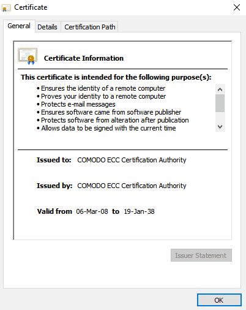
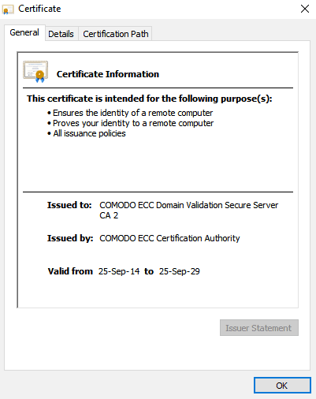
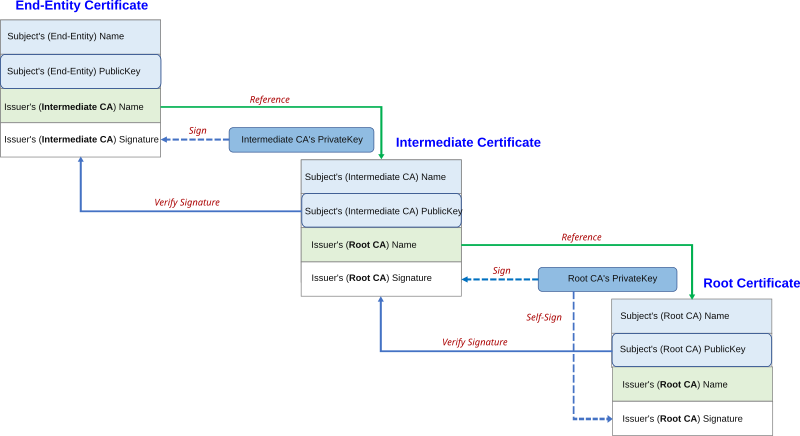
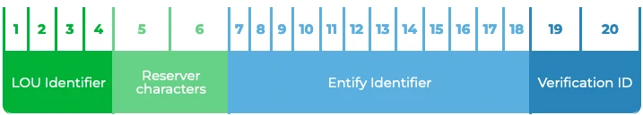

## 什么是证书颁发机构及其重要性

> 证书颁发机构（CA）是现代网络安全的基石，在公钥基础设施（PKI）中发挥着重要作用。 CA 颁发SSL/TLS 证书，以验证网站身份，实现安全加密通信。 该系统对于保护敏感数据（如信用卡号和个人信息）免受中间人攻击等网络威胁至关重要。

### 什么是证书颁发机构 (CA)？
证书颁发机构（CA）是一个受信任的组织，它颁发数字证书来验证网站和其他在线实体的身份。 这些证书允许在互联网上进行安全的加密通信，确保网络服务器和用户之间交换的数据保密。

当您访问一个网站时，您可能会注意到浏览器地址栏中有一个挂锁符号。 这表明该网站拥有 SSL/TLS 证书证书。 证书颁发机构实质上充当了可信第三方的角色，为网站的真实性提供担保，并确保网站身份的合法性。

### 证书颁发机构如何工作？
认证机构的工作流程涉及几个关键步骤。 当网站所有者希望获得数字证书时，他们必须通过 CA 的验证过程，以证明他们确实是域名的合法所有者。

下面是其工作原理的详细介绍：

- 申请证书：网站所有者向 CA 提交数字证书申请。 该请求包括用于加密数据的公开密钥。
- 验证：然后，CA 会执行验证流程，从简单的检查，如确认域名所有权（域名验证），到更广泛的组织详细信息验证（组织验证或扩展验证）。
- 签发：CA 验证信息后，会签发数字证书，将网站身份与加密密钥绑定。 该证书可确保网站能安全地加密与访问者交换的数据。
- 加密：用户访问网站时，浏览器会使用网站的公钥（来自数字证书）对敏感信息进行加密。 只有网站的私人密钥才能解密这些数据，确保数据安全。

这一过程构成了 公钥基础设施（PKI）的基础，它依靠 CA 在用户和网站之间建立信任。


### 证书颁发机构类型
证书颁发机构有多种类型，每种都在证书层次结构中扮演特定角色。这种层次结构确保了从根证书颁发机构到安装在网站上的证书之间的信任链。

- 根证书颁发机构：根 CA是证书链中的最高级别机构。`其根证书预装在所有主要网络浏览器和操作系统中`。 这些根证书是其下发的所有证书的信任锚。
- 中间证书颁发机构：`中间证书颁发机构是根证书颁发机构和最终用户证书之间的中间人`。 它们帮助分配证书签发的负荷，并通过隔离根密钥使其不直接暴露，从而提供额外的安全保护。
- 第三方证书颁发机构：许多商业 CA（如Let’s Encrypt、DigiCert 和GlobalSign）都向网站所有者颁发证书。 这些 CA 受主要浏览器的信任，并根据所需的验证过程提供不同级别的证书。

### 为什么证书颁发机构很重要？
证书颁发机构之所以重要，主要是因为它们有助于在互联网上建立信任。 没有证书颁发机构，用户就无法验证网站的身份，从而导致以下重大安全风险 中间人攻击.

以下是 CA 至关重要的几个重要原因：

- 安全通信：CA 可以对网站和用户之间传输的数据进行加密，确保密码、信用卡号和个人数据等敏感信息受到保护。
- 验证身份：通过签发数字证书，CA 可确保网站由域名的合法所有者运营，帮助用户避免上当受骗。
- 防止网络攻击：由 CA 签发的 SSL/TLS 证书提供的加密功能是防范网络威胁（如窃听和数据泄露）的一道重要防线。

如果没有证书颁发机构，网络安全就会崩溃，恶意行为者很容易冒充合法网站窃取敏感数据。 因此，证书颁发机构在互联网安全基础设施中发挥着不可或缺的作用。

### CA 签发的不同类型证书
证书颁发机构（CA）颁发各种类型的数字证书，每种证书都有不同的验证和安全级别。 这些证书不仅能验证网站的身份，还能实现安全的加密通信。 让我们来看看 CA 颁发的不同类型的证书：

1.域名验证 (DV) 证书
- 域验证（DV）证书是 CA 可以颁发的最基本证书类型。 这些证书验证申请人是否拥有相关域名，但不进行任何额外的身份检查。 DV 证书通常可以快速签发，通常用于需要简单通信加密的小型网站。
- 优点快速发放，成本低廉。
- 使用案例：不处理敏感交易的个人网站、博客或小型企业。

2.组织验证（OV）证书
- 组织验证 (OV) 证书组织验证（OV）证书则更进一步，不仅要验证域名所有权，还要验证网站运营组织的合法性。 这涉及 CA 的一些背景调查，包括核实公司的详细信息，如名称和实际地址。
- 优势：信任度更高，因为组织的身份已得到验证。
- 使用案例：中型企业、电子商务网站以及希望向用户证明其合法性的组织。

3.扩展验证（EV）证书
- 扩展验证 (EV) 证书提供最高级别的信任，需要最严格的审查过程。 当网站使用 EV 证书时，浏览器通常会在地址栏中显示该组织的名称，向访问者表明该网站是高度可信的。
- 优点最大限度地提高信任度和可信度，并在浏览器中显示。
- 使用案例：处理敏感交易的大型企业、金融机构和电子商务平台。

4.通配符证书
- 通配符证书允许网站所有者使用单个证书保护多个子域的安全。 这非常适合管理多个子域但希望简化安全设置的企业。
- 优点覆盖所有子域，减少对单个证书的需求。
- 使用案例：具有多个子域的网站，如公司主网站（如 example.com）和子域（如 blog.example.com 或 store.example.com）。

5.多域（SAN）证书
- 多域证书也称为 主题备选名称 (SAN) 证书多域证书允许持有者用一个证书保护多个域。 这对于用不同域名管理多个网站的企业尤其有用。
- 优点通过一个证书确保多个域的安全，从而简化管理。
- 使用案例：拥有多个域名或单一组织下拥有多个实体的企业。

### 世界顶级证书颁发机构
有几家主要的证书颁发 机构在颁发数字证书方面受到全球信任。 每个 CA 都在确保互联网安全通信方面发挥着重要作用。 以下是一些顶级 CA：

1. DigiCert是 CA 行业最值得信赖的公司之一，提供各种证书，包括 OV 和 EV 证书。 DigiCert 以其强大的加密功能和一流的客户支持而著称。

2. SectigoSectigo 的前身是Comodo，是一家历史悠久的证书颁发机构，提供广泛的 SSL 证书，包括 DV、OV 和 EV 证书。 由于其具有竞争力的价格和全面的产品，Sectigo 在中小型企业中尤其受欢迎。

3. Thawte以其国际业务和声誉而闻名，是最早在美国以外提供数字证书的 CA 之一。 它提供 DV、OV 和EV证书，深受全球企业的信赖。

4. GeoTrust在中小型企业中享有盛誉，为网站安全提供经济高效的解决方案。 GeoTrust 致力于使 SSL 证书易于获取和安装。

5. RapidSSL是一家经济实惠的证书颁发机构，以提供低成本、快速签发的 DV 证书而闻名。 它专门为需要基本加密的网站提供快速、简便的 SSL 证书。

6. GlobalSign是一家备受推崇的证书颁发机构，提供各种证书，包括 DV、OV 和 EV。 它以提供基于云的服务和对加密技术的高度重视而闻名。

7. Let’s Encrypt是一个免费、自动和开放的证书颁发机构，为网站所有者提供域名验证（DV）证书。 它简化了获取 SSL 证书的流程，促进了 HTTPS 的广泛采用，因此广受欢迎。

### 如何选择正确的证书颁发机构
为网站选择合适的证书颁发机构（CA）取决于多个因素。 不同的 CA 提供不同的信任度、成本和证书类型，因此在做出决定之前，必须仔细评估自己的需求。

- 可信度。 一定要选择被主要浏览器和操作系统广泛认可的可信 CA。 受信任的 CA 可确保您网站的证书被顺利接受。
- 费用。 一些 CA（如Let’s Encrypt）提供免费证书，而其他 CA 则对更高级别的验证证书（如 OV 或 EV）收费。 如果您的网站处理敏感数据或需要更高级别的信任，可能需要付费购买 OV 或 EV 证书。
- 所需证书类型。 评估所需证书类型。 如果您的网站只需要基本加密，免费 CA 的 DV 证书可能就足够了。 但是，对于需要证明其合法性的企业来说，OV 或 EV 证书是更好的选择。
- 支持。 如果您不熟悉证书安装或故障排除，选择一家提供客户支持和文档的 CA 可以节省您的时间和麻烦。
- 续期政策。 查看 CA 的续期政策。 有些 CA 提供自动续期服务，可以简化续期过程，特别是对于拥有多个证书的网站。

### 如何从 CA 获取数字证书
从证书颁发机构获取数字证书是一个简单的过程，但需要注意细节。 以下是如何获取证书的分步指南：

- 选择证书颁发机构。 首先，根据需求选择一个可信的 CA。
- 生成证书签名请求 (CSR)。 申请证书前，必须生成 证书签名请求（CSR）。 该请求包括有关您的域名和公开密钥的信息。 大多数虚拟主机提供商和服务器软件都提供生成 CSR 的工具。
- 向 CA 提交 CSR。 获得 CSR 后，将其与有关贵组织的任何必要信息一起提交给所选 CA。 对于域名验证，您可能只需要证明域名所有权。 对于组织验证或扩展验证，您可能需要提供更多文件来验证您的业务。
- 完成验证过程。 根据证书类型的不同，CA 会执行不同的验证步骤。 对于 DV 证书，这可能只是验证电子邮件地址或将文件上传到网络服务器这么简单。 对于 OV 和 EV 证书，CA 可能会要求对贵组织进行更详细的验证。
- 接收并安装证书。 CA 完成验证后，你将收到证书。 然后，您就可以在网络服务器上安装证书，启用 SSL/TLS 加密。

### 证书颁发机构和浏览器信任
证书颁发机构和网络浏览器之间的关系是互联网安全和可信度的关键。 浏览器使用 CA 根证书来验证网站的真实性，因此使用由可信 CA 签发的证书非常重要。

`Chrome、Firefox 和 Safari 等浏览器都预装了知名 CA 的可信根证书列表`。 访问网站时，浏览器会根据该列表检查网站的证书。 如果证书由可信 CA 签发，浏览器就会允许安全连接。

如果证书是由不受信任或未知的 CA 签发的，浏览器就会显示警告，说明网站可能不安全。 这种情况可能发生在 自签名证书或浏览器无法识别 CA 时都会出现这种情况。

在某些情况下，如果证书受损，可能需要撤销证书。 `CA 维护 证书吊销列表（CRLs）浏览器可使用在线证书状态协议（OCSP）检查证书状态，以确保证书仍然有效`。

### 证书颁发机构面临的挑战和批评
尽管证书颁发机构在互联网安全方面发挥着至关重要的作用，但它们也并非没有受到批评。 以下是一些挑战和担忧：

- 垄断问题。 少数几家 CA 主导着市场，导致人们对垄断力量和行业缺乏竞争的担忧。
- 安全漏洞。 CA 本身也可能成为网络攻击的目标。 如果 CA 遭到攻击，攻击者就可以签发虚假证书，从而危及整个域的安全。 几起备受瞩目的 CA 外泄事件都凸显了这一漏洞。
- 腐败的可能性。 由于 CA 对网络安全拥有重大权力，因此总是存在滥用或腐败的可能性。 这导致一些人质疑 CA 模式是否是确保互联网信任的最佳方法。

### 最终想法
了解证书颁发机构的作用对于确保网站安全和建立访客信任至关重要。 无论您需要的是基本的域名验证（DV）证书还是高度可信的扩展验证（EV）证书，选择正确的 SSL 证书都是保护敏感信息和确保您的在线业务安全的重要一步。

## 什么是证书签名请求（CSR）

> 证书签名请求（CSR）是使用SSL/TLS 证书确保任何网站安全的关键部分。 CSR 是通过加密数据传输保护用户敏感信息所必需的。 从本质上讲，它是一个加密文本块，包含域名、组织和公钥等重要信息。

### 什么是证书签名请求？
证书签名请求（CSR）是一种特殊格式的文本块，包含有关网站或组织的关键信息。 它在获取 SSL/TLS 证书该证书对于加密网络服务器与客户端（如浏览器）之间的通信至关重要。

需要使用SSL/TLS 保护网站安全时，第一步是生成 CSR。 然后将此请求发送给 证书颁发机构（CA）-一个受信任的第三方，负责签发实际的数字证书。 `CSR 中包含用于建立安全连接的公钥，以及有关域名和组织的其他详细信息`。

通过提交 CSR，您实质上是在要求 CA 验证您的身份并签发必要的数字证书，以确保您网站的安全。 如果没有这个过程，您的网站就无法建立安全的 HTTPS 连接，而 HTTPS 对保护用户数据和提高搜索引擎优化排名至关重要。

### 为什么需要证书签名请求？
无论是网站还是内部网络系统，只要需要 SSL/TLS证书，就必须提交CSR。 之所以如此重要，原因很简单：SSL/TLS 证书提供加密功能，可保护用户与网站之间传输的敏感数据。 这对于电子商务网站、金融机构或任何处理个人信息的平台尤为重要。

此外，谷歌等搜索引擎现在会优先考虑使用 HTTPS 的网站，这意味着 SSL 证书可以直接提高搜索引擎优化性能。 有效的 SSL 证书还能提高客户的信任度，因为它能向用户保证，他们的数据不会被窃听或拦截。 CSR是获得证书的第一步。

### 证书签名请求如何工作？
证书签名请求的过程围绕公钥基础设施（PKI）展开。 简单解释一下，它是如何工作的：

- 生成 CSR：这一步发生在网站所在的服务器上。 您将使用一个工具（如 OpenSSL等）生成 CSR 文件。
- 公钥和私钥对：创建 CSR 时，需要一个公钥和一个私钥对。 私钥同时生成。 公开密钥将放入 CSR，而私人密钥则安全地保存在服务器上。
- 提交 CSR：然后将 CSR 提交给证书颁发机构 (CA)，如Let’s Encrypt或 DigiCert来验证你的身份。
- 验证：CA 验证 CSR 中的信息。 对于域验证(DV) 证书，这可能是对域所有权的简单检查，而对于组织验证(OV) 证书，这可能是对组织名称的简单检查。 组织验证（OV）和扩展验证 (EV)证书则需要更彻底的验证。
- 证书签发：通过验证后，CA 将签发 SSL/TLS 证书，并将其安装在您的服务器上。 这样，您的网站就可以通过 HTTPS 安全地传输数据。

此工作流程可确保 CSR 中的公钥与服务器上的私钥相匹配，从而使未经授权的各方无法解密敏感数据。

## CSR 包含哪些信息？
证书签名请求包含几项重要信息，对创建 SSL证书至关重要：

- 通用名称 (CN)：网站的完全合格域名 (FQDN)，如www.example.com。
- 组织 (O)：贵公司或组织的法定名称。
- 组织单位 (OU)：组织内负责管理证书的部门（此字段为可选字段）。
- 国家 (C)：您所在国家的双字母代码，如 “US “代表美国。
- 州/省 (S)：州或省的全称。
- 地点 (L)：企业所在的城市或城镇。
- 电子邮件地址（可选）：有些 CSR 可能会提供一个电子邮件地址，用于交流。
- 公钥：这是 CSR 中最关键的部分。 公钥嵌入证书中，用于加密和与客户的安全通信。

所有这些信息都编码在 CSR 中，然后使用私钥对 CSR 进行数字签名，以确保其真实性。

### 公共和私人钥匙在企业社会责任中的作用
创建CSR 时，公钥和私钥之间的关系对安全至关重要。 具体操作如下

- 公钥：公钥包含在 CSR 中，是 SSL/TLS 证书的一部分。 它用于加密发送到服务器的数据。 任何人都可以访问公钥，但只有相应的私钥才能解密信息。
- 私钥：该密钥保留在服务器上，不得共享。 它用于解密由公钥加密的数据。 如果其他人获得了你的私钥，他们就有可能解密敏感信息，这就是为什么确保私钥安全至关重要的原因。

从本质上讲，公钥对信息进行加密，而私钥对信息进行解密。 CSR 可确保您的公钥有效，并可由证书颁发机构验证，然后颁发 SSL 证书。

### 如何生成证书签名请求
生成证书签名请求（CSR）取决于所使用的服务器环境。 以下是创建 CSR 的一些常用方法：

#### OpenSSL （基于 Linux/Unix 的服务器）
OpenSSL 是生成 CSR 和私钥最常用的工具之一。 下面是一个分步示例：

运行以下命令生成 CSR：
```
openssl req -new -newkey rsa:2048 -nodes -keyout yourdomain.key -out yourdomain.csr
```
此命令将生成两个文件：
- yourdomain.key：私钥。
- yourdomain.csr：证书签名请求。

系统会提示您填写域名 (CN)、组织和国家等详细信息。

#### cPanel（虚拟主机环境）
许多共享主机平台（如使用cPanel 的平台）都提供内置的 CSR 生成工具：

- 登录cPanel，进入SSL/TLS部分。
- 单击生成新 CSR。
- 在表格中填写您的域名和组织信息。
- 生成 CSR 后，下载 CSR 和私钥。

#### Windows 服务器
如果您使用的是带有 IIS（Internet 信息服务）的 Windows Server， IIS 管理器提供了创建 CSR 的直接方法：

- 打开IIS 管理器并导航到服务器。
- 在服务器证书部分，选择创建证书请求。
- 填写域名、组织和公钥大小等必填字段。
- 保存 CSR 文件，以便提交给证书颁发机构。

以上只是生成 CSR 的几种方法，但各平台的基本流程大同小异：输入域名和组织的详细信息，生成 CSR，然后提交给证书颁发机构。

### 了解不同类型的证书签名请求
SSL 证书有多种类型，每种类型都有不同的验证级别。 这些差异会影响CSR要求，但基本结构保持不变：

#### 域验证 (DV) 证书：
- 只需最低限度的验证–只需证明您控制着域名。
- 通常使用仅包含通用名称 (CN)（域名）的 CSR。
- 最适合不处理敏感信息的小型网站或博客。

#### 组织验证 (OV) 证书：
- 除了证明域名所有权外，证书颁发机构（CA）还将验证贵组织的合法存在。
- 企业社会责任包括组织详情，如公司名称和地址。
- 适用于处理用户数据但不需要最高级别验证的企业。

#### 扩展验证 (EV) 证书：
- SSL 验证的最高级别。
- 需要对域名和组织进行广泛的验证。
- 企业社会责任必须包括详细的组织信息。
- 通常用于金融机构、大型企业和电子商务网站。

这些证书类型的用途各不相同，但都以生成CSR并提交验证为起点。

### 证书签名请求的有效期有多长？
证书签名请求没有具体的有效期，但其相关性与SSL 证书的有效期有关。 SSL 证书的有效期通常为一年或两年，之后必须更新。

在更新 SSL 证书时，通常最好生成一个新的CSR，以确保最安全的加密做法。 一些托管平台或 CA 可能会鼓励在更新时使用新的 CSR，以提高安全性。

### CSR 批准后会发生什么？
一旦证书签名请求获得批准，证书颁发机构（CA）签发 SSL证书，下一步就是安装。 以下是批准后的情况：
- 安装 SSL 证书：收到证书后，将其安装到网络服务器上。 具体过程取决于你的服务器类型，但通常包括通过 cPanel 上传证书文件，或通过 SSH 手动上传基于 Linux 的服务器的证书文件。
- 配置 HTTPS：确保您的网站配置为使用 HTTPS。 这可能需要更新网站的内部链接，并设置从 HTTP 到 HTTPS 的自动重定向。
- 测试 SSL 证书安装后，使用 HTTPS 访问网站并使用以下工具验证 SSL 证书是否正常工作SSL Labs’ SSL Test等工具检查是否存在配置错误。

维护 SSL 证书对网站的持续安全性和可信度非常重要。

### 底线
证书签名请求（CSR）是使用 SSL/TLS证书保护网站安全的第一步，也是至关重要的一步。 通过正确生成 CSR，可以确保正确签发 SSL 证书，帮助保护访问者的敏感信息并建立信任。


## 根证书和中间证书：关键区别说明

> 了解根证书和中间证书的区别对于确保在线通信安全至关重要。 这两种类型的数字证书与 SSL 证书一起构成了安全网络浏览的支柱，实现了加密数据传输，并在服务器和用户之间建立了信任。 但它们之间到底有什么区别呢？
> 
> 根证书作为最终权威，位于证书层次结构的顶端，而中间证书则作为中介，创建一个安全的信任链。 在本文中，我们将分析这些证书的作用、功能和主要区别，帮助你了解它们是如何共同保护网上敏感信息的。

主要
- 根证书是信任链中最高级别的证书，由受信任的证书颁发机构（CA）自行签署。 它们是安全通信的基础，对于在互联网上建立信任至关重要。
- 中间证书是根证书和最终用户证书之间的中介。 它们由根证书或其他中间证书签署，有助于建立信任链，降低直接使用根证书的风险。
- 这两类证书共同确保整个网络的数据加密、身份验证和完整性，保护敏感信息免受网络威胁。

### 什么是根证书？
根证书（通常称为CA 证书 ）是一种数字证书，是公钥基础设施（PKI）系统的基础。 它由受信任的证书颁发机构（CA）签发，并且是`自签名`的，也就是说，CA 会对自己进行验证。`根证书存储在一个被称为根存储的可信存储库中，由浏览器和操作系统维护，以验证安全连接`。

根证书对于建立证书链中最高级别的信任至关重要。 根证书验证并签署中间证书，中间证书再签署最终用户证书。 由于其重要性，根证书的有效期通常很长，通常为 20-25 年或更长。

与商业证书不同，根证书的寿命更长。 下面是 SectigoECC 的有效期。 如您所见，它将在遥远的 2038 年到期。



整个证书链的安全性取决于根证书的完整性。

### 什么是中间证书？
中间证书是根证书和服务器证书（如网站的SSL/TLS 证书）之间的桥梁。 与根证书不同，中间证书不是自签名的，而是`由根证书或其他中间证书签名的`。 这种结构创建了一个被称为 “信任链“的层次结构。


中间证书在降低风险方面起着至关重要的作用。 证书颁发机构不使用根证书直接颁发最终用户证书，而是使用中间证书。 这种方法限制了根证书的暴露，使撤销和替换受损证书变得更容易，而不会影响整个信任链。

### 证书等级解释
在数字证书层次结构中，根证书位于顶层，其次是一个或多个中间证书，最后是位于底层的服务器或最终用户证书。 这种层次结构对于建立安全的信任链至关重要。 当用户连接到一个网站时，浏览器会按照信任根证书链检查服务器证书的有效性。
- 根证书：最高权威，由 CA 自行签名。
- 中间证书：由根证书或另一个中间证书签名，创建多层信任。
- 服务器/最终用户证书：颁发给网站或实体，提供加密通信和身份验证。

### 证书链的重要性
证书链又称认证路径，是指从最终用户证书追溯到受信任根证书的证书序列。 该证书链对于在互联网上建立安全连接至关重要。 证书链中的每张证书都经过上一张证书的验证，确保信任从受信根证书一直传递到最终用户。



图片来源：Fanyangxi – CC BY-SA 4.0

证书链通过提供多层验证来增强安全性。 如果中间证书受到损害，可以在不影响根证书或其他中间证书的情况下撤销该证书，从而保持整个系统的完整性。

### 根证书和中间证书的主要区别
了解根证书和中间证书的区别对于任何从事数字安全工作的人来说都至关重要。 虽然这两种类型的证书在信任等级体系中都起着至关重要的作用，但它们在签发、存储、寿命和用途方面却有很大不同。 以下是主要区别的细分：
- 层次结构和信任级别。 根证书位于信任层次结构的顶端。 作为最终权威，它们是最可信的证书，由证书颁发机构（CA）自行签署。 相比之下，中间证书在层次结构中处于较低位置，是连接根证书和最终用户证书的中介。 这种分层结构确保了信任从根证书流向最终用户。
- 签发和签名机构。 根证书由受信任的证书颁发机构颁发，是自签名的，即证书颁发机构验证自己的身份。 而中间证书则由根证书或其他中间证书签署。 由于根证书不直接用于签署最终用户证书，这种签署授权使 CA 能够更安全地签发证书。
- 存储和安全措施。 `来自受信任的根证书颁发机构的根证书存储在受信任的位置，如网络浏览器和操作系统的信任存储区`。 这些信任存储中包含一份被所有用户自动信任的公认根证书列表。 而中间证书则存储在需要它们的组织的服务器上。 由于它们不需要像根证书那样的信任度，因此它们的存储不太重要，但仍需要安全处理，以防止未经授权的访问。`大多数设备和浏览器都有一套预先下载的根证书，这些证书存储在信任存储区，为安全通信提供了基线`。
- 有效期和寿命。 根证书的有效期通常比中间证书的有效期要长得多。 根证书的有效期可达 20-25 年或更长，而中间证书的有效期通常较短，通常为 1 至 5 年。 较短的有效期有助于最大限度地降低中间证书被泄露的风险，因为它比根证书更容易被撤销或替换。
- 风险管理和缓解。 根证书代表证书链中的最终信任锚，一旦被泄露，风险较高。 为了降低这种风险，中间证书被用来签发最终用户证书。 如果中间证书受损，可在不影响根证书的情况下撤销该证书，从而维护 PKI 系统的整体安全。
- 真实世界的应用和示例。 在实践中，根证书和中间证书都被广泛用于确保在线交易、网站和通信的安全。 例如，根证书可能被所有浏览器信任，而中间证书则用于为网站签发 SSL 证书，以验证其身份并实现安全通信。 通过创建这种分层方法，该系统可确保即使证书链的某个部分受到破坏，整个系统也不会崩溃。

### 与根证书和中间证书有关的高级概念
通过深入研究根证书和中间证书的概念，了解它们如何在数字安全的大背景下相互作用，这一点非常重要。 这些高级概念将有助于明确它们在公钥基础设施（PKI）系统中的作用，以及保证我们在线通信安全的机制。

#### 什么是根计划？
根程序是一种策略框架，用于确定网络浏览器、操作系统和其他软件平台信任哪些根证书。 这些程序由微软、苹果、Mozilla 和谷歌等主要组织管理，它们维护着一份受信任的根证书列表，即信任存储。

根程序对于确保信任存储中的证书真实、安全并遵守严格的安全标准至关重要。 它们会定期审查和审核根证书，添加新的受信任根证书，删除不再符合安全要求的证书。

#### 数字签名及其作用
数字签名是验证证书完整性和来源的加密签名。 根证书和中间证书都依靠数字签名来验证它们是否被篡改，是否由合法的证书颁发机构（CA）颁发。
- 对于根证书：数字签名由 CA 自行签署，以确立其权威性和可信度。
- 中间证书：数字签名是使用签发根证书或中间证书的私钥创建的，提供了与受信任根证书的链接。

数字签名可确保链中的每张证书都能追溯到受信任的根认证机构，从而维护安全通信的完整性。

#### 链根系统与单根系统的区别
证书系统主要有两种：连锁根系统和单一根系统。
- 连锁根系统：在根证书和最终用户证书之间使用多个中间证书。 这增加了安全性和灵活性，因为中间证书可以撤销或更换，而不会影响根证书。
- 单根系统：使用单一根证书直接签发最终用户证书。 这种系统虽然更简单，但风险更大，因为任何对根证书的破坏都可能破坏整个系统的安全性。

由于链式根系统能够降低风险并提供更强大的安全性，因此更常用。

### 底线
了解根证书和中间证书的区别对于维护安全的数字环境至关重要。

根证书在证书层次结构的顶端建立了最终信任，而中间证书则提供了一个重要的安全层，为最终用户证书架起了桥梁。 它们共同创建了一个强大的信任链，保护在线通信，确保数据完整性，并在互联网上验证身份。

通过了解它们的不同作用以及如何协同工作，您就能更好地理解确保在线互动安全的机制。


## 什么是法人实体识别码 (LEI)，如何使用？

> 在 21 世纪初，企业和客户并不总能确定母公司的法律身份，因为没有一个通用代码来识别每个法律实体。 由于缺乏这样的识别器，导致了许多欺诈行为，最终引发了 2008 年的市场崩溃。
> 
> 尘埃落定后，G20 引入了 “法律实体标识符”（LEI）的概念，以彻底解决这一突出问题。
> 
> 在本文中，我们将讨论 LEI 代码，包括什么是 LEI 号码（法律实体识别码）、LEI 的历史、好处、应用以及如何为贵公司获取 LEI 代码。

### 什么是 LEI 编号？
LEI 编号或法律实体标识符是一个`20`个字符的唯一代码，用于识别从事金融交易的组织。 LEI 由 ISO 17442 标准定义，并得到世界主要经济体（20 国集团）的认可，有助于在全球范围内遵守监管规定并证明公司的合法性。

### 法人实体标识符有什么用？
每个 LEI 都包含有关实体所有权结构的信息，从而回答了 “谁是谁 “和 “谁拥有谁 “的关键问题，以最透明的方式将母子组织联系起来。

公开的 LEI 数据库可确保交易的安全性和可预测性，任何相关方都可方便免费地使用。

### LEI 代码包括哪些数据？
LEI 代码包括以下数据：
- 法人实体或基金管理人正式名称
- 登记处名称和登记处编号
- 公司的法律形式
- ISO 国家代码
- 总部地址
- LEI 首次发布日期
- LEI 过期日期
- 最近一次更改信息的日期
- LEI 代码历史

早在 LEI 代码实施之前，私营部门就已经在其愿望清单上列出了 LEI 代码。 但通常情况下，只有全球金融危机才会敦促世界上最大的经济体制定具体的解决方案。

没有什么比 2008 年雷曼兄弟公司的倒闭更能说明法律实体的必要性了。 当这家全球金融服务公司破产并在全球引发震动时，监管机构无法迅速识别与雷曼有关的庞大市场参与者网络。

每个国家都有不同的代码系统来识别金融交易的对应公司。 此外，也无法确定个别公司的交易细节和金融交易的对应方。

市场崩溃后，全球最大经济体的领导人通过二十国集团和金融稳定委员会（FSB），同意创建一个全球解决方案，对从事金融交易的组织进行合法身份识别。

2011 年 3 月，国际标准化组织 (ISO) 成立了一个专门的工作组，负责制定 LEI 标准，制定了规范草案（ISO 17442），并选定了一个注册机构来监督分配工作。

首批 LEI 于 2012 年 12 月发布。 截至 2022 年 2 月，LEI 数量已突破 200 万大关。

### 谁需要 LEI 编号？
随着新的金融市场监管法规日趋严格，需要 LEI 编号的司法管辖区和行业数量也在稳步上升。 任何进行金融交易的法人实体都可以获得 LEI 代码，并在官方 LEI 注册表中编制索引。 从银行业、保险业到私营企业，各公司都在使用 LEI 来提高透明度和可信度。

如果贵公司属于以下类别（但不限于此），则必须依法注册 LEI 代码。
- 投资公司和贷款人
- 银行家
- 经纪人
- 基金经理
- 贸易商
- 机构投资者
- 交流官员
- 金融中介机构

即使法律没有要求，仍可申请 LEI 的公司：
- 协会和分支机构
- 政府机构
- 慈善机构
- 有限公司
- 个体经营者
- 业务验证 SSL 证书所有者
- 扩展验证 SSL 证书所有者

### LEI 数字从何而来？
每个 LEI 代码背后都有一个严格的合规流程，由全球监管机构、私营企业和行业协会共同监督。 监管全球 LEI 系统（GLEIS）代码分配的国际实体是监管监督委员会（ROC）。

ROC 和私营部门成立了全球 LEI 基金会 (GLEIF)，该组织负责认证地方运营单位 (LOU)，以便在不同的司法管辖区分配 LEI 代码。 基金会由 16 名成员组成的董事会领导，所有成员均来自私营企业。

地方运营单位利用地区业务知识和实践来批准其管辖范围内的 LEI 编号，从而简化 LEI 的发放并确保最佳的管理规程。

### LEI 代码如何工作？
LEI 代码与条形码或数字护照有许多相似之处。 其目的是识别和认证高度管制行业的参与者。 LEis 取代了过时的验证方法，如 KYS（了解你的客户）标准，这种方法耗时较长，而且容易被伪造。

LEI 的两个核心方面是归属于一个实体的 20 位字母数字代码和记录所有 LEI 注册者的公共 LEI 目录。

银行、金融监管机构和证书颁发机构是一些积极使用 LEI 代码验证客户身份的部门。 由于 LEI 已包含实体的法律地位，因此验证过程快捷、方便、安全。

作为一项全球倡议，LEI 代码结合了金融领域最新的技术和安全进步，可有效识别各方身份。

### 什么是 LEI 代码示例？



20 个字符的代码包含所有必要信息，便于识别：
- 前四个字符前缀被唯一分配给每个 LOU（法定运行单位）。
- 以下两个字符将被置零并保留以备将来使用。
- 以下 12 个字符是 LOU 根据透明分配政策生成和分配的代码的实体特定部分。
- 最后两位数字代表 ISO 17422 中描述的验证 ID。

### LEI 代码的好处
没过多久，LEI 就成为了全球主要的商业标识符。 本地和海外公司使用 LEI 代码来遵守金融法规，并在充满挑战的环境中高效运营。

LEI 的优势不仅仅在于其独特性和唯一性。据全球管理咨询公司麦肯锡称，LEI 系统每年可为银行业节省 20 亿至 40 亿美元的 “了解你的客户”（KYC）检查费用。

以下是公司应该获得法人实体识别码的更多原因：

- 对公司身份的信任。 信任是任何成功交易的基础。 在全球市场中，在收购或投资前进行尽职调查是实现积极成果的关键一步。
  
  LEI 代码通过证明实体的真实性和诚信经营，简化了流程。 在获得 LEI 之前，要通过当地的官方公司注册机构核实实体的活跃公司身份。

- LEI 已在全球实现标准化。 无论您是来自美国、欧盟还是开曼群岛等离岸司法管辖区，LEI 都能提供完全相同的公司数据，与司法管辖区或行业无关。 有了全球 LEI 指数的整个列伊数据池，就不必再浏览各国的注册信息，也不必再浪费时间进行 KYC 流程。
  
  此外，有了 LEI 代码，您就可以获得 LEI 证书，该证书是可下载、可打印的证明，可证明您作为注册法人实体的地位。

- 全球合规。 有了 LEI 代码，您就可以在数百个司法管辖区开展业务，进行国际化经营。 美国、英国和欧盟等最大的经济区都要求 LEI 用于报告目的。
  
  全球和本地有 120 多项法规规定了 LEI。 其中包括 MiFID II、MiFIR、EMIR、FICOD、多德-弗兰克法案等。 没有 LEI 就意味着没有交易。

- 提高 SSL 验证速度 现在，所有网站，无论其类型、规模和行业，都必须获得 SSL 证书。 但是，商业验证和扩展验证证书需要书面文件，如果证书颁发机构无法将公司的详细资料与公共登记处的官方数据相印证，那么验证工作就会拖得很久。
  
  有了 LEI 代码，整个流程就会加快，因为 CA 可以查看全球 LEI 索引，快速找到与您的企业相关的数据。

- 终身认证。 LEI 系统不受实体生命周期内发生的任何变化的影响。 即使某个实体因关闭或合并而解散，或被另一个实体合并，其原始标识符仍然有效，可以恢复与该实体活动时间有关的参考数据。

- 人类使用之外的无障碍环境 不仅人类可以使用 LEI 记录，应用程序也可以。 LEI 数据库可通过网络、API 或下载完整数据集进行访问。
  
  LEI 代码为姓名和地址提供多语种支持，可用于 QR 码、条形码、数字签名、电子文档、现场封条等。 人工和机器可读的XBRL数字签名利用LEIs实现财务报表和年度报告的完整性。

既然我们已经列出了 LEI 代码的主要好处，那么让我们来看看哪些实体没有 LEI 就无法运营，哪些公司即使还没有强制要求也可以申请 LEI。

### 如何获取法人实体识别码？
不同辖区内成千上万的实体都可以轻松获取 LEI 代码。 获取法律实体标识符简单快捷。 无需大量文书工作，在大多数情况下，只需几分钟即可填写 LEI 提供商的表格。

### 如何申请法人实体识别码？
在 SSL Dragon，LEI 申请流程已实现自动化。 我们提供经济实惠的 LEI 计划和多年折扣以及出色的支持。

首先，在下新订单前进行 LEI 搜索，因为一个实体只能分配一个 LEI。

选择账单周期后，继续结账并输入您的详细信息和账单信息。

SSL Dragon 是最值得信赖的 LEI 注册代理之一，将在 1 至 36 小时内交付您的 LEI，具体取决于您所在的司法管辖区。

### 法律实体标识符有哪些要求？
有几种文件可以作为正式登记数据。 文件应确认合法注册的实体名称、当前地址和主要利益相关者的姓名（如董事、首席执行官）。

LEI 申请必须提供注册地址（见实体成立文件）和总部地址（实体开展业务的地点）。 这些地址可以相同，但注册 LEI 时必须同时包含这两个地址。

以下是获得 LEI 所需的数据和文件清单：
- 法定名称。
- 注册地址
- 总部地址`
- 注册编号和管理机构。
- 实体类型。
- 母公司关系信息。

现在就获取 LEI 代码！

### 最后的话
LEI 代码的引入虽然姗姗来迟，但正所谓 “迟来总比不来好”。 2008 年市场崩溃之后，全球经济，尤其是金融部门，吸取了一些惨痛的教训。 本文试图回答什么是法律实体标识符，以及为什么它是现代金融和数字交易的基本要素。

没有全球法律实体标识符，金融犯罪猖獗，直至整个系统崩溃。 如今，在公共监管机构和私营企业的协调努力下，世界经济更加健康和安全。

LEI 代码是复杂问题的简单解决方案。 它为处理金融交易的组织带来了信任、安全和可预测性。 LEI 得到了数百家监管机构的认可，其最终目的是更好地管理金融风险。 如果贵公司没有 LEI 代码，现在正是注册 LEI 代码的最佳时机。

## 什么是证书吊销列表？证书吊销列表解释

> 数字证书是安全在线交互的支柱，可验证身份并确保加密通信。然而，当这些证书被泄露或滥用时，必须及时撤销它们以保持信任。这就是证书吊销列表（CRL）的作用所在。证书吊销列表由证书颁发机构（CA）维护，对于在证书造成危害之前识别和吊销证书至关重要。
> 
> 在本指南中，我们将探讨什么是CRL、CRL的功能以及CRL对网络安全至关重要的原因。

### 什么是证书吊销列表（CRL）？
证书吊销列表（ CRL ）是由证书颁发机构（CA）创建的数字签名文件，其中列出了已吊销的数字证书。由于安全漏洞、密钥泄露或管理变更等原因，这些证书会在预定到期日之前被吊销。CRL 在公钥基础设施（PKI）中至关重要，可防止使用受损证书，从而确保通信安全。

根据X.509 标准和RFC 5280 的定义，**证书废止列表包含重要的详细信息，如无效证书的序列号、废止时间戳、废止日期，有时还包括废止的具体原因**。该机制可确保在验证过程中标记已撤销的证书。

### CRL 如何工作？
证书吊销列表是公钥基础设施（PKI）中的一个信任验证系统。当数字证书被吊销时，其详细信息会被添加到由签发证书机构（CA）维护的证书吊销列表（CRL）中。该列表定期更新，并通过指定的证书废止列表分发点（CDP）分发，可通过证书中嵌入的 URL 进行访问。

### CRL 流程
网络浏览器或应用程序遇到证书时，会从 CDP 中检索相关的 CRL。检索到的列表会扫描证书序列号，以检查证书吊销状态。如果发现匹配，证书就会被标记为已撤销，并警告用户存在潜在风险，防止用户不恰当地接受证书。这一过程有助于在不安全连接发生之前就加以阻止。

CRL 通常由签发 CA 签署，以确保其真实性并防止篡改。它们包括时间戳和下一次计划更新的详细信息。频繁更新是保持可靠性的必要条件，但也会带来性能挑战，尤其是对于大型 CRL。

### CRL 功能面临的挑战
CRL 并非没有局限性。CRL 依赖于定期更新，这就产生了一个延迟窗口，在此期间，被撤销的证书仍有可能被接受。此外，CRL 的大小也会影响效率；较大的列表需要更多资源来解析，导致响应速度变慢，特别是对于处理能力有限的设备。本地缓存 CRL 可以减少一些延迟，但如果错过更新，就会带来额外的风险。

### 为什么证书会被吊销？
数字证书在其完整性或有效性受到损害时会被撤销，以确保它们不会被滥用来破坏安全系统。证书颁发机构（CA）的这一主动措施可防止恶意行为者利用被吊销的证书绕过安全协议或欺骗用户。

证书可能因各种原因被吊销，包括
- 密钥泄露：如果与证书相关的私人密钥暴露或被怀疑泄露，则有必要撤销证书，以减少未经授权的访问。
- CA 破坏：当签发 CA 的安全受到破坏时，它签发的所有证书都可能失去可信度。
- 错发证书：在签发过程中出现错误，如域名验证不正确，需要撤销和重新签发。
- 所有权变更：域名所有权或组织隶属关系的变更往往需要撤销和更换证书。
- 停止业务：当证书持有者停止业务或不再控制域名时，撤销可确保证书不被滥用。

被破坏的证书对网络安全构成重大风险。未及时标记的废止证书会助长 中间人攻击身份盗窃、数据泄露和恶意软件传播。例如，苹果和谷歌等 CA 的大规模证书废止就凸显了迅速处理漏洞的重要性。

### CRL 与替代方案：OCSP 和证书透明度日志
虽然证书吊销列表被广泛用于管理被吊销的证书，但它并不是唯一的方法。替代方法有 `在线证书状态协议（OCSP）`和 `证书透明度 (CT) 日志`等替代方法提供了解决证书信任问题的独特方法。

#### CRL 与 OCSP
- CRL依赖于浏览器或应用程序下载并解析的定期更新列表。这种离线方法虽然有效，但可能会造成延迟，尤其是对于大型列表。
- OCSP允许浏览器直接向 CA 查询特定证书的状态，从而提供实时验证。浏览器无需下载整个列表，只需收到一个简单的回复：”良好”、”已撤销 “或 “未知”。
- OCSP 装订OCSP Stapling 是一项增强功能，可将负担从客户端转移到服务器。服务器会缓存 OCSP 响应，并在TLS 握手过程中将其 “装订 “到证书上，从而提高性能和保密性。

#### CRL 与 CT 日志
- 证书废止列表只关注被吊销的证书，而不涉及过期证书，这就确保了被泄露的证书不可信。
- 而证书透明度日志则记录所有已签发的证书。这些仅有附录的日志可以暴露错误签发或恶意签发的证书，从而提高透明度，但它们不涉及证书吊销状态。

### 选择正确的方法
CRL 对于批量管理被吊销的证书仍然有效，但可能难以满足可扩展性和实时性的要求。通过 OCSP 及其订书钉变体进行的证书吊销检查提供了更快和更动态的检查，解决了 CRL 的一些局限性。同时，CT 日志是一种补充工具，可确保对证书签发进行监督，但不能确保对证书吊销进行监督。

为了确保全面的安全性，企业通常会将这些方法结合起来。CRL 非常适合需要批量更新的环境，而 OCSP 可提供即时状态检查。CT 日志增加了一层透明度，确保了整个数字生态系统的信任。

### 使用值得信赖的解决方案确保网站安全
证书吊销列表可确保被吊销的证书不会被用来破坏安全，从而在保护数字通信方面发挥重要作用。

## 端口 80（HTTP）与端口 443（HTTPS）：主要区别说明

> 80 端口和443 端口定义了数据在网络上的传输方式。80 端口支持HTTP，但不提供加密，而 443 端口支持HTTPS，确保交互安全。随着网络安全成为首要任务，HTTPS 已取代 HTTP 成为安全数据传输和保护的标准。
> 
> 本文将探讨它们之间的差异，揭示端口 443 在日益数字化的环境中对于保护信息和维护信任至关重要的原因。

### 什么是端口？
在网络中，端口作为虚拟端点，可促进网络设备之间的通信。`每个端口号对应一个特定的服务或协议`，如传输控制协议（TCP），从而实现高效的数据路由并区分流量类型。这些端口在确保计算机与服务器之间的无缝互动方面发挥着至关重要的作用。

`端口号范围从0到65535，分为知名端口号（0-1023）、注册端口号（1024-49151）和动态/专用端口号（49152-65535）`。HTTP 和 HTTPS 主要使用知名类别。通过为协议指定唯一的编号，端口允许系统有效地处理传入和传出的数据，保持整个网络连接的秩序和功能。

### 什么是 80 端口（HTTP）？
80 端口是未加密网络通信的网关，是HTTP（超文本传输协议）的默认端口。HTTP 在互联网诞生之初就已成为网络通信的主干，使浏览器能从服务器请求和检索HTML、CSS、图像和网页等资源。这种通信方式基于请求-响应模式，即浏览器发起查询，服务器响应所请求的数据。

不过，80 端口的主要缺点在于缺乏加密。通过 HTTP 传输的数据是纯文本，因此很容易被截获。网络犯罪分子可以通过数据嗅探或内容注入等方法利用这一漏洞。例如，恶意行为者可以在传输过程中更改 HTML 或 CSS 文件，从而影响网站的完整性。

虽然 80 端口仍可用于非敏感任务，但现代浏览器和搜索引擎越来越优先考虑安全的替代方案。完全依赖 HTTP 的网站有可能降低搜索排名和用户信任度。随着安全问题的增加，从 HTTP 过渡已势在必行。

### 什么是 443 端口（HTTPS）？
443 端口通过引入 HTTPS 协议(超文本传输协议安全协议），它是 HTTP 的加密对应协议。与前者不同，HTTPS 确保浏览器和服务器之间传输的所有数据都经过 加密确保数据不被拦截或篡改。这种安全协议利用 SSL（安全套接字层）及其后续版本TLS（传输层安全）来加密数据、验证服务器身份，并在整个连接过程中保持完整性。

浏览器通过 443 端口启动安全连接时，会通过一个`握手过程`确保只有目标方能破译传输的信息。这种加密可保护登录凭证、支付详情和个人信息等敏感数据免受以下威胁 中间人攻击或 SSL 剥离.

除了安全性，HTTPS 还能提高用户信任度和网站可信度。现代浏览器会显示挂锁或警告等视觉指示，表明网站是否采用了 HTTPS。使用 HTTPS 的网站还能获得更好的搜索引擎排名，因为 Google 会优先考虑安全连接，以促进更安全的互联网。

443 端口已成为电子商务、网上银行和任何处理敏感用户信息的应用程序不可或缺的端口。在网络威胁日益复杂的时代，采用 443 端口凸显了对安全通信日益增长的需求。

### 端口 80 和端口 443 的主要区别
80 端口和 443 端口在促进网络流量方面的作用相似，但在安全性、功能性和用户信任度方面有很大不同。下面是它们主要功能的详细比较：
| 特点         | 端口 80 (HTTP)| 端口 443 (HTTPS) |
|--------------|--------------------|--------------------|
| 加密         | 无；数据以纯文本传输| 通过 SSL/TLS 进行全面加密   |
| 安全         | 容易受到数据嗅探和注入攻击 | 防止中间人攻击和篡改    |
| 使用案例     | 非敏感数据（如公开内容） | 敏感数据（如付款、个人信息）  |
| 浏览器指示标 | 在现代浏览器上显示“非安全”警告 | 显示挂锁图标；建立安全连接指示 |
| 规则         | 使用 HTTP | 使用 HTTPS |
| 实施情况     | 所需设备最少    | 需要 SSL/TLS 证书    |

虽然 80 端口为万维网奠定了基础，但其未加密的通信方式使其成为网络犯罪分子的目标。通过 HTTP 传输的数据可能会被拦截或修改，从而给用户带来风险。例如，公共 Wi-Fi 网络就是恶意行为者利用 HTTP 漏洞的热点。

与此相反，443 端口通过在传输过程中加密用户数据来保护敏感数据，确保数据在安全网络内的安全。这种安全通道是通过TLS 等协议实现的，这些协议使用 加密密钥来确保信息的私密性。HTTPS 还通过可信机构颁发的数字证书来验证服务器身份，从而进一步提高安全性。

HTTPS 的引入极大地改变了用户的期望，使安全通信成为一种标准。谷歌的 “HTTPS无处不在“活动鼓励网站所有者采用HTTPS，将其视为用户信任和网络安全的关键。如今，几乎所有浏览器都会在用户访问纯 HTTP 网站时发出警告，从而强化了 HTTPS 作为首选协议的地位。

### 从 HTTP 迁移到 HTTPS 的重要性
从 HTTP 连接迁移到 HTTPS对于希望保持竞争力和安全性的网站来说，这不再是可有可无的选择。转换过程需要启用 HTTPS，这就要求获得并安装 SSL/TLS 证书以确保传入连接的安全，并对服务器和用户之间的通信进行加密。这种迁移可以防止数据被截取和篡改，从而大大提高安全性。

迁移需要精心策划，以保持搜索引擎排名和用户体验。将 HTTP 流量重定向到 HTTPS、更新链接以及从可信的 证书颁发机构 (CA)是至关重要的步骤。许多托管提供商和平台都简化了这一过程，提供了启用 HTTPS 的自动化工具。

### 保护您的访客–立即升级到 HTTPS
80 端口和 443 端口在网络通信中起着至关重要的作用，然而从 HTTP 到 HTTPS 的转变标志着在提高网络安全性和信任度方面迈出了至关重要的一步。如果您的网站仍在 HTTP 上运行，现在是采取行动的时候了。


## 公钥与私钥：了解区别
> 公钥和私钥对加密至关重要，加密可确保数据在互联网上的安全。从安全的网上购物到安全的电子邮件，都离不开这些加密工具，但它们的作用和区别可能令人困惑。
> 
> 本文用简单的语言解释了公钥和私钥的概念，重点介绍了它们的用途、优势和实际应用。最后，你将清楚地了解它们如何保护敏感数据，以及为什么它们对数字安全至关重要。

### 密码学基础
密码学是通过加密确保信息安全的实践，它将数据转换成不可读的代码，以防止未经授权的访问。它是数字安全的基础，可确保数据传输过程中的保密性、完整性和身份验证。

加密主要有两种方法：`对称加密和非对称加密`。

对称加密在加密和解密时都使用单一密钥，因此速度快、效率高，但在共享密钥时容易出现安全风险。

相比之下，非对称加密涉及一对密钥：用于加密的公开密钥和用于解密的私人密钥。这种方法无需共享秘钥，从而提高了安全性。

这两种方法在当今的数字系统中都必不可少。对称加密擅长快速加密大量数据。相比之下，非对称加密是安全通信和身份验证的理想选择，通常由以下设备支持 公钥基础设施（PKI）以有效管理和分发密钥。

### 什么是公钥？
公开密钥是非对称加密系统中使用的加密代码。它是公私密钥对的一部分，公钥公开共享，`用于加密数据或验证数字签名`。与保密的私人密钥不同，公开密钥可以在不影响安全性的情况下广泛传播。

公钥和私钥之间的数学关系确保只有相应的私钥才能解密用公钥加密的数据。这种单向功能使公用密钥成为安全通信的关键，因为公用密钥允许任何人发送加密数据，同时确保只有持有私人密钥的目标接收者才能解密数据。

公钥被广泛应用于现实世界的各种应用中，如区块链技术、数字签名和 SSL/TLS 证书.例如，网站的 SSL 证书包含一个公钥，可实现浏览器和服务器之间的安全连接，保护登录凭证等敏感数据的安全。

### 什么是私钥？
私人密钥是非对称加密的重要组成部分，用于解密用相应公开密钥加密的数据。与公开密钥不同，私人密钥是保密的，只有其拥有者才知道，从而确保敏感信息的安全。

私钥不仅用于解密，还可用于安全数字签名。例如，在签署文件时，私钥会生成一个独一无二的数字签名，可以使用相应的公钥进行验证，以确认签名者的真实性。

私人密钥的保密性至关重要。一旦泄露，未经授权访问加密数据或数字资产就成为可能。因此，私钥通常使用硬件钱包、加密硬盘或离线存储解决方案进行安全存储。在安全电子邮件通信或加密货币交易等应用中，私钥可确保其保护的数据或资产的隐私性和完整性。

### 公钥与私钥：密钥的区别
公钥和私钥是同一枚加密硬币的两面，各自具有不同但互补的作用。虽然两者都是非对称加密不可或缺的部分，但它们在功能、用途和安全影响上有很大不同。

`公开密钥专为加密而设计`，可与任何需要发送安全数据的人公开共享。`它还可以验证数字签名，确保信息或文件来自合法的发送者`。另一方面，`私人密钥是保密的，用于解密或数字签名信息`。这种双重性确保了即使公开密钥被广泛传播，数据仍然是安全的，因为只有私人密钥才能对其进行解密。

以下是详细对比：

| 方面         | 公钥   | 私钥     |
|--------------|----------|---------------|
| 目的         | 加密数据，验签名   | 解密数据，创建签名|
| 无障碍环境   | 公开共享     | 保密 |
| 键类型       | 不对称 | 不对称   |
| 安全角色     | 确保保密性 | 保密  |
| 使用案例     | SSL/TLS 证书、区块链  | 安全交易、身份验证    |

公用密钥非常适合在没有事先通信的情况下安全共享数据，例如在电子邮件加密或 SSL/TLS 协议中。然而，私人密钥需要安全存储和严格保密，以防止泄露。

公钥和私钥之间的相互作用是数字系统安全的基础。例如，在发送安全电子邮件时，发件人使用收件人的公开密钥对信息进行加密。只有收件人的私人密钥才能解密信息，从而确保信息的保密性和真实性。这些密钥共同构成了强大的加密系统，能够在日益互联的世界中保护敏感信息的安全。

### 公共钥匙和私人钥匙的优缺点
公钥和私钥都有各自独特的优缺点，因此适用于密码学的不同应用。

#### 公用钥匙的优势
- 安全分发密钥：由于公开密钥可以公开共享，因此无需进行安全密钥交换，这是对称加密的一大优势。
- 可扩展性：公用密钥系统具有高度的可扩展性，使各方之间无需事先互动即可进行安全通信。
- 多功能性：公用密钥支持多种功能，如加密、身份验证和验证数字签名。

#### 公用钥匙的局限性
- 性能较慢：与对称方法相比，非对称加密算法的计算量更大，因此不太适合大型数据集。
- 复杂性增加：管理公钥基础设施（PKI）是一项具有挑战性的工作，需要大量资源。

#### 私钥的优势
- 效率：对称加密中使用的私钥速度更快，所需的计算能力更低，因此非常适合加密大量数据。
- 简单：由于只需要一个密钥，系统的复杂性低于非对称加密。

#### 私人密钥的限制
- 密钥分发的挑战：在各方之间安全共享私人密钥非常困难，而且会带来巨大的安全风险。
- 可扩展性问题：随着用户数量的增加，管理多个私人密钥变得非常麻烦。

为了应对这些挑战，混合加密系统往往结合了两者的优势。例如，非对称加密可用于安全交换会话密钥，然后用于更快的对称加密。这种方法兼顾了私人密钥的效率和公开密钥的安全分发优势。

了解了这些密钥的优缺点，企业和个人就能根据自身需要选择合适的加密方法，确保最佳的安全性和性能。

## 什么是公钥密码学？了解其工作原理

> 是什么保证了您网上银行、电子邮件和购物交易的安全？公钥加密技术。这种开创性的加密方法可确保您的数据在数字交换过程中保持私密性和不可篡改性。与传统加密方法不同的是，它使用两个密钥：用于加密的公开密钥和用于解密的私人密钥，无需共享秘密。
> 
> 在本文中，我们将探讨公钥密码学的原理、主要组成部分和实际应用。

### 什么是公钥密码学？
公开密钥加密法又称非对称加密法，是一种使用一对密钥（公开密钥和私人密钥）确保数字通信安全的方法。对称加密的加密和解密都使用同一个密钥，而公钥加密则不同，它确保加密和解密过程由两个独立但数学上相关的密钥处理。

公钥公开共享，用于加密数据，私钥保密，用于解密数据。这种分离方式消除了交换密钥所需的安全通道，使其成为一种更具可扩展性的数字通信解决方案。

例如，想象一下向同事发送机密信息。你会使用他们的公钥对信息进行加密。一旦他们收到信息，就会使用他们的私人密钥来解密和阅读。这样可以确保即使信息在传输过程中被截获，没有私人密钥也无法读取。

这种革命性的加密方法是我们今天所依赖的许多安全技术的基础，包括HTTPS、数字签名和电子邮件加密。

### 公钥密码学如何工作？
公钥密码学通过一个涉及多个关键步骤的系统过程运行。每个步骤都对确保数字通信的保密性、真实性和完整性起着至关重要的作用。

- 步骤 1：密钥生成。整个过程从创建一对加密密钥开始：一把公钥和一把私钥。这些密钥在数学上相互关联，但不能相互衍生。公开密钥公开共享，而私人密钥则由其所有者保管，所有者只能使用自己的私人密钥。RSA和椭圆曲线加密（ECC）等算法通常用于生成这些密钥，构成可靠的 公钥基础设施（PKI）.
- 步骤 2：密钥交换。为了建立安全的通信渠道，各方要交换各自的公开密钥，作为确保信息安全的加密密钥。这种交换使各方都能使用接收方的公开密钥加密发送给对方的信息。然而，私钥永远不会共享，以维护系统的安全。
- 步骤 3：加密。加密数据时，发送方使用接收方的公开密钥将明文（可读数据）转换为密文（不可读的加密数据）。这就确保了数据在传输过程中的安全性，因为只有目标收件人才能解密数据。
- 步骤 4：发送加密数据。加密数据通过标准通信渠道传输，如电子邮件或网络协议。即使被截获，没有私人密钥也无法读取或篡改密文。
- 步骤 5：解密。接收者收到密文后，使用私人密钥对数据进行解密。私人密钥可以逆转加密过程，恢复原始明文。

这一过程使公钥加密成为各种应用中安全通信不可或缺的工具，从电子邮件加密到使用 HTTPS 安全浏览。

### 公钥密码学的关键组成部分
要了解公开密钥加密法的功能，必须先了解其核心组件及其在加密过程中的作用。

#### 公钥和私钥
公钥和私钥是公钥加密的基础。这两个密钥是一对：
- 公钥：该密钥公开共享，用于加密数据。它确保任何人都能发送安全信息，但只有目标收件人才能解密。
- 私钥：该密钥由其所有者保密，用于解密用相应的公开密钥加密的数据。私钥的保密性对维护系统安全至关重要。

#### 加密算法
公钥和私钥通过数学算法生成，例如

- RSA 基于大素数分解的难度，被广泛用于安全数据传输。
- 椭圆曲线加密法（ECC）：一种更高效的算法，使用椭圆曲线生成密钥，以更短的密钥长度提供更高的安全性。

#### 明文和密文
- 明文：加密前数据或信息的原始可读形式。
- 密文：加密后的加扰、不可读的数据形式。只有使用私人密钥才能将密文变回明文。

#### 加密和解密过程
加密是使用收件人的公开密钥将明文转换为密文。解密则使用私人密钥逆转这一过程，确保只有目标接收者才能访问原始数据。

这些组件可无缝协作，在各种平台和应用程序之间实现安全通信、数据保护和数字身份验证。

### 公钥密码学的应用
公钥密码学是一种用途广泛的工具，可在各个领域实现安全通信和数据完整性。以下是其一些最重要的应用：

1.数字签名
- 数字签名可验证信息或文件的真实性和完整性。通过使用发件人的私人密钥签名，收件人可以使用发件人的公开密钥验证签名。这就确保了信息的真实性：
  - 来自声称的发件人。
  - 在传输过程中未作改动。
  
  例如通过电子方式签署合同，以验证发送者的身份和文件的完整性。

2.安全网页浏览（HTTPS）
- 公钥加密是浏览网页的安全协议 HTTPS 的基础。它确保
  - 浏览器和服务器之间的数据交换是加密的。
  - 服务器的真实性通过数字证书验证。
  
  举例说明：网上银行和电子商务依靠 HTTPS 实现安全交易。

3.区块链和加密货币
- 包括比特币和以太坊在内的区块链技术利用公钥加密技术确保交易安全。公钥充当钱包地址，私钥授权交易。
  
  举例说明：保护加密货币钱包并安全签署交易。

4.电子邮件加密和安全信息传送
- 公钥加密技术可对电子邮件和信息进行端到端加密。只有目标收件人才能解密和阅读内容。
  
  举例说明：PGP（Pretty Good Privacy）等工具可确保个人和组织之间的通信安全。

5.密钥交换协议
- Diffie-Hellman等协议利用公开密钥加密，通过不安全的信道建立共享密钥。这种共享密钥通常用于更快的对称加密。
  
  举例说明：确保VPN连接和加密聊天应用程序的安全。

公钥加密技术能够确保机密性、身份验证和完整性，是现代数字安全的基石。

## 什么是 OCSP（在线证书状态协议）？

> 互联网看似广阔而开放，但在其背后，有一个安全协议网络在保护着它的安全。SSL 证书是这一系统中的关键角色之一，它是验证网站合法性的数字文件。但如果证书出了问题怎么办？这就是OCSP（在线证书状态协议）的作用所在。
> 
> 在本文中，我们将回答 “什么是 OCSP “的问题，为什么它对网络安全至关重要，以及它如何保证你的浏览安全。您将了解它的关键组件、如何实时验证证书，以及为什么它比证书吊销列表（CRL）等旧方法更好。我们还将介绍OCSP 装订的好处，并探讨该协议带来的一些挑战。

### 什么是 OCSP？
OCSP的核心是一种实时验证数字证书状态的方法。数字证书就像网站的批准章，确认你访问的网站是安全的，其身份已经过证书颁发机构（CA）的验证。但有时这些证书会被撤销，可能是因为网站被黑客攻击或私钥泄露。出现这种情况时，浏览器就不再信任证书了。

OCSP 允许网络浏览器或客户端询问 “此证书是否仍然有效？它会向 OCSP 应答器发送快速检查，以了解证书的状态。如果证书已被吊销，应答器会通知浏览器，浏览器就可以阻止访问该网站。

因此，简单地说，在线证书状态协议是一种工具，它能实时确保你浏览的网站证书无效。

### OCSP 如何工作？
让我们逐步了解 OCSP 的工作过程。在浏览网页时，你将清楚地了解证书是如何得到验证的。

- 客户端请求：每次访问使用HTTPS的网站（现在大多数网站都使用HTTPS）时，浏览器都会检查网站的SSL 证书是否有效。为此，浏览器会向OCSP 服务器发送 OCSP 请求。就像在问服务器：”这个证书还有效吗？
- OCSP 应答器检查：OCSP 服务器（也称OCSP 应答器）会检查其记录，查看浏览器询问的特定证书。应答器由最初签发证书的认证机构管理，因此它对证书是否仍然有效或已被撤销有最终决定权。
- 发回响应：服务器向浏览器发送 OCSP 响应，让浏览器知道证书是有效、过期还是已撤销。

### OCSP 的主要组成部分
- OCSP 客户端：这是发出请求的网络浏览器或应用程序。
- OCSP 应答器：回答证书是否仍然有效的服务器。
- 证书颁发机构：颁发证书并负责管理已撤销证书的受信任机构。

例如，您正在访问一个证书可能已损坏的网站。您的浏览器会向 OCSP 应答器发送请求，询问该特定证书的状态。应答器会进行检查，并告知浏览器是否可以继续浏览。如果一切正常，则页面加载正常。如果没有，你可能会看到一个SSL 连接警告，告诉你不要继续。

### OCSP 为何对安全至关重要
数字证书的实时验证对网络安全至关重要。没有它，攻击者就可以利用被撤销或过期的证书来冒充合法网站。OCSP 提供即时验证，确保您遇到的证书仍然有效且值得信赖。

如果没有 OCSP，你就有可能在不知情的情况下与黑客共享敏感信息。OCSP 提供快速、最新的证书状态检查，与证书吊销列表等老式、缓慢的方法不同。此外，随着OCSP 订书机等技术的进步，它的速度更快，私密性更高，在保证数据安全的同时减轻了浏览器的负担。

### OCSP 的主要优势
- 实时安全：即时检查证书的吊销状态，防止滥用。
- 速度：比 CRL 更快，减少浏览体验的延迟。
- 效率：OCSP 订书机将证书状态与网站请求捆绑在一起，从而提高了性能和隐私保护。
- 降低网络钓鱼的风险：检测受损证书，降低上当受骗的几率。

### OCSP 与 CRL（证书吊销列表）
在 OCSP 之前，我们有 CRL。CRL 就像它们听起来的样子–被撤销证书的列表。当证书颁发机构撤销证书时，证书的序列号就会被添加到列表中。网络浏览器会检查这些列表，以验证证书的状态。听起来很简单，对吗？其实不然。

证书吊销列表通常很大，下载需要时间，尤其是在处理许多证书时。例如，假设你一天要访问十几个不同的网站。每个网站都需要根据 CRL 进行检查，而且每次浏览器都要下载列表。这就浪费了大量的带宽和时间。

相比之下，OCSP 的速度更快。浏览器无需下载大量已撤销证书的列表，只需请求所需的特定证书即可。这是一个效率更高的系统–一个 OCSP 请求，一个 OCSP 响应，然后就完成了。流量更少，浏览更快，安全性更高。

当然，CRL 仍然存在，但在大多数现代安全基础设施中，OCSP 因其高效性而在很大程度上取代了 CRL。一言以蔽之，有了 OCSP，证书吊销变得更加顺畅和快捷。

### 什么是 OCSP 订书钉？
既然你已经知道了 OCSP 的工作原理，那我们就来谈谈OCSP 订书钉，它将该协议提升到了一个新的水平。

通常，当你访问一个网站时，浏览器会询问 OCSP 应答器证书是否有效。问题是，这种不断的来来回回会产生隐私问题–每次你检查证书时，实质上就是在告诉 OCSP 应答器你正在访问哪个网站。面对现实吧，没有人愿意被这样跟踪。

这就是 OCSP 订书机的用武之地。所有工作都由网站服务器来完成，而不是由浏览器来完成。服务器向 OCSP 应答器询问证书状态，并将 OCSP 应答 “装订 “到SSL/TLS 握手中。这样，当你的浏览器连接到网站时，就不需要单独发送 OCSP 请求–响应已经在那里，随时可以发送。

这样做有几个好处：
- 提高速度：省去额外的 OCSP 协议检查，网站加载速度更快，尤其是对于连接速度较慢的用户。
- 更多隐私：由于浏览器无需与 OCSP 应答器联系，因此您的浏览习惯不会被泄露。

对于网站所有者来说，OCSP 订书机是一个不二之选。它易于实施、提高性能并保护用户隐私。

### OCSP 的挑战和局限性
尽管 OCSP 有很多优点，但它并不完美。一个主要问题是它依赖于实时通信。OCSP 服务器需要在线响应请求，但如果服务器宕机，就会产生可靠性问题。浏览器往往不得不做出艰难的选择–要么阻止访问网站，要么加载网站，这可能会给用户带来风险。

还有一个延迟问题。由于 OCSP 检查是实时进行的，因此会降低浏览体验，尤其是在 OCSP 服务器距离较远或流量较大的情况下。这就是 OCSP 订书机如此重要的原因–它可以减少不必要的步骤，从而降低延迟。

最后，如前所述，OCSP 可能会引发隐私问题。每次浏览器向 OCSP 应答器发送请求时，都会暴露你正在访问某个特定网站的事实。虽然这并不一定会影响到每个人，但对于重视隐私的用户来说，这是需要考虑的问题。

### 底线
OCSP 对在线安全至关重要，它能确保保护我们数据的数字证书始终有效且不受损害。它提供实时状态检查，比证书吊销列表等旧方法更有效。有了 OCSP 订书机等增强功能，浏览变得更快、更私密。

尽管存在延迟和隐私问题等挑战，OCSP 仍然是互联网安全的重要组成部分，在您浏览网络时确保您的连接安全。

## 什么是 SSL 桥接，如何工作？

> 如何在不暴露加密数据的情况下对其进行检查？这就是SSL 桥接的作用所在。虽然很多人都熟悉 SSL/TLS 加密，但 SSL 桥接通过增加额外的保护层更进了一步。无论你是 IT 专业人员、网络安全专业学生，还是正在探索网络安全选项的决策者，了解 SSL 桥接都能让你的工作变得更加轻松。 可以帮助您更有效地保护系统安全。

### 什么是 SSL 桥接？
SSL 桥接可打破客户端（如网络浏览器）与服务器（如网站或应用程序）之间的加密连接。它对数据进行解密，检查是否存在安全威胁，然后在发送到最终目的地之前重新加密。这一过程可确保数据即使经过检查，在检查前后仍然是安全的。

如果没有 SSL 桥接，数据从头到尾都是加密的，安全设备就无法检查其中是否有恶意软件或其他问题。通过 SSL 桥接，企业可以检查加密数据，并在不暴露数据的情况下检测威胁。

### SSL 桥接如何工作
下面是SSL 桥接工作原理的详细介绍：
- 加密流量到达：来自客户端的数据到达负载平衡器或防火墙等中间设备。在此阶段，数据仍然是加密的。
- 解密：中间设备对流量进行解密，将其变回可读形式，以便您检查是否存在安全问题。
- 流量检查：解密后，设备会扫描数据，检查是否存在恶意软件、合规性问题或其他威胁。
- 重新加密：检查后，设备会重新加密数据，然后再将其发送到最终目的地。

通过将SSL 连接分成两部分，SSL 桥接可确保数据在整个过程中保持安全。客户端认为数据在到达服务器之前是加密的，而中间设备则对数据进行安全检查。

### SSL 桥接的优势
SSL 桥接可为企业带来多种好处，尤其是在处理加密数据时：
- 更好的安全性：加密数据隐藏着潜在的威胁，但通过 SSL 桥接，企业可以在这些威胁造成危害之前对其进行检查和阻止。这包括检测隐藏在下载中的恶意软件、伪装成合法网站的网络钓鱼 企图、未经授权的数据传输以及恶意命令和控制通信。
- 监管合规：某些行业，如金融和医疗保健，有严格的安全和数据隐私要求。SSL 桥接允许公司检查所有流量，甚至是加密数据，从而帮助公司满足这些法规要求。
- 提高网络性能：负载平衡器等安全设备可在检测后优化流量，确保流量快速、安全地到达目的地。
- 可扩展性：随着企业的发展，其安全需求也会增加。SSL 桥接可无缝扩展，使企业能够保护更多流量，而不会降低网络速度。
- 主动威胁检测：如果没有 SSL 桥接，加密数据可能会在未经检查的情况下通过网络。通过检查数据，企业可以在问题升级之前发现并解决它们。

### SSL 桥接、SSL 卸载和 SSL 终止之间的区别
虽然 SSL 桥接 是检查加密数据的关键，但它经常与其他两种方法混淆： SSL 卸载和SSL 终止。以下是它们的区别：
- SSL 桥接：该过程对数据进行解密和检查，然后在传输之前重新加密。这是最安全的方法，因为它允许在保持加密的同时进行检查。
- SSL 卸载：在 SSL 卸载中，负载平衡器或类似设备负责数据的加密和解密。服务器不处理 SSL 任务。但根据设置，数据在解密后可能不会重新加密、
- SSL 终止：通过 SSL 终止，加密在负载平衡器或防火墙处结束。之后，数据在可信网络中传输时仍保持未加密状态。这种方法对于不一定需要加密的内部通信非常有效。

SSL 桥接之所以能脱颖而出，是因为它在安全性和检查之间取得了平衡。它允许你检查流量是否存在威胁，同时又不会牺牲保证数据安全的加密。

### 如何实施 SSL 桥接
如果你正在考虑设置SSL 桥接，下面是开始的方法：
- 选择设备：你需要一台能处理 SSL 桥接的设备。它可以是支持 SSL/TLS 解密的防火墙、代理或负载平衡器。
- 获取 SSL 证书：由于SSL 桥接涉及解密和再加密，因此您选择的设备需要自己的 SSL 证书。这些证书可确保客户端与中间设备之间以及中间设备与服务器之间的通信安全。
- 设置解密和重新加密：获得合适的设备和SSL 证书后，需要对其进行配置，以执行 SSL 桥接。这意味着要使设备能够解密传入的流量，检查其中是否存在威胁，并在传输之前重新加密。
- 定义安全策略：您还需要设置流量检查策略。这些规则规定了应该检查哪些类型的流量，以及设备在发现问题时应该如何响应。
- 监控和维护：设置好一切后，定期监控设备的性能并更新其规则，以跟上不断变化的威胁。流量也可能会增加，因此要确保设备能够在不降低网络速度的情况下处理这些流量。

### 结论
随着加密流量的增加，对 SSL 桥接等有效安全解决方案的需求也越来越大。SSL 桥接允许企业检查加密流量，在不影响数据安全的情况下阻止潜在威胁。它可能需要仔细规划和设置，但其在安全性和合规性方面的优势，使其成为处理敏感信息的组织必不可少的工具。


## 什么是 SSL 终止及其工作原理

> 当您访问一个网站，尤其是处理敏感信息的网站时，您的数据必须安全地从您的设备传输到网络服务器。这就是SSL 终止的作用所在。
> 
> 本文介绍了它的工作原理、优缺点以及如何有效实施。继续阅读，你将学会如何有效地使用这一网络安全工具。

### 什么是 SSL 终止？
SSL 终止在网络中的指定点（通常是负载平衡器或网络服务器）对加密的 TLS 流量进行解密。解密后，流量将作为未加密的纯数据继续传输到后端服务器进行进一步处理。

虽然TLS 终止更为准确（因为TLS 是 SSL 更新、更安全的版本），但这两个术语经常互换使用。HTTPS 终止的工作原理类似，都是处理HTTPS 流量。`其目的是减轻后端服务器处理密集加密和解密的负担，加快处理速度`。

### SSL 终止如何工作
现在，让我们来看看 SSL 终止是如何工作的。但首先，让我们为不熟悉负载平衡器的用户定义一下什么是负载平衡器。

`负载平衡器`是充当客户端和后端服务器之间中间人的设备或服务。它在多个服务器之间管理和分配传入流量，以确保没有一个服务器超负荷。在 SSL 终止的情况下，负载平衡器还负责解密客户端发送的SSL 加密流量，允许内部服务器处理请求而无需管理加密。 步骤如下
- 客户端请求：用户访问网站并启动 SSL 连接。客户端向服务器或负载平衡器发送请求。
- SSL 会话：终止点（如负载平衡器）使用 SSL证书处理 SSL 会话。该证书可证明网站的身份并确保加密。
- 解密：通过SSL/TLS 加密的流量到达终止点后被解密。现在，数据可以读取了。
- 转发：解密后的未加密流量会转发到内部应用程序服务器或后端服务器。

可选的重新加密：在某些情况下，数据在进一步传入系统之前可能会被重新加密，从而在负载平衡器和后端服务器之间提供额外的安全层。

这一过程减轻了网络服务器的负荷，加快了处理同时连接的速度。

### 终止 SSL 的好处
使用 SSL 终结有几个明显的好处：
- 减轻处理负担：加密和解密流量需要大量 CPU。将这一任务卸载到负载平衡器或专用服务器上，可以腾出后端服务器来处理其他任务。
- 提高性能：无需处理加密，内部后端服务器就能更快地工作，尤其是在处理敏感数据时。
- 简化 SSL 管理：在一个地方（终止点）管理 SSL 证书要比在多个服务器上管理它们容易得多。这一举措降低了复杂性，减少了可能出现的错误。
- 支持负载平衡：负载平衡器可在多个后端服务器之间分配传入的 SSL 连接，提高大流量环境下的效率和可靠性。
- 安全灵活性：通过将加密流量从客户端一直保留到到达终点，SSL 终止在优化性能的同时还能保持安全性。

### SSL 终止的缺点和挑战
与其他任何安全系统一样，SSL 终止也并非没有挑战：

- 潜在的安全风险：系统解密流量后，会将未加密数据发送到服务器。如果内部网络不安全，敏感数据就有可能受到中间人攻击。
- 重新加密开销：如果选择在将流量转发到后端服务器之前重新加密，则会增加一层复杂性，并可能降低系统速度。
- 单点故障：如果负载平衡器或终止点发生故障，整个加密过程都可能受到影响，导致停机或安全漏洞。

### SSL 终止与 SSL 卸载
很容易将 SSL 终止与 SSL 卸载.让我们来澄清两者的区别。

SSL 终止是在服务器或特定设备上进行的，该设备接收传入的 SSL/TLS 连接并对流量进行解密。相比之下，SSL 卸载将这些任务从网络服务器转移到负载平衡器或应用服务器上，这样它们就不会被繁重的加密和解密工作所困扰。相反，您的服务器可以集中精力运行应用程序，更高效地处理用户请求。

为什么要使用 SSL 卸载？它通过让专用硬件管理加密来提高服务器的性能。这种设置可使您的服务器保持更快的速度，减少过载，从而简化整个系统。

### 实施 SSL 终止
既然知道了 SSL 终止的工作原理和好处，我们就来看看如何实施它。
- 选择终止点：大多数公司使用负载平衡器或网络服务器来终止 SSL。例如，您可以选择AWS Elastic Load Balancing、NGINX 或HAProxy 等流行的负载平衡器，或者选择F5 BIG-IP 等专用硬件。
- 安装 SSL 证书：你需要在终端上安装有效的 SSL 证书。例如，如果使用 AWS Elastic Load Balancer，则需要通过 AWS 证书管理器上传 SSL 证书。
- 配置负载平衡器：安装 SSL 证书后，设置负载平衡器以管理 TLS 流量。使用 AWS 弹性负载平衡，您将配置监听器设置以处理 HTTPS 流量，并决定是否要在流量到达后端服务器之前对其重新加密。
- 确保网络安全：由于未加密流量将流向后端服务器，因此要确保内部网络安全。您可以设置防火墙和 VLAN，或采用其他网络安全措施来保护敏感数据不被泄露。
- 监控性能：密切关注负载平衡器和服务器的性能，确保一切顺利运行。例如，您可以使用AWS CloudWatch等监控工具来跟踪性能指标并调整配置，以平衡安全性和效率。

### 结论
SSL 终止是处理加密流量，同时兼顾安全性和性能需求的有效方法。通过在负载平衡器或网络服务器上终止 SSL 连接，可以将内部应用程序服务器和后端服务器从繁重的解密任务中解放出来。这一过程减轻了基础设施的处理负担，简化了 SSL 证书的管理。不过，与任何安全工具一样，在使用前应权衡风险和收益。

## HAProxy SSL 终止及其优势：终极指南

> HAProxy 是一个高性能的负载均衡器和代理服务器，支持 SSL 终止（SSL termination），即在 HAProxy 上处理 SSL/TLS 加密和解密，从而减轻后端服务器的负担。
> 
> 设置HAProxy SSL终止时，必须对其进行配置，以便有效处理安全连接。 这包括在配置文件中定义 “监听 “部分，绑定到 443 端口，并使用ssl 和crt 指令指定 SSL 证书和密钥文件。 通过在将传入的 SSL/TLS 流量路由到后端服务器之前对其进行解密，HAProxy 可以提高性能并简化证书管理。

### 什么是 SSL 终结和 SSL 卸载？
SSL 终止和 SSL 卸载有助于高效处理加密连接。

SSL 终止在负载平衡器上对加密的 SSL 流量进行解密，然后再转发到后端服务器。 通过 HAProxy SSL 终止功能，可以对传入流量进行解密，使后端服务器能够处理纯 HTTP 请求，从而减少其处理负荷。

另一方面，SSL 卸载 通过处理流量的加密和解密，超越了SSL 终结。 HAProxy SSL 卸载可管理传出响应的加密，从而减少后端服务器的工作量。

### 在负载平衡器终止 SSL/TLS 的好处
使用 HAProxy 进行 SSL 终结和卸载具有多种优势。 它可以集中管理 SSL，使应用更新和配置变得更容易。

此外，由于 HAProxy 可处理大量流量，因此可确保您的系统保持响应速度和安全性。 通过将 SSL 处理卸载给 HAProxy，您可以专注于优化后端服务器的性能，而不是加密任务。 以下是其主要优势：

- 强化安保措施
  
  在负载平衡器上终止 SSL/TLS 如何加强安全措施并简化网络操作？ HAProxy 可集中处理加密流量，仅在可信点解密数据，减少内部网络的风险。
  
  它允许在转发请求前进行 HTTP 标头检查和安全策略应用，从而在不增加应用服务器负担的情况下过滤恶意流量。 它还支持现代加密协议，确保通信安全并简化安全配置维护。

- 简化证书管理
  
  在负载平衡器上集中 SSL/TLS 终止可简化证书管理，使续期、更新和部署变得更容易。 通过单点管理证书，无需对单个服务器进行更新，从而降低了证书过期和服务中断的风险。
  
  这种集中式方法可简化新证书的部署，并利用 Let’s Encrypt 等工具自动进行更新，保持证书的最新状态，最大限度地减少人工干预。 减少管理开销和人为错误

- 提高服务器性能
  
  将 SSL/TLS 终止卸载到负载平衡器，可消除资源繁重的加密和解密任务，从而提高后端服务器的性能。
  
  有了负载平衡器处理加密，服务器就可以专注于处理请求和提供内容，从而加快响应速度，带来更流畅的用户体验。
  
  这种优化可释放服务器资源，使其能够处理更多并发连接和请求。 这对高流量应用或资源有限的环境尤为有利。

- 简化交通处理
  
  通过在负载平衡器上管理 SSL/TLS 终止，可以简化网络架构并提高流量处理能力。 HAProxy 接管加密和解密，减轻后端服务器的负担，从而提高其效率并减少延迟，带来更好的用户体验。
  
  集中加密连接管理可简化维护和更新工作。 更新或更换证书只需在负载平衡器上进行，从而最大限度地减少停机时间和配置错误。
  
  此外，HAProxy 的高级路由选择功能可根据 URL 路径、标题或其他标准做出智能路由选择，从而优化流量分配，确保负载平衡并防止出现瓶颈。

- 集中式 SSL/TLS 政策
  
  在负载平衡器上终止 SSL/TLS 的一个主要优势是能够在整个网络中执行集中的安全策略。 在一个地方管理 SSL/TLS 协议、密码套件和证书，可简化管理并减少配置错误，确保统一的安全标准和更容易的更新。
  
  集中式 SSL/TLS 策略还能更快地满足 PCI-DSS、GDPR 或 HIPAA 等监管要求。 通过单点控制，可以轻松审计和更新安全措施，从而在不触及每台服务器的情况下迅速应对漏洞。

### 如何在 HAProxy 中配置 SSL 终止
要在 HAProxy 中配置 SSL 终止，首先要为 SSL 终止设置监听配置。

接下来，您将定义前端来处理传入的 SSL/TLS 连接，定义后端来将解密后的流量转发到您的服务器。

让我们按照以下步骤确保 HAProxy 已为安全流量管理做好准备。 请注意，本指南假定你已经拥有有效的 SSL 证书和私钥文件。 如果没有 SSL 证书，请按照我们的说明在 HAProxy 中配置 SSL 证书。

#### HAProxy 中 SSL 终止的监听配置
首先在 HAProxy 配置文件中创建 “监听 “部分。 该部分绑定了一个特定的 IP 地址和端口 ，HAProxy 将在此监听传入连接。

在 “监听 “部分，加入bind 等指令，设置 IP 地址和端口，以及ssl 启用 SSL 终止。 还需要使用crt 指令指定 SSL 证书和密钥文件。 例如
```
listen my-ssl-proxy
bind *:443 ssl crt /etc/ssl/private/my-cert.pem
mode http
option httplog
```
别忘了将网络流量模式设置为 “http”，并加入日志选项（如选项 httplog），以便更好地监控。 你还可以添加其他选项来提高性能和安全性，如使用重定向方案 https来执行HTTPS。

### HAProxy 中 SSL/TLS 终止的前台和后台配置
在 HAProxy 中为SSL/TLS终止设置前端和后端配置时，必须定义如何处理传入流量并将其路由到后端服务器。

首先配置前端部分。 在此指定侦听 SSL/TLS 连接的端口，通常是 443 端口。 使用绑定 指令设置 IP 和端口，并包含 关键字以及 SSL 证书的路径。

接下来，配置后端部分。 在此，您要定义将处理解密流量的后端服务器。 使用服务器 指令指定每个后端服务器的 IP 地址、端口和其他参数（如健康检查）。

在 HAProxy 配置文件中，配置文件可能如下所示：
```
明文
frontend myfrontend
bind *:443 ssl crt /etc/haproxy/certs/mycert.pem
default_backend mybackend
```
```
backend mybackend
server server1 192.168.1.10:80 check
server server2 192.168.1.11:80 check
```
该配置通过 443 端口监听 SSL 连接，解密流量，然后将其路由到 80 端口的后端服务器。

确保您的后端服务器配置为处理未加密流量，因为 HAProxy 将处理 SSL 终止。

### 结论
通过配置 HAProxy SSL 终止功能，可以提高服务器性能、简化证书管理并增强系统安全性。 HAProxy TLS 终止集中了加密流量策略，使管理更加高效。

无论是设置 “监听 “部分还是管理前端和后端配置，HAProxy SSL 卸载都能简化流程。 采用这些做法可确保安全和高性能的网络基础设施。

## 什么是 SSL 卸载？ 优势和重要性

> 确保客户端和服务器之间的数据传输安全是企业的首要任务。 用于增强这种安全性的一个重要方法就是SSL 卸载。 但 SSL 卸载到底是什么，为什么它对现代网络基础设施越来越重要？
> 本文将探讨 SSL 卸载的类型、优势、挑战和未来趋势，为旨在提高网络性能和安全性的用户提供全面指导。

### 什么是 SSL 卸载？
SSL 卸载是网络管理中使用的一种技术，将 SSL 加解密任务从后端服务器转移到专用设备上，如负载平衡器或应用交付控制器 (ADC)。

SSL 或安全套接字层是一种协议，可确保客户端与网络服务器之间的数据交换安全，从而确保密码和信用卡详细信息等敏感信息的安全传输。

`在实施 SSL 卸载时，它会将计算成本高昂的SSL握手和加密/解密过程卸载到服务器之外的独立设备上，使服务器能够专注于处理实际的应用逻辑和内容交付`。 这就减少了网络服务器负载，提高了响应时间，并增强了用户体验。 SSL 卸载经常与SSL 终结和SSL 桥接等术语相混淆，它们之间有微妙但重要的区别。

- SSL 终止是指在负载平衡器一级对 SSL 流量进行解密，然后将其作为纯文本发送到后端服务器。
- SSL 桥接包括在 SSL 负载均衡器上解密流量、检查流量，然后在将流量转发到后端服务器之前重新加密。

了解这些差异对于企业选择正确的 SSL 管理战略至关重要。

### SSL 卸载的重要性和优势
随着互联网加密流量的持续增长，有效管理 SSL/TLS 握手和加密对企业来说变得至关重要。 SSL 卸载有几个主要优势，可帮助企业优化网络基础设施，改善用户体验。

#### 提高服务器性能
SSL 卸载的主要好处之一是减少服务器负载。 SSL 加密和解密是资源密集型流程，会消耗大量的 CPU 和内存容量。 通过将这些任务转移到负载平衡器等专用设备上，网络服务器就可以专注于其主要功能–处理请求和提供内容。

卸载 SSL 任务可减少后端服务器的 CPU 占用率和内存需求，从而在高流量期间加快响应速度并提高性能。

#### 加强安全
SSL 卸载通过集中SSL 证书管理和策略执行来提高安全性，确保整个网络的数据安全。 这降低了可能暴露漏洞的错误配置和过期证书的风险。

- 集中管理：集中管理 SSL 操作可以方便地进行更新和续期，最大限度地降低证书过期的风险，提高整体网络安全性。
- 端到端加密：`SSL 桥接是 SSL 卸载的一种形式`，可对流量进行解密检查并重新加密，从而在安全性和性能之间取得平衡。

#### 简化 SSL 管理
在众多服务器上管理 SSL 证书可能很复杂。 SSL 卸载通过集中管理SSL 证书简化了这一过程。

通过在一个地方处理 SSL 证书，更新和续期变得更加高效，减少了管理开销和安全漏洞的可能性。

#### 更好的可扩展性
SSL 卸载可减少网络服务器的工作量，从而支持可扩展性，使企业无需不断升级服务器即可处理更多流量。

在销售或促销等高流量活动期间，SSL 卸载可将服务器从密集的加密任务中解放出来，确保服务器能够处理更多连接。

### SSL 卸载类型
有不同类型的 SSL 卸载技术，每种技术都适合特定的使用案例和网络环境：

- 完全 SSL 卸载：这包括在负载平衡器或 ADC 上终止 SSL 连接，启用 SSL 加速，所有传入流量的加密和解密工作都由专用设备完成。 然后，流量将以纯 HTTP 方式发送到后端服务器。 当主要目标是减少服务器负载和优化性能时，这种类型最为有效。
- SSL 终止：在这种方法中，SSL 连接在负载平衡器或 ADC 终止。 数据经过解密、处理，然后以未加密的方式发送到后端服务器。 这种方法非常适合内部网络，因为在初始加密后，数据传输的安全性就不那么重要了。
- SSL 桥接：这种方法在负载平衡器上对 SSL 流量进行解密，检查数据的安全性和策略合规性，然后在转发到后端服务器之前重新加密。 SSL 桥接适用于需要端到端加密，但也需要中间检查和策略执行的情况。

每种类型的 SSL 卸载都有自己的优缺点，选择正确的 SSL 卸载取决于组织的具体安全要求、网络架构和性能目标。

### SSL 卸载如何在网络中运行
SSL 卸载通常涉及一个专用设备，如负载平衡器或 ADC，它从后端服务器接管 SSL 握手和加密/解密过程。 以下是 SSL 卸载如何在网络中发挥作用的步骤分解：

- 客户端连接：客户端通过HTTPS 启动与网络应用程序的连接，发出安全连接请求信号。
- SSL 握手卸载：专用 SSL 卸载设备代替后端服务器处理 - SSL 握手过程。 这一过程包括交换 SSL 证书和加密密钥，以建立安全会话。
- 数据加密和解密：SSL 卸载设备对传出数据进行加密，对传入数据进行解密，将繁忙的网络服务器从这些 CPU 密集型任务中解放出来。
- 转发数据：解密后，数据可以加密或未加密的形式转发到后端服务器，具体取决于使用的是 SSL 终结还是 SSL 桥接。
- 对客户端的响应：后端服务器处理请求并将响应发送回 SSL 卸载设备，后者对响应进行加密并将其发送回客户端。

这种设置可减少后端服务器的工作量，确保终端用户获得更快的响应时间，从而提高网络的整体效率。

### SSL 卸载的挑战和考虑因素
虽然 SSL 卸载带来了许多好处，但也伴随着某些挑战和考虑因素，组织必须加以解决，以确保其有效性：

- 安全问题：如果 SSL 卸载配置不当，可能会带来安全风险。 例如，当 SSL 在负载平衡器上终止时，数据会以纯文本形式发送到后端服务器，从而可能暴露敏感信息。 应采用适当的加密策略和网络分段来降低此类风险。
- 性能瓶颈：如果 SSL 请求和 SSL 处理任务过多，负载均衡器或 ADC 等 SSL 卸载设备就会成为单点故障。 这会导致性能瓶颈和网络中断。 为避免这种情况，企业应确保多个设备之间的冗余和负载平衡。
- 成本和复杂性：实施 SSL 卸载可能需要大量前期成本，用于购买负载平衡器或 ADC 等专用设备。 此外，持续维护和管理也需要专业技能和资源。 企业需要权衡这些成本与潜在的性能和安全收益。

要应对这些挑战，就必须进行周密的规划、配置和持续监控，以确保 SSL 卸载在网络内顺利安全地运行。

### SSL 卸载最佳实践
为了最大限度地发挥 SSL 卸载的优势，同时最大限度地降低潜在风险，必须遵循最佳实践：
- 定期更新和管理 SSL 证书：确保 SSL 证书始终是最新的。 尽可能实现更新过程自动化，避免证书过期导致安全漏洞。
- 正确配置负载平衡器和 ADC：仔细配置 SSL 卸载设备，以便在不影响安全性的情况下高效处理流量。 这包括为敏感数据设置 SSL 桥接或重新加密，并执行严格的安全策略。
- 监控和优化 SSL 卸载设置后的性能：持续监控对于识别和解决实施 SSL 卸载后可能出现的任何性能瓶颈或安全漏洞至关重要。 利用网络监控工具跟踪 SSL 卸载设备的性能，并进行必要的调整。

### 底线
SSL 卸载是优化网络性能、提高安全性和有效管理加密流量的一项基本技术。 通过了解其类型、优势、挑战和最佳实践，企业可以有效利用 SSL 卸载实现可扩展和安全的网络应用。 随着网络安全的不断发展，SSL 卸载仍将是保护数字环境和确保最佳用户体验的重要组成部分。

## 什么是自签名证书及其工作原理？

> 您是否想过如何在没有第三方参与的情况下建立安全连接？ 这就是自签名证书发挥作用的地方。 但什么是自签名证书，什么情况下应该使用自签名证书？
> 
> 在本文中，我们将深入探讨自签名证书，探讨它们的工作原理、优缺点以及何时适合使用。 您还将了解如何创建自己的证书并防范与之相关的风险。

### 什么是自签名证书？

自签证书是由拥有该证书的实体而不是受信任的证书颁发机构（CA）签署的数字证书。 与受信任 CA 签发的证书不同，自签证书不需要外部验证。 因此，自签名证书在公共网络中的信任度不高，但适合特定情况。

从 CA 订购证书时，您必须提交证书签名请求（CSR），以验证您的证书和网站所有权。 相比之下，自签名证书则由生成证书的私钥签名。 此过程创建的证书可在受信任的内部环境中使用。

生成自签名证书就像创建自己的安全通行证，而不是从可信的权威机构获取。 虽然它适用于私人内部使用，但面向公众的网站不接受它。 如果你正在运行任何需要用户在线信任的程序，获得可信证书是你唯一的选择。

### 自签名证书如何工作？
自签名证书依靠加密原理建立安全连接。 具体操作如下
- 密钥生成：首先，系统会生成一对加密密钥：一把公钥和一把自己的私钥。 公开密钥与任何需要验证证书的人共享，而私人密钥则妥善保管并用于签署证书。
- 数字签名：证书是用所有者的私人密钥签名创建的。 该签名可证明证书的真实性，因为只有相应的私人密钥才能签署该证书。
- 安全通信：当您连接到网站或应用程序时，证书中的公开密钥会对客户端和服务器之间发送的数据进行加密，从而确保 通信的安全。

接下来，让我们探讨一下自签名证书的利弊。

### 自签名证书的优势
在某些使用情况下，自签名证书有几个优点：
- 成本效益高：由于无需向受信任的证书颁发机构支付费用，自签名证书的创建是免费的，因此对内部网络来说是一个很有吸引力的选择。
- 即时签发：您无需等待 CA 的审批过程，而这一过程有时需要数天时间。 自签名证书可立即使用。
- 控制：您可以完全控制签发的证书。 这在内部保持信任的封闭环境中非常有用。
- 内部使用的理想选择：对于内网网站、测试和内部网络通信等环境，自签名证书提供了一种无需外部信任的实用解决方案。

### 自签名证书的缺点
自签名证书固然有其优点，但也有很大的缺点：
- 安全风险：主要问题是缺乏外部验证。 攻击者可以轻松创建自签名证书，并通过中间人攻击欺骗用户，让他们以为自己在合法网站上。
- 浏览器警告：大多数现代浏览器在遇到自签名 SSL 证书时都会显示警告。 这些警告可能会吓跑用户或阻止他们完全访问你的网站。
- 信任问题：自签证书无法提供与知名 CA 签发的证书相同的信任度。 在信任至关重要的环境中，这是一个很大的缺点。
- 有限用例：在用户希望获得安全连接和 CA 签发的数字证书的实时网站和应用程序中，不能使用新的自签名证书。

### 自签名证书与受信任证书
自签证书与受信任证书颁发机构颁发的证书的主要区别在于谁签署证书。 受信任的第三方 CA（如DigiCert或Comodo ）可验证证书所有者的身份，并确认域名所有权甚至组织的法律地位。 以下是区分这些证书类型的主要因素：
- 信任级别：浏览器、操作系统和设备信任有效的 SSL 证书，不会显示安全警告。 另一方面，自签名证书在外部网络上会引发SSL 连接错误，只能在内部使用，不会出现中断。
- 成本：自签证书是免费的，而 CA 签发的证书既可以是免费的，也可以是商业性的，这取决于它们的安全保障和签发者。

使用案例：自签名证书适用于测试、开发或内部服务器、

CA 签发的证书是实时网站在用户浏览器和网站服务器之间加密数据所必需的。

### 自签名证书的常见用例
自签名 SSL 证书尽管有其局限性，但在一些情况下还是很有用的：
- 本地开发：开发人员经常在开发环境中使用自签名证书来测试安全通信，而无需获取 CA 签发的证书。 这种方法快速、直接、省事。
- 内联网和内部服务器：组织使用为内部网络传输签发的自签名证书，在组织内部建立信任不需要外部 CA。
- 物联网设备：物联网（IoT）设备和家庭网络有时使用自签名证书进行安全连接，无需外部验证。
自签名证书的安全风险

由于自签名证书的性质，它们几乎没有相当大的风险：
- 不受信任的来源：任何人都可以在没有可靠 CA 的情况下创建自己的自签名证书。 这使得攻击者很容易伪造身份并拦截你的数据。
- 浏览器警告：浏览器看到自签名证书时会发出警告。 这些警告旨在保护您免受不安全网站的影响。
- 开放网络：在公共网络上使用自签名证书可能会让你受到黑客的攻击，他们可能会利用没有官方检查的漏洞。

### 如何创建自签名证书（分步指南）
下面介绍如何在 Linux 和 MacOS 上使用 OpenSSL（一种广泛使用的 SSL证书管理工具包）创建自签名证书：

1.生成私钥：
```
openssl genrsa -out privatekey.pem 2048
```
生成的私钥将用于签署证书。

2.创建证书签名请求（CSR）：
```
openssl req -new -key privatekey.pem -out certrequest.csr
```
系统会提示你输入国家名、组织单位和通用名（域名）等详细信息。

3.生成自签名证书：
```
openssl x509 -req -days 365 -in certrequest.csr -signkey privatekey.pem -out selfsigned.crt
```
该命令将创建有效期为 365 天的自签名证书。

### 视窗的替代方式
- 以管理员身份打开 PowerShell
- 按 Win + X，然后选择Windows PowerShell（管理员）。
- 使用以下单一命令创建自签名证书并将其放入本地计算机的证书存储区：
  
  ```
  New-SelfSignedCertificate -DnsName "example.com" -CertStoreLocation "cert:\LocalMachine\My"
  ```
  将 “example.com “替换为所需的域名或证书名。

- 如果需要导出证书供其他地方使用，可使用以下命令完成。 如果只需要本地机器存储中的证书，则可选择此步骤。
  ```
  $cert = Get-ChildItem -Path Cert:\LocalMachine\My | Where-Object { $_.Subject-like "*example.com*"}。}Export-Certificate -Cert $cert -FilePath "C:\path\to\certificate.cer" Export-PfxCertificate -Cert $cert -FilePath "C:\path\to\certificate.pfx" -Password (ConvertTo-SecureString -String "YourPassword" -Force -AsPlainText)
  ```

根据需要调整文件路径和密码。


### 使用自签名证书的最佳做法
使用自签名证书需要注意一些事项。 以下是安装位置：

- 封闭环境：将自签名证书限制在各方相互信任的环境中，如内部网或本地测试服务器。
- 附加安全层：将自签名 SSL 证书与VPN或防火墙等安全措施搭配使用，以减少安全威胁 和漏洞。
- 定期轮换：对于自签名证书来说，定期轮换可能显得有些矫枉过正，但这也是更广泛的安全策略的一部分。 定期轮换以防止漏洞。

### 如何安全部署自签名证书
部署自签名证书时，必须正确设置，以确保连接安全。 首先要将服务器配置为使用HTTPS。

例如，如果使用 Apache，更新httpd.conf或ssl.conf 文件，指向证书和私钥文件。 在 Nginx 中，你需要编辑 nginx.conf文件，在服务器块配置中包含这些文件的路径。

启用 HTTPS 后，下一步就是验证和加强服务器上的访问控制。 确保防火墙规则只允许来自受信任来源的流量。 配置服务器的用户权限，只允许授权人员访问。 例如，基于 Unix 的系统使用chmod和chown等命令来设置适当的文件权限和所有权。

及时更新这些配置可确保环境安全，并保护自签名证书不被滥用。

### 如何使用自签名证书避免浏览器警告
浏览器出现警告是因为可信 CA 没有签署证书。 要绕过这些警告，请
- 在本地安装证书：在开发机器上将自签名证书添加到浏览器的可信存储区。
- 自定义根证书：设置自己的自签名 CA，并将其根证书分发给组织内的浏览器。
- 接受警告：在开发环境中，您可以手动接受警告以继续测试。

### 结论
总之，自签名证书为某些用例，特别是内部网络和开发环境中的用例，提供了一种灵活、经济高效的解决方案。 自签名证书安全吗？ 是的，就加密而言。 它们遵循与商业证书相同的加密协议。 它们缺少的是 CA 签发证书的信任度，但如果使用得当，它们仍能提供安全的通信。

## 什么是根证书？ SSL/TLS 的支柱

> 你是否想过，为什么在网上商店输入信用卡信息或登录银行账户时会如此放心？ SSL/TLS 证书基础设施是确保您的数据安全的无形但又必不可少的防线，而安全链的顶端就是根证书。 但什么是根证书，它是如何工作的？ 没有根证书，网站就无法与用户建立信任关系。
> 
> 本文将探讨根证书，解释它们的工作原理，以及为什么它们对保护在线互动至关重要。

### 什么是根证书？
SSL 根证书是证书链层次结构中最高级别的安全证书。 它由受信任的证书颁发机构（CA）颁发，根证书用于签署其他证书，如服务器或中间证书。

根证书安全地存储在操作系统或浏览器等受信任的存储库中，很少直接签发或安装。 相反，它用于验证低级证书的真实性。 如果服务器的 SSL 证书可以追溯到受信任的根证书进行验证，系统就知道可以信任该连接。

根 SSL 证书的一个例子是DigiCert 全球根 G2 证书，由著名的证书颁发机构（CA）DigiCert 颁发。 下面是其内容概要：
- 主题：`C=US, O=DigiCert Inc, OU=www.digicert.com, CN=DigiCert Global Root G2`
- Issuer: `C=US, O=DigiCert Inc, OU=www.digicert.com, CN=DigiCert Global Root G2`. 签发者是签署证书的 CA，在这种情况下就是证书本身，因为它是根证书。
- 有效期 ：直至 2038 年 1 月 15 日
- Serial Number: 03:3A:F1:E6:A7:11:A9:A0:BB:28:64:B1:1D:09:FA:E5
- 签名算法： sha256RSA
- Fingerprint:CB:3C:CB:B7:60:31:E5:E0:13:8F:8D:D3:9A:23:F9:DE:47:FF:C3:5E:43:C1:14:4C:EA:27:D4:6A:5A:B1:CB:5F

主题字段显示拥有证书的实体。 本例中是 DigiCert。 签发者是签署证书的 CA，在本例中是证书本身，因为它是根证书。

您还可以看到用于签署证书的散列和加密方法以及指纹–这是通过散列证书内容生成的证书唯一标识符，用于验证证书的真实性。

### 根证书的工作原理
让我们通过强调关键要素来逐步分解根证书如何建立信任：
- 根CA：由根证书颁发机构创建根证书。 该证书是自签名的，即由同一机构签发和验证。 因此，根证书被安全地存储在硬件安全模块（HSM）中，通常是离线存储，以确保其安全。
- 中间证书：中间 CA 是根证书和终端实体证书（网站使用）之间的中间层。 它从根证书获得授权，并负责签署其他证书。
- 终端实体证书（服务器证书）：网站用来向访问者证明其身份的证书，让浏览器相信网站是合法的，浏览器和网站之间的通信是安全的。 终端实体证书是从 CA 获取并安装在服务器上的证书，但如果没有根证书，它也不会存在。
- 信任链：访问网站时，浏览器会验证证书链–从网站服务器证书开始，经过中间证书，最后到达根证书。
- 数字证书和加密：验证链后，加密通信就可以开始了。 利用公钥基础设施（PKI），服务器证书使用公钥对数据进行加密，只有相应的私钥才能解密。

从根证书到网站证书的链条使这一切成为可能，确保您的数据被安全地传输和接收。 如果没有这种结构，黑客可以轻易截获您的信息，网站也无法证明自己的合法性。

### SSL 根证书的重要性
在了解了其中的原理之后，让我们来探讨一下根证书对于 SSL/TLS 和网络安全的重要性。
- 与用户建立信任：SSL 证书在建立用户信任方面发挥着重要作用。 当用户看到挂锁或HTTPS 前缀时，他们就知道网站是安全的。 这种信任建立在根证书上。 如果没有根证书，浏览器就会标记此类网站并警告访问者，阻止他们访问网页。
- 数据完整性：根证书维护数据完整性。 当数据在浏览器和网站之间传输时，SSL 证书会对数据进行加密，防止第三方访问或篡改数据。 根证书保证加密从可信源开始，验证整个证书链。
- 在线交易安全：无论您是在办理银行业务、购物，还是只是登录电子邮件帐户，您的信息安全都取决于根证书。 如果根证书受损或过期，就会造成灾难性后果。 你不会希望在登录银行账户时收到警告，说该网站不安全，因为其根证书不再受信任。
- 网站安全：网站安全不仅仅是保证用户数据的安全。 它还能确保网站内容未被更改或篡改，这要归功于SSL 证书提供的加密功能，该功能源自根证书。

### SSL 根证书的类型
根证书主要有两种：
- 私人 CA 签发的私人自签证书
- 公共证书颁发机构颁发的证书

私人自签证书由签发者签署，通常用于内部网络或测试。 由于这些证书并非来自公认的证书颁发机构，主要浏览器默认情况下不会信任它们，因此必须手动安装。

另一方面，公共自签名根证书由公认和可信的证书颁发机构（CA）签署。 商业 CA（如Sectigo ）和开源 CA（如 Let’s Encrypt）会颁发浏览器和操作系统默认信任的证书。 这些 CA 遵循广泛的验证流程，确保只有经过验证的实体才能获得证书。

主要区别在于根存储（操作系统中受信任的证书存储）如何识别它们。 私人自签证书需要额外的安装步骤，因为浏览器不会自动信任它们。 相比之下，公共 CA 签发的证书已经包含在大多数浏览器的根存储中。

### 证书颁发机构如何管理根证书
证书颁发机构对根证书的处理非常精确，因为这些证书是整个证书链的信任基础。 以下是 CA 专门管理根证书的方法：
- 签发根证书：根证书不是随便签发的。 由于根证书位于层次结构的顶端，因此在生成前要经过广泛的审核过程。 根证书一旦创建，就会成为签署其他证书（包括中间证书和服务器证书）的权威机构。
- 安全和存储：根证书极为敏感，通常离线存储在硬件安全模块中。这种离线存储使它们与在线威胁隔离。 这些证书只有在必要时（如进行签名操作时）才会联机，即使在这种情况下，也会遵循严格的安全协议，以最大限度地降低风险。
- 签名：CA 使用根私钥签署其他证书，如中间证书。 这一签名过程受到严格控制，对根密钥的访问受到限制。
- 生命周期管理：根证书的有效期很长，往往长达数十年，但 CA 仍会对其进行积极管理。 它们会跟踪到期日期，并提前很长时间安排更新，以防止服务中断。 CA 还密切监控任何潜在的漏洞，并在根证书受到损害时将其撤销，不过由于根证书的安全级别很高，这种情况很少发生。
- 撤销：万一发生泄密事件，CA 可以撤销根证书。 不过，由于撤销根证书会影响其下的所有证书，因此这一步骤被视为最后手段。 当根证书被吊销时，CA 必须在证书吊销列表（CRL）中或通过在线证书状态协议（OCSP）公布，以便系统可以立即停止信任该证书。

### 根证书的潜在风险和问题
尽管根证书提供了安全保障，但也难免存在风险。 根证书受损或过期会引起广泛的问题，导致不信任和潜在的在线安全漏洞。

- 被破解的根证书：如果根证书被破解，攻击者就会签发看似有效的伪造证书，诱骗用户访问恶意网站。 一个显著的例子发生在 2011 年，荷兰 CA DigiNotar 遭黑客攻击，向数千名用户签发了未经授权的证书。 该 CA 无法从这一事件中恢复，并停止了存在。
- 过期的根证书：当根证书的有效期到期且未更新时，依赖该证书的网站会在浏览器中显示警告，导致用户对网站的安全性产生怀疑。 这会导致企业失去信任和收入。
- 证书吊销和路径验证：如果 CA 吊销证书，浏览器必须能够快速检查吊销状态，以避免信任无效证书。 检查证书的有效性称为路径验证，包括将证书追溯到受信任的根目录，并确保沿途不存在任何问题。
- 信任存储管理：操作系统和浏览器会维护一个包含受信任根证书列表的信任存储。 如果根证书从信任存储中删除，那么在该证书下签发的任何证书都将不再被视为有效。 不断更新信任存储可保持安全连接。

### 底线
根证书由受信任的根认证机构签发，默默地确保着我们所依赖的每张数字证书背后的信任。 它们确保数字交互的安全，验证加密通信，并提供网站和应用程序的完整性。

根证书维护着信任链。 没有根证书，我们对网站、应用程序甚至电子邮件系统的信任就会崩溃，从而大大降低在线交易的安全性。

下次使用浏览器时，请记住您的连接背后的安全性依赖于 CA 证书。 虽然 Chrome 浏览器等浏览器不再显示挂锁图标，但基本的信任系统仍然存在，可在后台确保数据和交易的完整性。


## 什么是 ACME 协议及其工作原理？

> 如果你正在管理一个网站，你可能听说过 SSL/TLS 证书以及确保网络通信安全的重要性。 但是，如果您能自动完成这些证书的签发、更新和撤销的整个过程呢？ 这就是ACME（自动证书管理环境）的作用所在。
> 
> 您可以通过与证书颁发机构（CA）的自动交互，使用ACME 协议简化证书管理。 您是否对 ACME 协议的工作原理和优势感到好奇？ 让我们来探讨一下这种灵活解决方案的机制和优势。

### 什么是 ACME？
自动证书管理环境（ACME）是一种协议，旨在简化和自动获取和管理SSL/TLS 证书。

ACME 有两个主要参与者：
- ACME 客户端是用户用来处理证书任务的软件工具。需要新证书时，客户端会创建一个证书签名请求（CSR）并将其发送给 ACME 服务器。
- 由证书颁发机构控制的ACME 服务器会处理这一请求，并在确认一切正常后颁发证书。

ACME 负责签发证书，并帮助完成其他任务，如在需要撤销证书时发送证书撤销请求。 这种自动化减少了人工操作，降低了出错的几率，使证书管理更加顺畅和安全。

互联网安全研究小组（ISRG）是Let’s Encrypt背后的同一组织，于 2016 年创建了 ACME。

### ACME 协议如何运作？
ACME 简化了证书的获取、管理和撤销过程，使网站管理员无需大量人工干预即可轻松维护数据安全。 要了解 ACME 的工作原理，让我们一步步来分解这个过程：
1. ACME 客户端：ACME 客户端是安装在网络服务器上的软件工具。 这些客户端负责与 ACME 服务器交互，以管理证书。
2. 请求证书管理操作：ACME 客户端发起获取证书或执行其他证书相关操作的请求。 这些操作是更广泛的证书生命周期管理的一部分。
3. 私钥和 CSR 生成：客户端生成私钥和证书签名请求。 CSR 包括申请证书的域信息和与私钥相对应的公钥信息。
4. 域验证程序：域验证程序确保申请证书的实体控制着域和授权密钥对（私钥和公钥）。 这一步骤对于签发 DV 证书 (域验证证书）的关键步骤。
5. 证书签发：域通过验证后，ACME 服务器将继续签发证书。
6. 安全 HTTPS 连接：颁发的证书安装在网络服务器上，使其能够与用户建立安全的HTTPS 连接。

ACME 还可以处理通配符证书请求，从而确保所有无限子域（如 *.example.com）的安全。 如果证书已损坏或不再需要，客户端可以发送请求撤销证书。 被撤销的证书随即失效，确保其不会被滥用。

各组织可以使用 ACME 建立自己的证书服务。 这就实现了证书内部管理的自动化，简化了安全基础设施的维护。

### ACME 协议的优点和用途
ACME 协议具有更强的安全功能，并简化了证书签发流程，是一种具有成本效益的解决方案。

想象一下，随着 ACME 协议的广泛采用和网络服务可扩展性的提高，您的基础设施可能会发生怎样的转变。 让我们来探讨一下这些优势如何优化您的运营。

1.简化证书颁发程序
- ACME 简化的证书签发流程简化了SSL/TLS 证书的获取过程，为您节省时间和精力，同时确保您的网络服务安全。 您可以利用 ACME 协议自动与 CA 交互，快速获取证书。 这一流程消除了人工步骤，减少了人为错误的可能性，并大大加快了部署时间。
- 完成域名验证后，CA 将签发 SSL/TLS 证书。 然后，ACME 客户端会自动检索和安装，以最少的人工干预保护您的网络服务。 这种简化的方法使您更容易维护网站和应用程序的安全。

2.具有成本效益的实施
- 实施 ACME 协议是实现SSL/TLS 证书管理自动化、降低运营成本和管理费用的一种经济高效的方法。 通过将 ACME 客户端集成到证书管理环境中，您可以简化原本耗时且容易出错的流程。
- 该协议可自动进行证书签发、更新和撤销，从而促进证书生命周期管理，确保域名安全。
- ACME 的自动化功能消除了人工干预验证域名所有权和处理证书请求的需要。该协议的自助服务性质允许快速、轻松地进行部署，从而节省宝贵的时间和资源。

3.广泛采用的潜力
- 手动管理证书既费时又容易出错。 有了 ACME，您可以跨多个域名自动进行证书申请、安装和续期。 您的团队可以专注于更具战略性的任务，而不是不断处理与证书相关的问题。
- 此外，通过有效应对 HTTPS 挑战，ACME 可确保您的网站始终符合行业标准，保护用户数据并提高信任度。
- 该协议能够处理各种证书管理操作，因此非常灵活，适用于多种用例。 无论是管理单个网站还是复杂的域名网络，ACME 的自动化方法都能简化流程。
- 它与众多现有系统和软件的集成进一步扩大了其应用潜力，使其成为希望实施自动化安全解决方案的组织的宝贵工具。

4.提高网络服务的可扩展性
- 在应对可扩展性挑战时，手动管理 SSL/TLS 证书可能会成为一大障碍。 ACME 证书管理流程通过自动进行证书签发、更新和撤销，优化了这一过程。
- 其中一个显著的优势是证书更新的自动化。 如果没有 ACME，您就必须跟踪证书到期日期，并手动更新每个证书。 ACME 可在证书过期前自动更新证书，从而消除了这一顾虑，让您可以专注于其他关键任务。
- 此外，通过 ACME 协议，您可以轻松管理多个网络服务器上的多个证书。 这种可扩展性对于必须在不投入大量资源进行证书管理的情况下维护安全性的成长型企业来说至关重要。

### 如何设置 ACME 协议？
有多种 ACME 客户端可供选择。 常用的有Certbot和acme.sh。 为简单起见，我们将笼统地使用ACME 客户端一词。 请按照以下步骤操作：

1. 安装 ACME 客户端：下载并在服务器上安装用户友好型 ACME 客户端。
2. 注册账户：使用客户端在 CA 创建一个账户，提供必要的信息（如电子邮件地址）。
3. 证明所有权：按照 ACME 客户端的说明证明您拥有域名（例如，在网络服务器上放置文件或更新 DNS 记录）。
4. 获取证书：客户端将向 CA 申请并获取证书。
5. 配置服务器：调整服务器设置以使用新证书，确保网站使用 HTTPS。
6. 自动：确保 ACME 客户端设置为自动更新证书，这样就不必担心证书过期。

### 底线
总之，ACME 通过自动签发、更新和撤销流程，简化了 SSL/TLS 证书管理。 通过了解 ACME 协议的工作原理及其优势，您只需进行最少的人工干预，就能确保敏感数据的安全。

设置 ACME 非常简单，而且能大大提高安全性和效率。 使用 ACME 简化证书生命周期，保护您的在线形象。