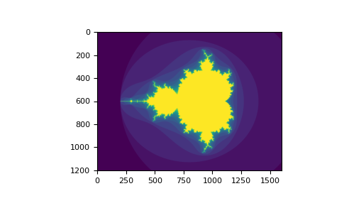
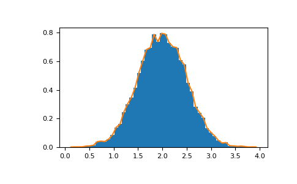

> copy form for learn: https://numpy.com.cn/doc/stable/user/quickstart.html
# NumPy 快速入门

## 基础知识
NumPy 的主要对象是同构多维数组。它是一个元素（通常是数字）表，所有元素类型相同，并由非负整数元组索引。在 NumPy 中，维度称为轴。

例如，表示 3D 空间中点坐标的数组 [1, 2, 1] 只有一个轴。该轴包含 3 个元素，因此我们说它的长度为 3。在下图示例中，数组有两个轴。第一个轴的长度为 2，第二个轴的长度为 3。
```
[[1., 0., 0.],
 [0., 1., 2.]]
```
NumPy 的数组类称为 `ndarray`。它也称为别名 `array`。请注意，`numpy.array` 与标准 Python 库类 `array.array` 不同，后者只处理一维数组，功能较少。ndarray 对象更重要的属性是

- ndarray.ndim
  
  数组的轴（维度）数。

- ndarray.shape
  
  数组的维度。这是一个整数元组，指示数组在每个维度上的大小。对于具有 *n* 行和 *m* 列的矩阵，shape 将为 (n,m)。shape 元组的长度因此是轴数，ndim。

- ndarray.size
  
  数组的元素总数。这等于 shape 元素的乘积。

- ndarray.dtype
  
  描述数组中元素类型的对象。可以使用标准 Python 类型创建或指定 dtype。此外，NumPy 还提供它自己的类型。`numpy.int32`、`numpy.int16` 和 `numpy.float64` 就是一些例子。

- ndarray.itemsize
  
  数组中每个元素的大小（以`字节`为单位）。例如，类型为 float64 的元素数组具有 itemsize 8 (=64/8)，而类型为 complex32 的元素数组具有 itemsize 4 (=32/8)。它等效于 ndarray.dtype.itemsize。

- ndarray.data
  
  包含数组实际元素的缓冲区。通常，我们不需要使用此属性，因为我们将使用索引功能访问数组中的元素。

## 一个例子
```python
import numpy as np
a = np.arange(15).reshape(3, 5)
a
array([[ 0,  1,  2,  3,  4],
       [ 5,  6,  7,  8,  9],
       [10, 11, 12, 13, 14]])
a.shape
(3, 5)
a.ndim
2
a.dtype.name
'int64'
a.itemsize
8
a.size
15
type(a)
<class 'numpy.ndarray'>
b = np.array([6, 7, 8])
b
array([6, 7, 8])
type(b)
<class 'numpy.ndarray'>
```

## 数组创建

有几种方法可以创建数组。

例如，您可以使用 array 函数`从常规 Python 列表或元组创建数组`。生成的数组的类型是从序列中元素的类型推断出来的。
```python
import numpy as np
a = np.array([2, 3, 4])
a
array([2, 3, 4])
a.dtype
dtype('int64')
b = np.array([1.2, 3.5, 5.1])
b.dtype
dtype('float64')
```

一个常见的错误是使用多个参数调用 array，而不是提供单个序列作为参数。
```python
a = np.array(1, 2, 3, 4)    # WRONG
Traceback (most recent call last):
  ...
TypeError: array() takes from 1 to 2 positional arguments but 4 were given
a = np.array([1, 2, 3, 4])  # RIGHT
```

array 将序列的序列转换为二维数组，将序列的序列的序列转换为三维数组，依此类推。
```python
b = np.array([(1.5, 2, 3), (4, 5, 6)])
b
array([[1.5, 2. , 3. ],
       [4. , 5. , 6. ]])
```
数组的类型也可以在创建时显式指定
```python
c = np.array([[1, 2], [3, 4]], dtype=complex)
c
array([[1.+0.j, 2.+0.j],
       [3.+0.j, 4.+0.j]])
```
通常，数组的元素最初是未知的，但其大小是已知的。因此，`NumPy 提供了几个函数来创建具有初始占位符内容的数组`。这些函数最大限度地减少了增长数组（一项昂贵的操作）的必要性。

`zeros` 函数创建一个全为零的数组，`ones` 函数创建一个全为一的数组，`empty` 函数创建一个其初始内容为随机且取决于内存状态的数组。默认情况下，创建的数组的 `dtype` 为 `float64`，但可以通过关键字参数 `dtype` 指定。
```python
np.zeros((3, 4))
array([[0., 0., 0., 0.],
       [0., 0., 0., 0.],
       [0., 0., 0., 0.]])
np.ones((2, 3, 4), dtype=np.int16)
array([[[1, 1, 1, 1],
        [1, 1, 1, 1],
        [1, 1, 1, 1]],

       [[1, 1, 1, 1],
        [1, 1, 1, 1],
        [1, 1, 1, 1]]], dtype=int16)
np.empty((2, 3)) 
array([[3.73603959e-262, 6.02658058e-154, 6.55490914e-260],  # may vary
       [5.30498948e-313, 3.14673309e-307, 1.00000000e+000]])
```

要创建数字序列，NumPy 提供了 `arange` 函数，它类似于 Python 内置的 `range`，但返回一个数组。

```python
np.arange(10, 30, 5)
array([10, 15, 20, 25])
np.arange(0, 2, 0.3)  # it accepts float arguments
array([0. , 0.3, 0.6, 0.9, 1.2, 1.5, 1.8])
```
当 `arange` 用于浮点参数时，由于浮点精度有限，通常无法预测获得的元素数量。因此，通常最好使用 `linspace` 函数，该函数接收我们想要的元素数量作为参数，而不是步长。

```python
from numpy import pi
np.linspace(0, 2, 9)                   # 9 numbers from 0 to 2
array([0.  , 0.25, 0.5 , 0.75, 1.  , 1.25, 1.5 , 1.75, 2.  ])
x = np.linspace(0, 2 * pi, 100)        # useful to evaluate function at lots of points
f = np.sin(x)
```

> 另请参阅
> 
> `array`，`zeros`，`zeros_like`，`ones`，`ones_like`，`empty`，`empty_like`，`arange`，`linspace`，`random.Generator.random`，`random.Generator.normal`，`fromfunction`，`fromfile`

## 打印数组

打印数组时，NumPy 会以类似于嵌套列表的方式显示它，但具有以下布局

- `最后一个轴从左到右打印`，
- `倒数第二个轴从上到下打印`，
- `其余轴也从上到下打印，每个切片用空行与下一个切片隔开`。

因此，一维数组打印为行，二维数组打印为矩阵，三维数组打印为矩阵列表。
```python
a = np.arange(6)                    # 1d array
print(a)
[0 1 2 3 4 5]

b = np.arange(12).reshape(4, 3)     # 2d array
print(b)
[[ 0  1  2]
 [ 3  4  5]
 [ 6  7  8]
 [ 9 10 11]]

c = np.arange(24).reshape(2, 3, 4)  # 3d array
print(c)
[[[ 0  1  2  3]
  [ 4  5  6  7]
  [ 8  9 10 11]]

 [[12 13 14 15]
  [16 17 18 19]
  [20 21 22 23]]]
```
参见 下方 获取关于 `reshape` 的更多细节。

如果数组太大而无法打印，NumPy 会自动跳过数组的中间部分，只打印角部。

```python
print(np.arange(10000))
[   0    1    2 ... 9997 9998 9999]

print(np.arange(10000).reshape(100, 100))
[[   0    1    2 ...   97   98   99]
 [ 100  101  102 ...  197  198  199]
 [ 200  201  202 ...  297  298  299]
 ...
 [9700 9701 9702 ... 9797 9798 9799]
 [9800 9801 9802 ... 9897 9898 9899]
 [9900 9901 9902 ... 9997 9998 9999]]
```
要禁用此行为并强制 NumPy 打印整个数组，您可以使用 `set_printoptions` 更改打印选项。

```python
np.set_printoptions(threshold=sys.maxsize)  # sys module should be imported
```

## 基本运算
`数组上的算术运算符是逐元素运算的`。`会创建一个新的数组并用结果填充`。
```python
a = np.array([20, 30, 40, 50])
b = np.arange(4)
b
array([0, 1, 2, 3])
c = a - b
c
array([20, 29, 38, 47])
b**2
array([0, 1, 4, 9])
10 * np.sin(a)
array([ 9.12945251, -9.88031624,  7.4511316 , -2.62374854])
a < 35
array([ True,  True, False, False])
```
与许多矩阵语言不同，在 NumPy 数组中，乘法运算符 `*` 是逐元素运算的。可以使用 `@ `运算符（在 Python >=3.5 中）或 `dot` 函数或方法执行矩阵乘积。
```python
A = np.array([[1, 1],
              [0, 1]])
B = np.array([[2, 0],
              [3, 4]])
A * B     # elementwise product
array([[2, 0],
       [0, 4]])
A @ B     # matrix product
array([[5, 4],
       [3, 4]])
A.dot(B)  # another matrix product
array([[5, 4],
       [3, 4]])
```
某些运算，例如 `+=` 和 `*=`，会就地**修改现有数组，而不是创建新数组**。

```python
rg = np.random.default_rng(1)  # create instance of default random number generator
a = np.ones((2, 3), dtype=int)
b = rg.random((2, 3))
a *= 3
a
array([[3, 3, 3],
       [3, 3, 3]])
b += a
b
array([[3.51182162, 3.9504637 , 3.14415961],
       [3.94864945, 3.31183145, 3.42332645]])
a += b  # b is not automatically converted to integer type
Traceback (most recent call last):
    ...
numpy._core._exceptions._UFuncOutputCastingError: Cannot cast ufunc 'add' output from dtype('float64') to dtype('int64') with casting rule 'same_kind'
```
`当使用不同类型的数组进行运算时，结果数组的类型将对应于更通用或更精确的类型（这种行为称为向上转换）`。
```python
a = np.ones(3, dtype=np.int32)
b = np.linspace(0, pi, 3)
b.dtype.name
'float64'
c = a + b
c
array([1.        , 2.57079633, 4.14159265])
c.dtype.name
'float64'
d = np.exp(c * 1j)
d
array([ 0.54030231+0.84147098j, -0.84147098+0.54030231j,
       -0.54030231-0.84147098j])
d.dtype.name
'complex128'
```
`许多一元运算，例如计算数组中所有元素的总和，都作为 ndarray 类的成员方法实现`。
```python
a = rg.random((2, 3))
a
array([[0.82770259, 0.40919914, 0.54959369],
       [0.02755911, 0.75351311, 0.53814331]])
a.sum()
3.1057109529998157
a.min()
0.027559113243068367
a.max()
0.8277025938204418
```
默认情况下，这些运算会应用于数组，就好像它是一个数字列表一样，而不管其形状如何。但是，通过指定 `axis` 参数，您可以沿着数组的指定轴应用运算。
```python
b = np.arange(12).reshape(3, 4)
b
array([[ 0,  1,  2,  3],
       [ 4,  5,  6,  7],
       [ 8,  9, 10, 11]])

b.sum(axis=0)     # sum of each column
array([12, 15, 18, 21])

b.min(axis=1)     # min of each row
array([0, 4, 8])

b.cumsum(axis=1)  # cumulative sum along each row
array([[ 0,  1,  3,  6],
       [ 4,  9, 15, 22],
       [ 8, 17, 27, 38]])
```

## 通用函数
NumPy 提供了熟悉的数学函数，例如 `sin`、`cos` 和 `exp`。在 NumPy 中，这些被称为“通用函数”（`ufunc`）。在 NumPy 中，这些函数对数组进行逐元素运算，产生数组作为输出。
```python
B = np.arange(3)
B
array([0, 1, 2])
np.exp(B)
array([1.        , 2.71828183, 7.3890561 ])
np.sqrt(B)
array([0.        , 1.        , 1.41421356])
C = np.array([2., -1., 4.])
np.add(B, C)
array([2., 0., 6.])
```

> 另请参阅
> 
> `all`，`any`，`apply_along_axis`，`argmax`，`argmin`，`argsort`，`average`，`bincount`，`ceil`，`clip`，`conj`，`corrcoef`，`cov`，`cross`，`cumprod`，`cumsum`，`diff`，`dot`，`floor`，`inner`，`invert`，`lexsort`，`max`，`maximum`，`mean`，`median`，`min`，`minimum`，`nonzero`，`outer`，`prod`，`re`，`round`，`sort`，`std`，`sum`，`trace`，`transpose`，`var`，`vdot`，`vectorize`，`where`

## 索引、切片和迭代

一维数组可以像 列表 和其他 Python 序列一样进行索引、切片和迭代。
```python
a = np.arange(10)**3
a
array([  0,   1,   8,  27,  64, 125, 216, 343, 512, 729])
a[2]
8
a[2:5]
array([ 8, 27, 64])
# equivalent to a[0:6:2] = 1000;
# from start to position 6, exclusive, set every 2nd element to 1000
a[:6:2] = 1000
a
array([1000,    1, 1000,   27, 1000,  125,  216,  343,  512,  729])
a[::-1]  # reversed a
array([ 729,  512,  343,  216,  125, 1000,   27, 1000,    1, 1000])
for i in a:
    print(i**(1 / 3.))

9.999999999999998  # may vary
1.0
9.999999999999998
3.0
9.999999999999998
4.999999999999999
5.999999999999999
6.999999999999999
7.999999999999999
8.999999999999998
```
多维数组每个轴可以有一个索引。这些索引以逗号分隔的元组形式给出。
```python
def f(x, y):
    return 10 * x + y

b = np.fromfunction(f, (5, 4), dtype=int)
b
array([[ 0,  1,  2,  3],
       [10, 11, 12, 13],
       [20, 21, 22, 23],
       [30, 31, 32, 33],
       [40, 41, 42, 43]])
b[2, 3]
23
b[0:5, 1]  # each row in the second column of b
array([ 1, 11, 21, 31, 41])
b[:, 1]    # equivalent to the previous example
array([ 1, 11, 21, 31, 41])
b[1:3, :]  # each column in the second and third row of b
array([[10, 11, 12, 13],
       [20, 21, 22, 23]])
```
当提供的索引少于轴的数量时，缺失的索引被认为是完整的切片:。
```python
b[-1]   # the last row. Equivalent to b[-1, :]
array([40, 41, 42, 43])
```
`b[i]` 中方括号内的表达式被视为一个 i，后面跟着尽可能多的 `:` 实例，以表示剩余的轴。NumPy 也允许您使用点将其写为 `b[i, ...]`。

点（`...`）表示产生完整索引元组所需的尽可能多的冒号。例如，如果 x 是一个具有 5 个轴的数组，则

- `x[1, 2, ...]` 等效于 `x[1, 2, :, :, :]`，
- `x[..., 3]` 等效于 `x[:, :, :, :, 3]`，以及
- `x[4, ..., 5, :]` 等效于 `x[4, :, :, 5, :]`。
```python
c = np.array([[[  0,  1,  2],  # a 3D array (two stacked 2D arrays)
               [ 10, 12, 13]],
              [[100, 101, 102],
               [110, 112, 113]]])
c.shape
(2, 2, 3)
c[1, ...]  # same as c[1, :, :] or c[1]
array([[100, 101, 102],
       [110, 112, 113]])
c[..., 2]  # same as c[:, :, 2]
array([[  2,  13],
       [102, 113]])
```
迭代多维数组是针对第一个轴进行的。
```python
for row in b:
    print(row)

[0 1 2 3]
[10 11 12 13]
[20 21 22 23]
[30 31 32 33]
[40 41 42 43]
```
但是，如果想要对数组中的每个元素执行操作，可以使用 `flat` 属性，它是一个迭代数组所有元素的 迭代器。
```python
for element in b.flat:
    print(element)

0
1
2
3
10
11
12
13
20
21
22
23
30
31
32
33
40
41
42
43
```
> 另请参阅
> 
> ndarray 的索引，索引例程（参考），`newaxis`，`ndenumerate`，`indices`

## 形状操作

### 更改数组的形状

数组的形状由沿每个轴的元素个数决定。
```python
a = np.floor(10 * rg.random((3, 4)))
a
array([[3., 7., 3., 4.],
       [1., 4., 2., 2.],
       [7., 2., 4., 9.]])
a.shape
(3, 4)
```
可以使用各种命令更改数组的形状。`请注意，以下三个命令都返回一个修改后的数组，但不更改原始数组`。
```python
a.ravel()  # returns the array, flattened
array([3., 7., 3., 4., 1., 4., 2., 2., 7., 2., 4., 9.])
a.reshape(6, 2)  # returns the array with a modified shape
array([[3., 7.],
       [3., 4.],
       [1., 4.],
       [2., 2.],
       [7., 2.],
       [4., 9.]])
a.T  # returns the array, transposed
array([[3., 1., 7.],
       [7., 4., 2.],
       [3., 2., 4.],
       [4., 2., 9.]])
a.T.shape
(4, 3)
a.shape
(3, 4)
```
由 `ravel` 函数生成的数组元素顺序通常为“C 风格”，即最右边的索引“变化最快”，因此 `a[0, 0]` 后面的元素是 `a[0, 1]`。如果数组被重塑为其他形状，则数组仍被视为“C 风格”。NumPy 通常创建按此顺序存储的数组，因此 `ravel` 通常不需要复制其参数，但是如果数组是通过获取另一个数组的切片或使用不寻常的选项创建的，则可能需要复制。 `ravel` 和 `reshape` 函数也可以使用可选参数来指示使用 `FORTRAN` 风格的数组，其中最左边的索引变化最快。

`reshape` 函数返回其参数，但形状已修改，而 `ndarray.resize` 方法修改数组本身。

```python
a
array([[3., 7., 3., 4.],
       [1., 4., 2., 2.],
       [7., 2., 4., 9.]])
a.resize((2, 6))
a
array([[3., 7., 3., 4., 1., 4.],
       [2., 2., 7., 2., 4., 9.]])
```

如果在重塑操作中将维度指定为 `-1`，则会自动计算其他维度。
```python
a.reshape(3, -1)
array([[3., 7., 3., 4.],
       [1., 4., 2., 2.],
       [7., 2., 4., 9.]])
```

> 另请参阅
> `ndarray.shape`，`reshape`，`resize`，`ravel`

### 将不同的数组堆叠在一起

可以沿不同的轴将多个数组堆叠在一起。

```python
a = np.floor(10 * rg.random((2, 2)))
a
array([[9., 7.],
       [5., 2.]])
b = np.floor(10 * rg.random((2, 2)))
b
array([[1., 9.],
       [5., 1.]])
np.vstack((a, b))
array([[9., 7.],
       [5., 2.],
       [1., 9.],
       [5., 1.]])
np.hstack((a, b))
array([[9., 7., 1., 9.],
       [5., 2., 5., 1.]])
```
`column_stack` 函数将一维数组作为列堆叠到二维数组中。对于二维数组，它等效于 `hstack`。
```python
from numpy import newaxis
np.column_stack((a, b))  # with 2D arrays
array([[9., 7., 1., 9.],
       [5., 2., 5., 1.]])
a = np.array([4., 2.])
b = np.array([3., 8.])
np.column_stack((a, b))  # returns a 2D array
array([[4., 3.],
       [2., 8.]])
np.hstack((a, b))        # the result is different
array([4., 2., 3., 8.])
a[:, newaxis]  # view `a` as a 2D column vector
array([[4.],
       [2.]])
np.column_stack((a[:, newaxis], b[:, newaxis]))
array([[4., 3.],
       [2., 8.]])
np.hstack((a[:, newaxis], b[:, newaxis]))  # the result is the same
array([[4., 3.],
       [2., 8.]])
```
一般来说，对于具有三个或更多维度的数组，`hstack` 沿其第二轴堆叠，`vstack` 沿其第一轴堆叠，而 `concatenate` 允许使用可选参数指定应沿其进行连接的轴的编号。

注意

在复杂情况下，`r_` 和 `c_` 可用于通过沿一个轴堆叠数字来创建数组。它们允许使用范围文字 `:`。
```python
np.r_[1:4, 0, 4]
array([1, 2, 3, 0, 4])
```
当使用数组作为参数时，`r_` 和 `c_` 在其默认行为上类似于 `vstack` 和 `hstack`，但允许使用可选参数指定要沿其连接的轴的编号。

> 另请参阅
> 
> `hstack`，`vstack`，`column_stack`，`concatenate`，`c_`，`r_`

### 将一个数组分割成几个较小的数组
使用 `hsplit`，您可以沿水平轴分割数组，方法是指定要返回的形状相同的数组数量，或者指定应进行分割的列。
```python
a = np.floor(10 * rg.random((2, 12)))
a
array([[6., 7., 6., 9., 0., 5., 4., 0., 6., 8., 5., 2.],
       [8., 5., 5., 7., 1., 8., 6., 7., 1., 8., 1., 0.]])
# Split `a` into 3
np.hsplit(a, 3)
[array([[6., 7., 6., 9.],
       [8., 5., 5., 7.]]), array([[0., 5., 4., 0.],
       [1., 8., 6., 7.]]), array([[6., 8., 5., 2.],
       [1., 8., 1., 0.]])]
# Split `a` after the third and the fourth column
np.hsplit(a, (3, 4))
[array([[6., 7., 6.],
       [8., 5., 5.]]), array([[9.],
       [7.]]), array([[0., 5., 4., 0., 6., 8., 5., 2.],
       [1., 8., 6., 7., 1., 8., 1., 0.]])]
```
`vsplit` 沿垂直轴分割，而 `array_split` 允许指定沿哪个轴分割。

## 副本和视图
在操作和处理数组时，其数据有时会被复制到新数组中，有时不会。这通常是初学者困惑的根源。共有三种情况。

### 根本没有复制
简单的赋值不会复制对象或其数据。
```python
a = np.array([[ 0,  1,  2,  3],
              [ 4,  5,  6,  7],
              [ 8,  9, 10, 11]])
b = a            # no new object is created
b is a           # a and b are two names for the same ndarray object
True
```
Python 将可变对象作为引用传递，因此函数调用不会进行复制。
```python
def f(x):
    print(id(x))

id(a)  # id is a unique identifier of an object 
148293216  # may vary
f(a)   
148293216  # may vary
```

### 视图或浅层复制

不同的数组对象可以共享相同的数据。 `view` 方法创建一个查看相同数据的新数组对象。

```python
c = a.view()
c is a
False
c.base is a            # c is a view of the data owned by a
True
c.flags.owndata
False

c = c.reshape((2, 6))  # a's shape doesn't change, reassigned c is still a view of a
a.shape
(3, 4)
c[0, 4] = 1234         # a's data changes
a
array([[   0,    1,    2,    3],
       [1234,    5,    6,    7],
       [   8,    9,   10,   11]])
```
数组切片返回其视图。

```python
s = a[:, 1:3]
s[:] = 10  # s[:] is a view of s. Note the difference between s = 10 and s[:] = 10
a
array([[   0,   10,   10,    3],
       [1234,   10,   10,    7],
       [   8,   10,   10,   11]])
```
### 深层复制

copy 方法会完整复制数组及其数据。
```python
d = a.copy()  # a new array object with new data is created
d is a
False
d.base is a  # d doesn't share anything with a
False
d[0, 0] = 9999
a
array([[   0,   10,   10,    3],
       [1234,   10,   10,    7],
       [   8,   10,   10,   11]])
```
如果不再需要原始数组，则有时应在切片后调用 copy。例如，假设 a 是一个巨大的中间结果，而最终结果 b 只包含 a 的一小部分，则在使用切片构造 b 时应进行深层复制。
```python
a = np.arange(int(1e8))
b = a[:100].copy()
del a  # the memory of ``a`` can be released.
```
如果使用 `b = a[:100]`，则 a 将被 b 引用，即使执行 del a，它也会保留在内存中。

另请参见 Copies and views。

## 函数和方法概述
这是一个按类别排序的一些有用的 NumPy 函数和方法名称列表。有关完整列表，请参见 Routines and objects by topic。

### 数组创建
- `arange`
- `array`
- `copy`
- `empty`
- `empty_like`
- `eye`
- `fromfile`
- `fromfunction`
- `identity`
- `linspace`
- `logspace`
- `mgrid`
- `ogrid`
- `ones`
- `ones_lik`
- `r_`
- `zeros`
- `zeros_like`

### 转换
- `ndarray.astype`
- `atleast_1d`
- `atleast_2d`
- `atleast_3d`
- `mat`

### 数组操作
- `array_split`
- `column_stack`
- `concatenate`
- `diagonal`
- `dsplit`
- `dstack`
- `hsplit`
- `hstack`
- `ndarray.item`
- `newaxis`
- `ravel`
- `repeat`
- `reshape`
- `resize`
- `squeeze`
- `swapaxes`
- `take`
- `transpose`
- `vsplit`
- `vstack`

### 条件判断
- `all`
- `any`
- `nonzero`
- `where`

### 排序
- `argmax`
- `argmin`
- `argsort`
- `max`
- `min`
- `ptp`
- `searchsorted`
- `sort`

### 数组运算
- `choose`
- `compress`
- `cumprod`
- `cumsum`
- `inner`
- `ndarray.fill`
- `imag`
- `prod`
- `put`
- `putmask`
- `real`
- `sum`

### 基本统计
- `cov`
- `mean`
- `std`
- `var`

### 基本线性代数
- `cross`
- `dot`
- `outer`
- `linalg.svd`
- `vdot`

## 进阶

### 广播规则
广播允许通用函数以有意义的方式处理形状不完全相同的输入。
- 广播的第一个规则是：如果所有输入数组的维数不同，则会在较小数组的形状前重复添加“1”，直到所有数组具有相同的维数。
- 广播的第二个规则确保沿特定维度大小为 1 的数组的行为如同它们沿该维度具有最大形状数组的大小。对于“广播”数组，假定数组元素的值沿该维度相同。

应用广播规则后，所有数组的大小必须匹配。更多细节可在广播中找到。

## 高级索引和索引技巧
NumPy 提供比常规 Python 序列更丰富的索引功能。除了我们之前看到的整数和切片索引外，还可以`使用整数数组和布尔数组对数组进行索引`。

### 使用索引数组
```python
a = np.arange(12)**2  # the first 12 square numbers
i = np.array([1, 1, 3, 8, 5])  # an array of indices
a[i]  # the elements of `a` at the positions `i`
array([ 1,  1,  9, 64, 25])

j = np.array([[3, 4], [9, 7]])  # a bidimensional array of indices
a[j]  # the same shape as `j`
array([[ 9, 16],
       [81, 49]])
```
当被索引的数组a是多维数组时，单个索引数组指的是a的第一维。以下示例通过使用调色板将标签图像转换为彩色图像来展示此行为。
```python
palette = np.array([[0, 0, 0],         # black
                    [255, 0, 0],       # red
                    [0, 255, 0],       # green
                    [0, 0, 255],       # blue
                    [255, 255, 255]])  # white
image = np.array([[0, 1, 2, 0],  # each value corresponds to a color in the palette
                  [0, 3, 4, 0]])
palette[image]  # the (2, 4, 3) color image
array([[[  0,   0,   0],
        [255,   0,   0],
        [  0, 255,   0],
        [  0,   0,   0]],

       [[  0,   0,   0],
        [  0,   0, 255],
        [255, 255, 255],
        [  0,   0,   0]]])
```
我们也可以为多个维度指定索引。每个维度的索引数组必须具有相同的形状。
```python
a = np.arange(12).reshape(3, 4)
a
array([[ 0,  1,  2,  3],
       [ 4,  5,  6,  7],
       [ 8,  9, 10, 11]])
i = np.array([[0, 1],  # indices for the first dim of `a`
              [1, 2]])
j = np.array([[2, 1],  # indices for the second dim
              [3, 3]])

a[i, j]  # i and j must have equal shape
array([[ 2,  5],
       [ 7, 11]])

a[i, 2]
array([[ 2,  6],
       [ 6, 10]])

a[:, j]
array([[[ 2,  1],
        [ 3,  3]],

       [[ 6,  5],
        [ 7,  7]],

       [[10,  9],
        [11, 11]]])
```

在 Python 中，`arr[i, j]` 与 `arr[(i, j)]` 完全相同——因此我们可以将 i 和 j 放入一个 tuple 中，然后使用它进行索引。

```python
l = (i, j)
# equivalent to a[i, j]
a[l]
array([[ 2,  5],
       [ 7, 11]])
```
但是，我们不能通过将 i 和 j 放入数组中来做到这一点，因为该数组将被解释为对 a 的第一维进行索引。
```python
s = np.array([i, j])
# not what we want
a[s]
Traceback (most recent call last):
  File "<stdin>", line 1, in <module>
IndexError: index 3 is out of bounds for axis 0 with size 3
# same as `a[i, j]`
a[tuple(s)]
array([[ 2,  5],
       [ 7, 11]])
```

使用索引数组的另一个常见用途是搜索时间序列的最大值。

```python
time = np.linspace(20, 145, 5)  # time scale
data = np.sin(np.arange(20)).reshape(5, 4)  # 4 time-dependent series
time
array([ 20.  ,  51.25,  82.5 , 113.75, 145.  ])
data
array([[ 0.        ,  0.84147098,  0.90929743,  0.14112001],
       [-0.7568025 , -0.95892427, -0.2794155 ,  0.6569866 ],
       [ 0.98935825,  0.41211849, -0.54402111, -0.99999021],
       [-0.53657292,  0.42016704,  0.99060736,  0.65028784],
       [-0.28790332, -0.96139749, -0.75098725,  0.14987721]])
# index of the maxima for each series
ind = data.argmax(axis=0)
ind
array([2, 0, 3, 1])
# times corresponding to the maxima
time_max = time[ind]

data_max = data[ind, range(data.shape[1])]  # => data[ind[0], 0], data[ind[1], 1]...
time_max
array([ 82.5 ,  20.  , 113.75,  51.25])
data_max
array([0.98935825, 0.84147098, 0.99060736, 0.6569866 ])
np.all(data_max == data.max(axis=0))
True
```
您也可以使用索引数组作为目标进行赋值。
```python
a = np.arange(5)
a
array([0, 1, 2, 3, 4])
a[[1, 3, 4]] = 0
a
array([0, 0, 2, 0, 0])
```
但是，当索引列表包含重复项时，赋值会执行多次，留下最后一个值。
```python
a = np.arange(5)
a[[0, 0, 2]] = [1, 2, 3]
a
array([2, 1, 3, 3, 4])
```
这足够合理，但是如果您想使用 Python 的 `+=` 结构，请注意它可能无法按预期工作。
```python
a = np.arange(5)
a[[0, 0, 2]] += 1
a
array([1, 1, 3, 3, 4])
```
即使索引列表中 0 出现两次，第 0 个元素也只递增一次。这是因为 Python 要求 `a += 1` 等效于 `a = a + 1`。

### 使用布尔数组索引
当我们使用（整数）索引数组对数组进行索引时，我们提供的是要选择的索引列表。使用布尔索引的方法有所不同；我们明确地选择数组中我们想要哪些项，以及哪些项我们不想要。

人们想到的最自然的布尔索引方法是使用与原始数组具有相同形状的布尔数组。
```python
a = np.arange(12).reshape(3, 4)
b = a > 4
b  # `b` is a boolean with `a`'s shape
array([[False, False, False, False],
       [False,  True,  True,  True],
       [ True,  True,  True,  True]])
a[b]  # 1d array with the selected elements
array([ 5,  6,  7,  8,  9, 10, 11])
```
此属性在赋值中非常有用。
```python
a[b] = 0  # All elements of `a` higher than 4 become 0
a
array([[0, 1, 2, 3],
       [4, 0, 0, 0],
       [0, 0, 0, 0]])
```
您可以查看以下示例，了解如何使用布尔索引生成曼德勃罗集的图像。
```python
import numpy as np
import matplotlib.pyplot as plt
def mandelbrot(h, w, maxit=20, r=2):
    """Returns an image of the Mandelbrot fractal of size (h,w)."""
    x = np.linspace(-2.5, 1.5, 4*h+1)
    y = np.linspace(-1.5, 1.5, 3*w+1)
    A, B = np.meshgrid(x, y)
    C = A + B*1j
    z = np.zeros_like(C)
    divtime = maxit + np.zeros(z.shape, dtype=int)

    for i in range(maxit):
        z = z**2 + C
        diverge = abs(z) > r                    # who is diverging
        div_now = diverge & (divtime == maxit)  # who is diverging now
        divtime[div_now] = i                    # note when
        z[diverge] = r                          # avoid diverging too much

    return divtime
plt.clf()
plt.imshow(mandelbrot(400, 400))
```


第二种使用布尔值进行索引的方法更类似于整数索引；对于数组的每个维度，我们提供一个一维布尔数组来选择我们想要的切片。
```python
a = np.arange(12).reshape(3, 4)
b1 = np.array([False, True, True])         # first dim selection
b2 = np.array([True, False, True, False])  # second dim selection

a[b1, :]                                   # selecting rows
array([[ 4,  5,  6,  7],
       [ 8,  9, 10, 11]])

a[b1]                                      # same thing
array([[ 4,  5,  6,  7],
       [ 8,  9, 10, 11]])

a[:, b2]                                   # selecting columns
array([[ 0,  2],
       [ 4,  6],
       [ 8, 10]])

a[b1, b2]                                  # a weird thing to do
array([ 4, 10])
```
请注意，一维布尔数组的长度必须与您要切片的维度（或轴）的长度一致。在前面的示例中，b1的长度为3（a中的行数），而b2（长度为4）适合索引a的第二个轴（列）。

### `ix_()` 函数
`ix_`函数可用于组合不同的向量，以便获得每个n元组的结果。例如，如果您想计算所有从向量a、b和c中取出的三元组的所有a+b*c。
```python
a = np.array([2, 3, 4, 5])
b = np.array([8, 5, 4])
c = np.array([5, 4, 6, 8, 3])
ax, bx, cx = np.ix_(a, b, c)
ax
array([[[2]],

       [[3]],

       [[4]],

       [[5]]])
bx
array([[[8],
        [5],
        [4]]])
cx
array([[[5, 4, 6, 8, 3]]])
ax.shape, bx.shape, cx.shape
((4, 1, 1), (1, 3, 1), (1, 1, 5))
result = ax + bx * cx
result
array([[[42, 34, 50, 66, 26],
        [27, 22, 32, 42, 17],
        [22, 18, 26, 34, 14]],

       [[43, 35, 51, 67, 27],
        [28, 23, 33, 43, 18],
        [23, 19, 27, 35, 15]],

       [[44, 36, 52, 68, 28],
        [29, 24, 34, 44, 19],
        [24, 20, 28, 36, 16]],

       [[45, 37, 53, 69, 29],
        [30, 25, 35, 45, 20],
        [25, 21, 29, 37, 17]]])
result[3, 2, 4]
17
a[3] + b[2] * c[4]
17
```
您还可以按如下方式实现reduce：
```python
def ufunc_reduce(ufct, *vectors):
   vs = np.ix_(*vectors)
   r = ufct.identity
   for v in vs:
       r = ufct(r, v)
   return r
```
然后将其用作：
```python
ufunc_reduce(np.add, a, b, c)
array([[[15, 14, 16, 18, 13],
        [12, 11, 13, 15, 10],
        [11, 10, 12, 14,  9]],

       [[16, 15, 17, 19, 14],
        [13, 12, 14, 16, 11],
        [12, 11, 13, 15, 10]],

       [[17, 16, 18, 20, 15],
        [14, 13, 15, 17, 12],
        [13, 12, 14, 16, 11]],

       [[18, 17, 19, 21, 16],
        [15, 14, 16, 18, 13],
        [14, 13, 15, 17, 12]]])
```
与普通的ufunc.reduce相比，此版本的reduce的优点是它利用了广播规则，以避免创建大小为输出大小乘以向量数量的实参数组。

### 使用字符串索引
参见结构化数组。

## 技巧和提示
这里我们列出一些简短且有用的技巧。

### “自动”重塑
要更改数组的维度，您可以省略其中一个大小，然后会自动推断出来。
```python
a = np.arange(30)
b = a.reshape((2, -1, 3))  # -1 means "whatever is needed"
b.shape
(2, 5, 3)
b
array([[[ 0,  1,  2],
        [ 3,  4,  5],
        [ 6,  7,  8],
        [ 9, 10, 11],
        [12, 13, 14]],

       [[15, 16, 17],
        [18, 19, 20],
        [21, 22, 23],
        [24, 25, 26],
        [27, 28, 29]]])
```
### 向量堆叠
我们如何从一系列大小相等的行向量构造一个二维数组？在MATLAB中，这很容易：如果x和y是两个长度相同的向量，您只需要执行`m=[x;y]`。在NumPy中，这可以通过`column_stack`、`dstack`、`hstack`和`vstack`函数实现，具体取决于要进行堆叠的维度。例如：
```python
x = np.arange(0, 10, 2)
y = np.arange(5)
m = np.vstack([x, y])
m
array([[0, 2, 4, 6, 8],
       [0, 1, 2, 3, 4]])
xy = np.hstack([x, y])
xy
array([0, 2, 4, 6, 8, 0, 1, 2, 3, 4])
```
在两个以上维度中，这些函数背后的逻辑可能很奇怪。

> 另请参阅
> 
> 面向 MATLAB 用户的 NumPy

### 直方图
应用于数组的NumPy `histogram`函数返回一对向量：数组的直方图和箱边界的向量。注意：matplotlib也有一个用于构建直方图的函数（称为hist，如在Matlab中），它与NumPy中的函数不同。主要区别在于`pylab.hist`会自动绘制直方图，而`numpy.histogram`仅生成数据。
```python
import numpy as np
rg = np.random.default_rng(1)
import matplotlib.pyplot as plt
# Build a vector of 10000 normal deviates with variance 0.5^2 and mean 2
mu, sigma = 2, 0.5
v = rg.normal(mu, sigma, 10000)
# Plot a normalized histogram with 50 bins
plt.hist(v, bins=50, density=True)       # matplotlib version (plot)
(array...)
# Compute the histogram with numpy and then plot it
(n, bins) = np.histogram(v, bins=50, density=True)  # NumPy version (no plot)
plt.plot(.5 * (bins[1:] + bins[:-1]), n)
```



使用Matplotlib >=3.4，您还可以使用`plt.stairs(n, bins)`。