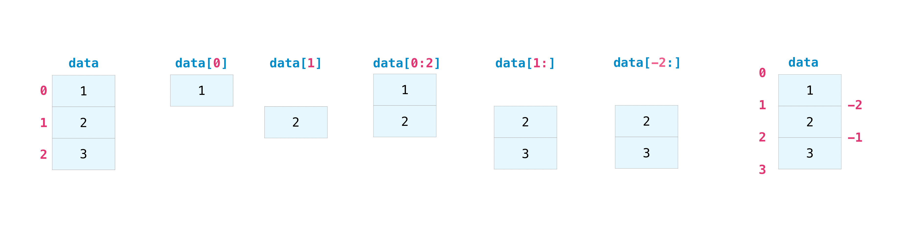
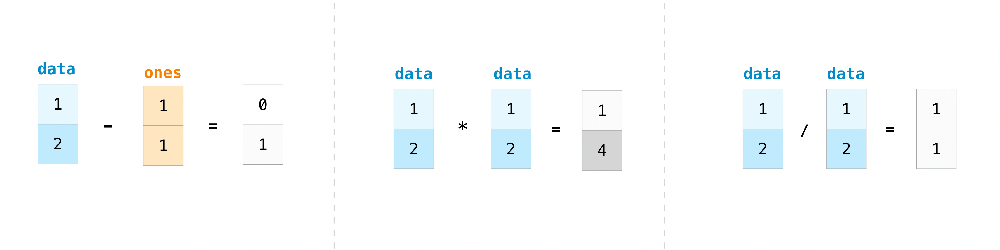
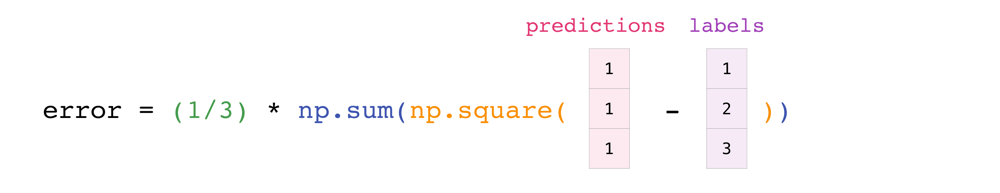
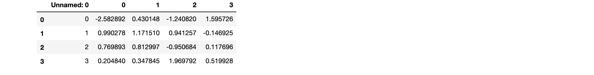
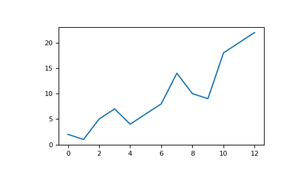
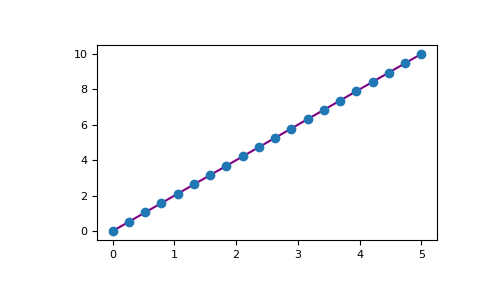
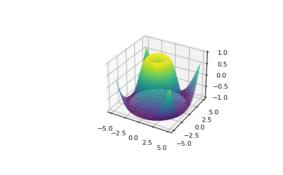

> copy from for learn: https://numpy.com.cn/doc/stable/user/absolute_beginners.html

# NumPy：绝对初学者指南

NumPy（**Numerical Python**）是一个广泛用于科学和工程领域的开源 Python 库。NumPy 库包含多维数组数据结构，例如同构的 N 维ndarray，以及大量高效操作这些数据结构的函数。在什么是 NumPy中了解更多关于 NumPy 的信息，如果您有任何意见或建议，请联系我们！

## 如何导入 NumPy
在安装 NumPy之后，可以像这样将其导入 Python 代码中：
```python
import numpy as np
```
这种广泛采用的约定允许使用简短易识别的前缀（`np.`）访问 NumPy 功能，同时区分 NumPy 功能和其他具有相同名称的功能。

## 阅读示例代码
在 NumPy 文档中，您会发现如下所示的代码块：
```python
a = np.array([[1, 2, 3],
              [4, 5, 6]])
a.shape
(2, 3)
```
以`>>>`或`...`开头的文本是**输入**，即您在脚本中或 Python 提示符下输入的代码。其余部分是**输出**，即运行代码的结果。请注意，`>>>`和`...`不是代码的一部分，如果在 Python 提示符下输入可能会导致错误。

## 为什么使用 NumPy？
Python 列表是很棒的通用容器。它们可以是“异构的”，这意味着它们可以包含各种类型的元素，并且在对少量元素执行单个操作时速度很快。

根据数据的特性和需要执行的操作类型，其他容器可能更合适；通过利用这些特性，我们可以提高速度，减少内存消耗，并提供用于执行各种常见处理任务的高级语法。当需要在 CPU 上处理大量“同构”（相同类型）数据时，NumPy 非常出色。

## 什么是“数组”？
在计算机编程中，数组是用于存储和检索数据的结构。我们经常将数组视为空间中的网格，每个单元格存储一个数据元素。例如，如果数据的每个元素都是一个数字，我们可以将“一维”数组可视化为一个列表：

| 1 | 5 | 2 | 0 |
|---|---|---|---|

二维数组就像一个表格：
| 1 | 5 | 2 | 0 |
|---|---|---|---|
| 8 | 3 | 6 | 1 |
| 1 | 7 | 2 | 9 |
 
三维数组就像一组表格，可能像打印在不同页面上一样堆叠在一起。在 NumPy 中，这个概念被推广到任意数量的维度，因此基本数组类被称为`ndarray`：它表示`“N 维数组”`。

大多数 NumPy 数组有一些限制。例如：
- 数组的所有元素必须是相同的数据类型。
- 创建后，数组的总大小不能更改。
- 形状必须是“矩形的”，而不是“参差不齐的”；例如，二维数组的每一行必须具有相同数量的列。

满足这些条件时，NumPy 会利用这些特性使数组比限制较少的更快的、更高效的内存以及更方便的数据结构。

在本文件的其余部分，我们将使用“数组”一词来指代ndarray的实例。

## 数组基础知识
初始化数组的一种方法是使用 Python 序列，例如列表。例如：
```python
a = np.array([1, 2, 3, 4, 5, 6])
a
array([1, 2, 3, 4, 5, 6])
```
可以各种方式访问数组的元素。例如，我们可以像访问原始列表中的元素一样访问此数组的单个元素：使用方括号中元素的整数索引。
```python
a[0]
1
```
> 注意
> 
> 与内置 Python 序列一样，NumPy 数组是“0 索引”的：第一个元素使用索引0访问，而不是1。

与原始列表一样，数组是可变的。
```python
a[0] = 10
a
array([10,  2,  3,  4,  5,  6])
```
与原始列表一样，可以使用 Python 切片表示法进行索引。

```python
a[:3]
array([10, 2, 3])
```

`一个主要区别是列表的切片索引会将元素复制到新列表中，但切片数组会返回一个_视图_`：一个引用原始数组中数据的对象。可以使用视图更改原始数组。
```python
b = a[3:]
b
array([4, 5, 6])
b[0] = 40
a
array([ 10,  2,  3, 40,  5,  6])
```
有关数组操作何时返回视图而不是副本的更全面解释，请参见副本和视图。

可以从嵌套的 Python 序列初始化二维和更高维数组：
```python
a = np.array([[1, 2, 3, 4], [5, 6, 7, 8], [9, 10, 11, 12]])
a
array([[ 1,  2,  3,  4],
       [ 5,  6,  7,  8],
       [ 9, 10, 11, 12]])

```
`在 NumPy 中，数组的维度有时被称为“轴”。此术语可能有助于区分数组的维度和数组表示的数据的维度。例如，数组a可以表示三个点，每个点位于四维空间内，但a只有两个“轴”`。

数组和列表列表之间的另一个区别是，可以通过在一个_单个_方括号中指定沿每个轴的索引来访问数组的元素，这些索引用逗号分隔。例如，元素8位于行1和列3：
```python
a[1, 3]
8
```
> 注意
> 
> 在数学中，通常的做法是首先使用行索引，然后使用列索引来引用矩阵的元素。对于二维数组来说，这是正确的，但是`更好的思维模型是将列索引视为_最后_一个，行索引视为_倒数第二个_。这可以推广到具有_任何_数量维度的数组`。
> 
> 您可能会听到 0 维 (零维) 数组被称为“标量”，1 维 (一维) 数组被称为“向量”，2 维 (二维) 数组被称为“矩阵”，或 N 维 (N 维，其中“N”通常是大于 2 的整数) 数组被称为“张量”。为清楚起见，最好避免在引用数组时使用数学术语，因为具有这些名称的数学对象的行为与数组不同（例如，“矩阵”乘法与“数组”乘法从根本上不同），并且科学 Python 生态系统中还有其他具有这些名称的对象（例如，PyTorch 的基本数据结构是“张量”）。

## 数组属性
本节介绍数组的`ndim`、`shape`、`size`和`dtype`属性。

数组的维度数包含在ndim属性中。
```python
a.ndim
2
```
数组的形状是一个非负整数元组，指定沿每个维度的元素数。
```python
a.shape
(3, 4)
len(a.shape) == a.ndim
True
```
数组中固定的总元素数包含在`size`属性中。
```python
a.size
12
import math
a.size == math.prod(a.shape)
True
```
数组通常是“同构的”，这意味着它们只包含一种“数据类型”的元素。数据类型记录在dtype属性中。
```python
a.dtype
dtype('int64')  # "int" for integer, "64" for 64-bit
```
在此处阅读有关数组属性的更多信息，并了解数组对象。

## 如何创建一个基本数组
本节介绍`np.zeros()`、`np.ones()`、`np.empty()`、`np.arange()`、`np.linspace()`。

除了从元素序列创建数组外，还可以轻松创建填充0的数组：
```python
np.zeros(2)
array([0., 0.])
```
或者填充1的数组：
```python
np.ones(2)
array([1., 1.])
```
甚至是一个空数组！函数empty创建一个初始内容随机且取决于内存状态的数组。`empty`优于`zeros`（或类似函数）的原因是速度 - 确保之后填充每个元素！

```python
# Create an empty array with 2 elements
np.empty(2) 
array([3.14, 42.  ])  # may vary
```
您可以创建一个包含一系列元素的数组：

```python
np.arange(4)
array([0, 1, 2, 3])
```
甚至是一个包含一系列均匀间隔的数组。为此，您将指定**第一个数字**、**最后一个数字**和**步长**。

```python
np.arange(2, 9, 2)
array([2, 4, 6, 8])
```
你也可以使用`np.linspace()`创建一个数组，其值在指定区间内线性分布。

```python
np.linspace(0, 10, num=5)
array([ 0. ,  2.5,  5. ,  7.5, 10. ])
```

**指定数据类型**

虽然默认数据类型是浮点数(`np.float64`)，但你可以使用`dtype`关键字显式指定所需的数据类型。

```python
x = np.ones(2, dtype=np.int64)
x
array([1, 1])
```
点击此处了解更多关于创建数组的信息

## 添加、删除和排序元素
本节涵盖 `np.sort()`, `np.concatenate()`

使用`np.sort()`对数组排序非常简单。调用函数时，可以指定轴、排序类型和顺序。

如果你从这个数组开始

```python
arr = np.array([2, 1, 5, 3, 7, 4, 6, 8])
```
你可以快速地将数字按升序排序：

```python
np.sort(arr)
array([1, 2, 3, 4, 5, 6, 7, 8])
```
除了`sort`函数（返回数组的已排序副本）之外，你还可以使用：

- `argsort`，它是在指定轴上进行的间接排序；
- `lexsort`，它是在多个键上进行的间接稳定排序；
- `searchsorted`，它将在已排序的数组中查找元素；以及
- `partition`，它是一种局部排序。

要了解更多关于数组排序的信息，请参阅：`sort`。

如果你从这些数组开始

```python
a = np.array([1, 2, 3, 4])
b = np.array([5, 6, 7, 8])
```
你可以使用`np.concatenate()`将它们连接起来。

```python
np.concatenate((a, b))
array([1, 2, 3, 4, 5, 6, 7, 8])
```
或者，如果你从这些数组开始
```python
x = np.array([[1, 2], [3, 4]])
y = np.array([[5, 6]])
```
你可以使用以下方法连接它们：
```python
np.concatenate((x, y), axis=0)
array([[1, 2],
       [3, 4],
       [5, 6]])
```
要从数组中删除元素，只需使用索引选择要保留的元素即可。

要了解更多关于连接的信息，请参阅：`concatenate`。

## 如何知道数组的形状和大小？
本节涵盖 `ndarray.ndim`, `ndarray.size`, `ndarray.shape`

- `ndarray.ndim`将告诉你数组的轴数或维度。
- `ndarray.size`将告诉你数组的元素总数。这是数组形状元素的乘积。
- `ndarray.shape`将显示一个整数元组，表示沿数组每个维度存储的元素数量。例如，如果你有一个2行3列的二维数组，则数组的形状为(2, 3)。

例如，如果你创建了这个数组
```python
array_example = np.array([[[0, 1, 2, 3],
                           [4, 5, 6, 7]],

                          [[0, 1, 2, 3],
                           [4, 5, 6, 7]],

                          [[0 ,1 ,2, 3],
                           [4, 5, 6, 7]]])
```
要查找数组的维度数，请运行
```python
array_example.ndim
3
```
要查找数组中的元素总数，请运行
```python
array_example.size
24
```
要查找数组的形状，请运行
```python
array_example.shape
(3, 2, 4)
```

## 可以重塑数组吗？
本节涵盖 `arr.reshape()`

可以！

使用`arr.reshape()`将赋予数组新的形状，而不会更改数据。记住，使用`reshape`方法时，你想要生成的数组需要与原始数组具有相同的元素数量。如果你从一个有12个元素的数组开始，你需要确保你的新数组也总共有12个元素。

如果你从这个数组开始

```python
a = np.arange(6)
print(a)
[0 1 2 3 4 5]
```
你可以使用`reshape()`来重塑你的数组。例如，你可以将这个数组重塑为一个有三行两列的数组

```python
b = a.reshape(3, 2)
print(b)
[[0 1]
 [2 3]
 [4 5]]
```
使用`np.reshape`，你可以指定一些可选参数

```python
np.reshape(a, shape=(1, 6), order='C')
array([[0, 1, 2, 3, 4, 5]])
```
a是要重塑的数组。

`shape`是你想要的新的形状。你可以指定一个整数或一个整数元组。如果你指定一个整数，结果将是一个具有该长度的数组。形状应该与原始形状兼容。

`order: C`表示使用类似C的索引顺序读取/写入元素，F表示使用类似Fortran的索引顺序读取/写入元素，A表示如果a在内存中是Fortran连续的，则使用类似Fortran的索引顺序读取/写入元素，否则使用类似C的顺序。（这是一个可选参数，不需要指定。）

如果你想了解更多关于C和Fortran顺序的信息，你可以在这里阅读更多关于NumPy数组内部组织的信息。本质上，C和Fortran顺序与索引如何对应于数组在内存中存储的顺序有关。在Fortran中，当遍历存储在内存中的二维数组的元素时，**第一个**索引是变化最快的索引。当第一个索引随着变化移动到下一行时，矩阵按列存储。这就是为什么Fortran被认为是**列优先语言**。另一方面，在C中，**最后一个**索引变化最快。矩阵按行存储，使其成为**行优先语言**。你对C或Fortran的操作取决于保留索引约定还是不重新排序数据哪个更重要。

点击此处了解更多关于形状操作的信息.

## 如何将一维数组转换为二维数组（如何向数组添加新轴）
本节涵盖 `np.newaxis`, `np.expand_dims`

你可以使用`np.newaxis`和`np.expand_dims`来增加现有数组的维度。

使用`np.newaxis`一次将使你的数组维度增加一维。这意味着**一维**数组将变成**二维**数组，**二维**数组将变成**三维**数组，依此类推。

例如，如果你从这个数组开始

```python
a = np.array([1, 2, 3, 4, 5, 6])
a.shape
(6,)
```
你可以使用`np.newaxis`添加一个新轴

```python
a2 = a[np.newaxis, :]
a2.shape
(1, 6)
```
你可以使用`np.newaxis`显式地将一维数组转换为行向量或列向量。例如，你可以通过在第一维插入一个轴来将一维数组转换为行向量

```python
row_vector = a[np.newaxis, :]
row_vector.shape
(1, 6)
```
或者，对于列向量，你可以在第二维插入一个轴
```python
col_vector = a[:, np.newaxis]
col_vector.shape
(6, 1)
```
你也可以使用`np.expand_dims`在指定位置插入新轴来扩展数组。

例如，如果你从这个数组开始
```python
a = np.array([1, 2, 3, 4, 5, 6])
a.shape
(6,)
```
你可以使用`np.expand_dims`在索引位置1添加一个轴：
```python
b = np.expand_dims(a, axis=1)
b.shape
(6, 1)
```
你可以在索引位置0添加一个轴：
```python
c = np.expand_dims(a, axis=0)
c.shape
(1, 6)
```
可以在这里找到更多关于`newaxis`的信息，以及`expand_dims`的信息，请访问`expand_dims`。

## 索引和切片
你可以像切片Python列表一样索引和切片NumPy数组。
```python
data = np.array([1, 2, 3])

data[1]
2
data[0:2]
array([1, 2])
data[1:]
array([2, 3])
data[-2:]
array([2, 3])
```
你可以这样可视化它


你可能想要获取数组的一部分或特定数组元素，以便在进一步分析或其他操作中使用。为此，你需要对数组进行子集化、切片和/或索引。

如果你想选择满足某些条件的数组值，使用NumPy很简单。

例如，如果你从这个数组开始

```python
a = np.array([[1 , 2, 3, 4], [5, 6, 7, 8], [9, 10, 11, 12]])
```
你可以轻松地打印数组中所有小于5的值。

```python
print(a[a < 5])
[1 2 3 4]
```
你还可以选择例如等于或大于5的数字，并使用该条件来索引数组。

```python
five_up = (a >= 5)
print(a[five_up])
[ 5  6  7  8  9 10 11 12]
```
你可以选择能被2整除的元素

```python
divisible_by_2 = a[a%2==0]
print(divisible_by_2)
[ 2  4  6  8 10 12]
```
或者你可以使用`&`和`|`运算符选择满足两个条件的元素

```python
c = a[(a > 2) & (a < 11)]
print(c)
[ 3  4  5  6  7  8  9 10]
```
你也可以使用逻辑运算符`&`和`|`来返回布尔值，这些值指定数组中的值是否满足特定条件。这对于包含名称或其他分类值的数组很有用。

```python
five_up = (a > 5) | (a == 5)
print(five_up)
[[False False False False]
 [ True  True  True  True]
 [ True  True  True True]]
```
你也可以使用`np.nonzero()`从数组中选择元素或索引。

从这个数组开始

```python
a = np.array([[1, 2, 3, 4], [5, 6, 7, 8], [9, 10, 11, 12]])
```
你可以使用`np.nonzero()`打印例如小于5的元素的索引

```python
b = np.nonzero(a < 5)
print(b)
(array([0, 0, 0, 0]), array([0, 1, 2, 3]))
```
在这个例子中，返回了一个数组元组：每个维度一个。第一个数组表示找到这些值的行索引，第二个数组表示找到这些值的列索引。

如果你想生成一个元素存在的坐标列表，你可以压缩数组，遍历坐标列表，并打印它们。例如
```python
list_of_coordinates= list(zip(b[0], b[1]))

for coord in list_of_coordinates:
    print(coord)
(np.int64(0), np.int64(0))
(np.int64(0), np.int64(1))
(np.int64(0), np.int64(2))
(np.int64(0), np.int64(3))
```
你也可以使用`np.nonzero()` 来打印数组中小于 5 的元素。
```python
print(a[b])
[1 2 3 4]
```
如果你要查找的元素不存在于数组中，则返回的索引数组将为空。例如：
```python
not_there = np.nonzero(a == 42)
print(not_there)
(array([], dtype=int64), array([], dtype=int64))
```
了解更多关于索引和切片的信息，以及更多信息。

阅读更多关于使用 `nonzero` 函数的信息：`nonzero`。

## 如何从现有数据创建数组
本节涵盖 切片 和 索引，`np.vstack()`，`np.hstack()`，`np.hsplit()`，`.view()`，`copy()`

你可以轻松地从现有数组的一部分创建一个新数组。

假设你拥有这个数组：

```python
a = np.array([1,  2,  3,  4,  5,  6,  7,  8,  9, 10])
```
你可以随时通过指定要切片数组的位置来从数组的一部分创建一个新数组。

```python
arr1 = a[3:8]
arr1
array([4, 5, 6, 7, 8])
```
在这里，你从索引位置 3 到索引位置 8（不包括位置 8 本身）获取了数组的一部分。

*提醒：数组索引从 0 开始。这意味着数组的第一个元素位于索引 0，第二个元素位于索引 1，以此类推。*

你也可以垂直和水平地堆叠两个现有数组。假设你拥有两个数组，a1 和 a2

```python
a1 = np.array([[1, 1],
               [2, 2]])

a2 = np.array([[3, 3],
               [4, 4]])
```
你可以使用 `vstack` 垂直堆叠它们：

```python
np.vstack((a1, a2))
array([[1, 1],
       [2, 2],
       [3, 3],
       [4, 4]])
```
或者使用 `hstack` 水平堆叠它们：

```python
np.hstack((a1, a2))
array([[1, 1, 3, 3],
       [2, 2, 4, 4]])
```
你可以使用 `hsplit` 将数组分割成几个较小的数组。你可以指定要返回的形状相同的数组数量，或者指定之后应该进行分割的列。

假设你拥有这个数组：

```python
x = np.arange(1, 25).reshape(2, 12)
x
array([[ 1,  2,  3,  4,  5,  6,  7,  8,  9, 10, 11, 12],
       [13, 14, 15, 16, 17, 18, 19, 20, 21, 22, 23, 24]])
```
如果你想将此数组分割成三个形状相同的数组，则应运行：

```python
np.hsplit(x, 3)
  [array([[ 1,  2,  3,  4],
         [13, 14, 15, 16]]), array([[ 5,  6,  7,  8],
         [17, 18, 19, 20]]), array([[ 9, 10, 11, 12],
         [21, 22, 23, 24]])]
```
如果你想在第三列和第四列之后分割你的数组，则应运行：

```python
np.hsplit(x, (3, 4))
  [array([[ 1,  2,  3],
         [13, 14, 15]]), array([[ 4],
         [16]]), array([[ 5,  6,  7,  8,  9, 10, 11, 12],
         [17, 18, 19, 20, 21, 22, 23, 24]])]
```
在此处了解有关堆叠和分割数组的更多信息：.

你可以使用 `view` 方法创建一个新的数组对象，该对象查看与原始数组相同的数据（浅拷贝）。

视图是一个重要的 NumPy 概念！NumPy 函数以及诸如索引和切片之类的操作将尽可能返回视图。这节省了内存并且速度更快（无需复制数据）。但是，务必注意这一点——修改视图中的数据也会修改原始数组！

假设你创建了这个数组：

```python
a = np.array([[1, 2, 3, 4], [5, 6, 7, 8], [9, 10, 11, 12]])
```
现在我们通过切片 a 创建数组 b1 并修改 b1 的第一个元素。这也会修改 a 中相应的元素！

```python
b1 = a[0, :]
b1
array([1, 2, 3, 4])
b1[0] = 99
b1
array([99,  2,  3,  4])
a
array([[99,  2,  3,  4],
       [ 5,  6,  7,  8],
       [ 9, 10, 11, 12]])
```
使用 `copy` 方法将创建一个数组及其数据的完整副本（深拷贝）。要在你的数组上使用它，你可以运行：

```python
b2 = a.copy()
```
在此处了解有关副本和视图的更多信息：.

## 基本数组运算
本节涵盖加法、减法、乘法、除法等等。

创建数组后，你可以开始使用它们。例如，假设你创建了两个数组，“`data`”和“`ones`”。


你可以使用加号将数组加在一起。

```python
data = np.array([1, 2])
ones = np.ones(2, dtype=int)
data + ones
array([2, 3])
```

当然，你可以做的不仅仅是加法！

```python
data - ones
array([0, 1])
data * data
array([1, 4])
data / data
array([1., 1.])
```


NumPy 中的基本运算很简单。如果你想找到数组中元素的总和，可以使用 `sum()`。这适用于一维数组、二维数组和更高维度的数组。

```python
a = np.array([1, 2, 3, 4])

a.sum()
10
```
要添加二维数组中的行或列，需要指定轴。

如果你从这个数组开始

```python
b = np.array([[1, 1], [2, 2]])
```
你可以使用以下代码对行轴求和：

```python
b.sum(axis=0)
array([3, 3])
```
你可以使用以下代码对列轴求和：

```python
b.sum(axis=1)
array([2, 4])
```
在此处了解有关基本运算的更多信息：.

## 广播
有时你可能想要在一个数组和一个数字（也称为向量和标量之间的运算）之间或两个不同大小的数组之间执行运算。例如，你的数组（我们称之为“data”）可能包含以英里为单位的距离信息，但你想将信息转换为公里。你可以使用以下操作执行此操作：

```python
data = np.array([1.0, 2.0])
data * 1.6
array([1.6, 3.2])
```


NumPy 理解应该对每个单元格进行乘法运算。这个概念称为**广播**。广播是一种机制，允许 NumPy 对不同形状的数组执行运算。你的数组的维度必须兼容，例如，当两个数组的维度相等时，或者其中一个维度为 1 时。如果维度不兼容，则会得到一个ValueError。

在此处了解有关广播的更多信息：.

## 更多有用的数组操作
本节涵盖最大值、最小值、总和、平均值、乘积、标准差等等。

NumPy 还执行聚合函数。除了`min`、`max`和`sum`之外，你还可以轻松运行`mean`来获取平均值，`prod`来获取元素相乘的结果，`std`来获取标准差等等。

```python
data.max()
2.0
data.min()
1.0
data.sum()
3.0
```
让我们从这个名为“a”的数组开始：

```python
a = np.array([[0.45053314, 0.17296777, 0.34376245, 0.5510652],
              [0.54627315, 0.05093587, 0.40067661, 0.55645993],
              [0.12697628, 0.82485143, 0.26590556, 0.56917101]])
```
通常需要沿行或列进行聚合。默认情况下，每个 NumPy 聚合函数都将返回整个数组的聚合结果。要查找数组中元素的总和或最小值，请运行：

```python
a.sum()
4.8595784
```
或者：

```python
a.min()
0.05093587
```
你可以指定要在哪个轴上计算聚合函数。例如，你可以通过指定axis=0来查找每列中的最小值。

```python
a.min(axis=0)
array([0.12697628, 0.05093587, 0.26590556, 0.5510652 ])
```
上面列出的四个值对应于数组中的列数。对于一个四列数组，你将得到四个值作为结果。

在此处阅读有关数组方法的更多信息。

## 创建矩阵
你可以传递 Python 列表的列表来创建一个二维数组（或“矩阵”)，以便在 NumPy 中表示它们。

```python
data = np.array([[1, 2], [3, 4], [5, 6]])
data
array([[1, 2],
       [3, 4],
       [5, 6]])
```

当你操作矩阵时，索引和切片操作非常有用。

```python
data[0, 1]
2
data[1:3]
array([[3, 4],
       [5, 6]])
data[0:2, 0]
array([1, 3])
```
你可以像聚合向量一样聚合矩阵。

```python
data.max()
6
data.min()
1
data.sum()
21
```

你可以聚合矩阵中的所有值，并且可以使用axis参数跨列或行聚合它们。为了说明这一点，让我们来看一个稍微修改过的数据集：

```python
data = np.array([[1, 2], [5, 3], [4, 6]])
data
array([[1, 2],
       [5, 3],
       [4, 6]])
data.max(axis=0)
array([5, 6])
data.max(axis=1)
array([2, 5, 6])
```

创建矩阵后，如果拥有两个大小相同的矩阵，则可以使用算术运算符将它们相加和相乘。

```python
data = np.array([[1, 2], [3, 4]])
ones = np.array([[1, 1], [1, 1]])
data + ones
array([[2, 3],
       [4, 5]])
```
你可以在不同大小的矩阵上执行这些算术运算，但前提是其中一个矩阵只有一列或一行。在这种情况下，NumPy 将使用其广播规则进行运算。

```python
data = np.array([[1, 2], [3, 4], [5, 6]])
ones_row = np.array([[1, 1]])
data + ones_row
array([[2, 3],
       [4, 5],
       [6, 7]])
```
请注意，当 NumPy 打印 N 维数组时，最后一个轴的循环速度最快，而第一个轴的循环速度最慢。例如：

```python
np.ones((4, 3, 2))
array([[[1., 1.],
        [1., 1.],
        [1., 1.]],

       [[1., 1.],
        [1., 1.],
        [1., 1.]],

       [[1., 1.],
        [1., 1.],
        [1., 1.]],

       [[1., 1.],
        [1., 1.],
        [1., 1.]]])
```
通常情况下，我们希望 NumPy 初始化数组的值。NumPy 提供了诸如`ones()`和`zeros()`之类的函数，以及用于随机数生成的`random.Generator`类。你只需要传入你希望它生成的元素数量即可：

```python
np.ones(3)
array([1., 1., 1.])
np.zeros(3)
array([0., 0., 0.])
rng = np.random.default_rng()  # the simplest way to generate random numbers
rng.random(3) 
array([0.63696169, 0.26978671, 0.04097352])
```
如果你向它们提供一个描述矩阵维度的元组，你也可以使用`ones()`、`zeros()`和`random()`来创建一个二维数组：

```python
np.ones((3, 2))
array([[1., 1.],
       [1., 1.],
       [1., 1.]])
np.zeros((3, 2))
array([[0., 0.],
       [0., 0.],
       [0., 0.]])
rng.random((3, 2)) 
array([[0.01652764, 0.81327024],
       [0.91275558, 0.60663578],
       [0.72949656, 0.54362499]])  # may vary
```
阅读更多关于创建数组的信息，包括填充0、1、其他值或未初始化的数组，请访问数组创建例程。

## 生成随机数
随机数生成的使用是许多数值和机器学习算法配置和评估的重要组成部分。无论你需要随机初始化人工神经网络中的权重、将数据拆分为随机集合，还是随机打乱你的数据集，能够生成随机数（实际上是可重复的伪随机数）都是必不可少的。

使用`Generator.integers`，你可以生成从低（记住，在 NumPy 中这是包含的）到高（不包含）的随机整数。你可以设置`endpoint=True`以使高数也包含在内。

你可以使用以下代码生成一个 2 x 4 的随机整数数组，范围在 0 到 4 之间：

```python
rng.integers(5, size=(2, 4)) 
array([[2, 1, 1, 0],
       [0, 0, 0, 4]])  # may vary
```
在此处阅读更多关于随机数生成的资料：.

## 如何获取唯一项和计数
本节涵盖 `np.unique()`

你可以使用`np.unique`轻松找到数组中的唯一元素。

例如，如果你从这个数组开始

```python
a = np.array([11, 11, 12, 13, 14, 15, 16, 17, 12, 13, 11, 14, 18, 19, 20])
```
你可以使用np.unique打印数组中的唯一值：

```python
unique_values = np.unique(a)
print(unique_values)
[11 12 13 14 15 16 17 18 19 20]
```
要获取 NumPy 数组中唯一值的索引（数组中唯一值的第一个索引位置的数组），只需将return_index参数以及你的数组一起传递到`np.unique()`中即可。

```python
unique_values, indices_list = np.unique(a, return_index=True)
print(indices_list)
[ 0  2  3  4  5  6  7 12 13 14]
```
您可以将 `return_counts` 参数与您的数组一起传递给 `np.unique()` 函数，以获取 NumPy 数组中唯一值的频率计数。

```python
unique_values, occurrence_count = np.unique(a, return_counts=True)
print(occurrence_count)
[3 2 2 2 1 1 1 1 1 1]
```
这对于二维数组也适用！如果您从这个数组开始

```python
a_2d = np.array([[1, 2, 3, 4], [5, 6, 7, 8], [9, 10, 11, 12], [1, 2, 3, 4]])
```
您可以使用以下方法查找唯一值：

```python
unique_values = np.unique(a_2d)
print(unique_values)
[ 1  2  3  4  5  6  7  8  9 10 11 12]
```
如果不传递 axis 参数，则您的二维数组将被展平。

如果您想获取唯一的行或列，请确保传递 `axis` 参数。要查找唯一的行，请指定 axis=0；要查找唯一的列，请指定 axis=1。

```python
unique_rows = np.unique(a_2d, axis=0)
print(unique_rows)
[[ 1  2  3  4]
 [ 5  6  7  8]
 [ 9 10 11 12]]
```
要获取唯一的行、索引位置和出现次数，您可以使用：

```python
unique_rows, indices, occurrence_count = np.unique(
     a_2d, axis=0, return_counts=True, return_index=True)
print(unique_rows)
[[ 1  2  3  4]
 [ 5  6  7  8]
 [ 9 10 11 12]]
print(indices)
[0 1 2]
print(occurrence_count)
[2 1 1]
```
要了解更多关于查找数组中唯一元素的信息，请参见 unique。

## 矩阵的转置和重塑
本节涵盖 `arr.reshape()`、`arr.transpose()`、`arr.T`

通常需要对矩阵进行转置。NumPy 数组具有 `T` 属性，允许您转置矩阵。

您可能还需要切换矩阵的维度。例如，当您的模型期望的输入形状与您的数据集不同时，就会发生这种情况。这时，reshape 方法就很有用。您只需要传入矩阵所需的新维度。

```python
data.reshape(2, 3)
array([[1, 2, 3],
       [4, 5, 6]])
data.reshape(3, 2)
array([[1, 2],
       [3, 4],
       [5, 6]])
```

您也可以使用 `.transpose()` 根据您指定的数值反转或更改数组的轴。

如果你从这个数组开始

```python
arr = np.arange(6).reshape((2, 3))
arr
array([[0, 1, 2],
       [3, 4, 5]])
```
您可以使用 `arr.transpose()` 转置您的数组。

```python
arr.transpose()
array([[0, 3],
       [1, 4],
       [2, 5]])
```
您也可以使用 `arr.T`

```python
arr.T
array([[0, 3],
       [1, 4],
       [2, 5]])
```
要了解更多关于转置和重塑数组的信息，请参见 transpose 和 reshape。

## 如何反转数组
本节涵盖 `np.flip()`

NumPy 的 `np.flip()` 函数允许您沿某个轴翻转或反转数组的内容。使用`np.flip()` 时，请指定要反转的数组和轴。如果您没有指定轴，NumPy 将沿输入数组的所有轴反转内容。

### 反转一维数组

如果您从像这样的一个一维数组开始

```python
arr = np.array([1, 2, 3, 4, 5, 6, 7, 8])
```
您可以使用以下方法反转它：

```python
reversed_arr = np.flip(arr)
```
如果您想打印反转后的数组，您可以运行：

```python
print('Reversed Array: ', reversed_arr)
Reversed Array:  [8 7 6 5 4 3 2 1]
```

### 反转二维数组

二维数组的工作方式大致相同。

如果你从这个数组开始

```python
arr_2d = np.array([[1, 2, 3, 4], [5, 6, 7, 8], [9, 10, 11, 12]])
```
您可以使用以下方法反转所有行和所有列的内容：

```python
reversed_arr = np.flip(arr_2d)
print(reversed_arr)
[[12 11 10  9]
 [ 8  7  6  5]
 [ 4  3  2  1]]
```
您可以轻松地仅反转行：

```python
reversed_arr_rows = np.flip(arr_2d, axis=0)
print(reversed_arr_rows)
[[ 9 10 11 12]
 [ 5  6  7  8]
 [ 1  2  3  4]]
```
或者仅反转列：

```python
reversed_arr_columns = np.flip(arr_2d, axis=1)
print(reversed_arr_columns)
[[ 4  3  2  1]
 [ 8  7  6  5]
 [12 11 10  9]]
```
您还可以仅反转一列或一行的内容。例如，您可以反转索引位置为 1（第二行）的行的内容：

```python
arr_2d[1] = np.flip(arr_2d[1])
print(arr_2d)
[[ 1  2  3  4]
 [ 8  7  6  5]
 [ 9 10 11 12]]
```
您还可以反转索引位置为 1（第二列）的列的内容：

```python
arr_2d[:,1] = np.flip(arr_2d[:,1])
print(arr_2d)
[[ 1 10  3  4]
 [ 8  7  6  5]
 [ 9  2 11 12]]
```
阅读更多关于反转数组的信息，请参见 flip。

## 重塑和展平多维数组
本节涵盖 `.flatten()`、`ravel()`

展平数组的两种常用方法是：`.flatten()` 和 `.ravel()`。两者之间的主要区别在于，使用 `ravel()` 创建的新数组实际上是对父数组的引用（即“视图”）。这意味着对新数组的任何更改也会影响父数组。由于 `ravel` 不创建副本，因此它内存效率高。

如果你从这个数组开始

```python
x = np.array([[1 , 2, 3, 4], [5, 6, 7, 8], [9, 10, 11, 12]])
```
您可以使用 flatten 将您的数组展平为一维数组。

```python
x.flatten()
array([ 1,  2,  3,  4,  5,  6,  7,  8,  9, 10, 11, 12])
```
当您使用 `flatten` 时，对新数组的更改不会更改父数组。

例如

```python
a1 = x.flatten()
a1[0] = 99
print(x)  # Original array
[[ 1  2  3  4]
 [ 5  6  7  8]
 [ 9 10 11 12]]
print(a1)  # New array
[99  2  3  4  5  6  7  8  9 10 11 12]
```
但是当您使用 `ravel` 时，您对新数组所做的更改会影响父数组。

例如

```python
a2 = x.ravel()
a2[0] = 98
print(x)  # Original array
[[98  2  3  4]
 [ 5  6  7  8]
 [ 9 10 11 12]]
print(a2)  # New array
[98  2  3  4  5  6  7  8  9 10 11 12]
```
阅读更多关于 `flatten` 的信息，请参见 `ndarray.flatten`；关于 `ravel` 的信息，请参见 `ravel`。

## 如何访问文档字符串以获取更多信息
本节涵盖 `help()`、`?`、`??`

在数据科学生态系统中，Python 和 NumPy 的设计都考虑到了用户。最好的例子之一就是对文档的内置访问。每个对象都包含对字符串的引用，这被称为**文档字符串**。在大多数情况下，此文档字符串包含对象的快速简洁摘要及其使用方法。Python 有一个内置的 `help()` 函数可以帮助您访问这些信息。这意味着几乎任何时候您都需要更多信息，都可以使用 `help()` 快速找到所需的信息。

例如

```python
help(max)
Help on built-in function max in module builtins:

max(...)
    max(iterable, *[, default=obj, key=func]) -> value
    max(arg1, arg2, *args, *[, key=func]) -> value

    With a single iterable argument, return its biggest item. The
    default keyword-only argument specifies an object to return if
    the provided iterable is empty.
    With two or more arguments, return the largest argument.
```
由于访问附加信息非常有用，IPython 使用 ? 字符作为访问此文档和其他相关信息的简写。IPython 是一个用于多种语言交互式计算的命令 shell。 您可以在此处找到有关 IPython 的更多信息。

例如

```python
max?
max(iterable, *[, default=obj, key=func]) -> value
max(arg1, arg2, *args, *[, key=func]) -> value

With a single iterable argument, return its biggest item. The
default keyword-only argument specifies an object to return if
the provided iterable is empty.
With two or more arguments, return the largest argument.
Type:      builtin_function_or_method
```
您甚至可以将此符号用于对象方法和对象本身。

假设你创建了这个数组：

```python
a = np.array([1, 2, 3, 4, 5, 6])
```
然后您可以获得大量有用的信息（首先是关于 a 本身的信息，然后是 a 是其实例的 ndarray 的文档字符串）

```python
a?
Type:            ndarray
String form:     [1 2 3 4 5 6]
Length:          6
File:            ~/anaconda3/lib/python3.9/site-packages/numpy/__init__.py
Docstring:       <no docstring>
Class docstring:
ndarray(shape, dtype=float, buffer=None, offset=0,
        strides=None, order=None)

An array object represents a multidimensional, homogeneous array
of fixed-size items.  An associated data-type object describes the
format of each element in the array (its byte-order, how many bytes it
occupies in memory, whether it is an integer, a floating point number,
or something else, etc.)

Arrays should be constructed using `array`, `zeros` or `empty` (refer
to the See Also section below).  The parameters given here refer to
a low-level method (`ndarray(...)`) for instantiating an array.

For more information, refer to the `numpy` module and examine the
methods and attributes of an array.

Parameters
----------
(for the __new__ method; see Notes below)

shape : tuple of ints
        Shape of created array.
...
```
这对于您创建的函数和其他对象也适用。只需记住使用字符串文字（`""" """` 或 `''' '''`）在您的函数中包含文档字符串。

例如，如果您创建此函数

```python
def double(a):
  '''Return a * 2'''
  return a * 2
```
您可以获取有关该函数的信息：

```python
double?
Signature: double(a)
Docstring: Return a * 2
File:      ~/Desktop/<ipython-input-23-b5adf20be596>
Type:      function
```
您可以通过阅读您感兴趣的对象的源代码来获得更多信息。使用双问号 (`??`) 允许您访问源代码。

例如

```python
double??
Signature: double(a)
Source:
def double(a):
    '''Return a * 2'''
    return a * 2
File:      ~/Desktop/<ipython-input-23-b5adf20be596>
Type:      function
```
如果所讨论的对象是用 Python 以外的语言编写的，则使用 `??` 将返回与 `?` 相同的信息。您会在许多内置对象和类型中发现这一点，例如

```python
len?
Signature: len(obj, /)
Docstring: Return the number of items in a container.
Type:      builtin_function_or_method
和

len??
Signature: len(obj, /)
Docstring: Return the number of items in a container.
Type:      builtin_function_or_method
```
具有相同的输出，因为它们是用 Python 以外的编程语言编写的。

## 使用数学公式
轻松实现作用于数组的数学公式是 NumPy 在科学 Python 社区中得到广泛使用的因素之一。

例如，这是均方误差公式（在处理回归的监督机器学习模型中使用的核心公式）

$$
\text{MeanSquareError} = \frac{1}{n} \sum_{i=1}^{n} (Y_{\text{prediction}_i} - Y_i)^2
$$
在 NumPy 中实现此公式简单直接

```python
error = (1/n) * np.sum(np.square(predictions - labels))
```
之所以能如此有效地工作，是因为 `predictions` 和 `labels` 可以包含一个或一千个值。它们只需要大小相同。

你可以这样可视化它


在此示例中，预测向量和标签向量都包含三个值，这意味着 n 的值为 3。在进行减法运算后，向量中的值将被平方。然后 NumPy 对值求和，您的结果是该预测的误差值以及模型质量的评分。

## 如何保存和加载 NumPy 对象

本节涵盖 `np.save`, `np.savez`, `np.savetxt`, `np.load`, `np.loadtxt`

在某些时候，您可能需要将数组保存到磁盘并在无需重新运行代码的情况下加载它们。幸运的是，NumPy 提供了几种保存和加载对象的方法。ndarray 对象可以保存到磁盘文件并从磁盘文件加载，可以使用处理普通文本文件的 `loadtxt` 和 `savetxt` 函数，可以使用处理具有 `.npy` 文件扩展名的 NumPy 二进制文件的 `load `和 `save` 函数，以及可以使用 `.npz` 文件扩展名的 NumPy 文件的 `savez` 函数。

`.npy` 和 `.npz` 文件存储数据、形状、dtype 和重建 ndarray 所需的其他信息，即使文件在具有不同架构的其他机器上，也能正确检索数组。

如果要存储单个 ndarray 对象，请使用 `np.save` 将其存储为 `.npy` 文件。如果要将多个 ndarray 对象存储在一个文件中，请使用 `np.savez` 将其存储为 `.npz` 文件。您还可以使用 `savez_compressed` 将多个数组保存到单个压缩的 `npz` 文件中。

使用 `np.save()` 保存和加载数组很容易。只需指定要保存的数组和文件名即可。例如，如果您创建了这个数组：

```python
a = np.array([1, 2, 3, 4, 5, 6])
```
您可以使用以下代码将其保存为“filename.npy”：

```python
np.save('filename', a)
```
您可以使用 `np.load()` 来重建您的数组。

```python
b = np.load('filename.npy')
```

如果要检查您的数组，可以运行：

```python
print(b)
[1 2 3 4 5 6]
```
您可以使用 `np.savetxt` 将 NumPy 数组保存为纯文本文件，例如 `.csv` 或 `.txt` 文件。

例如，如果你创建了这个数组

```python
csv_arr = np.array([1, 2, 3, 4, 5, 6, 7, 8])
```
您可以像这样轻松地将其保存为名为“new_file.csv”的 .csv 文件：

```python
np.savetxt('new_file.csv', csv_arr)
```
您可以使用 `loadtxt()` 快速轻松地加载已保存的文本文件。

```python
np.loadtxt('new_file.csv')
array([1., 2., 3., 4., 5., 6., 7., 8.])
```
`savetxt()` 和 `loadtxt()` 函数接受其他可选参数，例如 header、footer 和 delimiter。虽然文本文件更容易共享，但 `.npy` 和 `.npz` 文件更小，读取速度更快。如果您需要更复杂的文本文件处理（例如，如果您需要处理包含缺失值的行），则需要使用 `genfromtxt` 函数。

使用 savetxt，您可以指定标题、页脚、注释等等。

在此处了解更多关于 输入和输出例程 的信息。

## 导入和导出 CSV
读取包含现有信息的 CSV 非常简单。最好最简单的方法是使用 Pandas。

```python
import pandas as pd

# If all of your columns are the same type:
x = pd.read_csv('music.csv', header=0).values
print(x)
[['Billie Holiday' 'Jazz' 1300000 27000000]
 ['Jimmie Hendrix' 'Rock' 2700000 70000000]
 ['Miles Davis' 'Jazz' 1500000 48000000]
 ['SIA' 'Pop' 2000000 74000000]]

# You can also simply select the columns you need:
x = pd.read_csv('music.csv', usecols=['Artist', 'Plays']).values
print(x)
[['Billie Holiday' 27000000]
 ['Jimmie Hendrix' 70000000]
 ['Miles Davis' 48000000]
 ['SIA' 74000000]]
```


使用 Pandas 导出数组也很简单。如果您不熟悉 NumPy，您可能希望从数组中的值创建一个 Pandas 数据框，然后使用 Pandas 将数据框写入 CSV 文件。

如果您创建了这个数组“a”：

```python
a = np.array([[-2.58289208,  0.43014843, -1.24082018, 1.59572603],
              [ 0.99027828, 1.17150989,  0.94125714, -0.14692469],
              [ 0.76989341,  0.81299683, -0.95068423, 0.11769564],
              [ 0.20484034,  0.34784527,  1.96979195, 0.51992837]])
```
您可以创建一个 Pandas 数据框：

```python
df = pd.DataFrame(a)
print(df)
          0         1         2         3
0 -2.582892  0.430148 -1.240820  1.595726
1  0.990278  1.171510  0.941257 -0.146925
2  0.769893  0.812997 -0.950684  0.117696
3  0.204840  0.347845  1.969792  0.519928
```
您可以轻松地保存您的数据框：

```python
df.to_csv('pd.csv')
```
并使用以下代码读取您的 CSV：

```python
data = pd.read_csv('pd.csv')
```



您也可以使用 NumPy 的 `savetxt` 方法保存您的数组。

```python
np.savetxt('np.csv', a, fmt='%.2f', delimiter=',', header='1,  2,  3,  4')
```
如果您使用的是命令行，您可以随时使用以下命令读取保存的 CSV：

```python
$ cat np.csv
#  1,  2,  3,  4
-2.58,0.43,-1.24,1.60
0.99,1.17,0.94,-0.15
0.77,0.81,-0.95,0.12
0.20,0.35,1.97,0.52
```
或者您可以随时使用文本编辑器打开文件！

如果您有兴趣了解更多关于 Pandas 的信息，请查看 Pandas 官方文档。学习如何使用 Pandas 官方安装信息 安装 Pandas。

## 使用 Matplotlib 绘制数组
如果您需要为您的值生成图表，使用 Matplotlib 非常简单。

例如，您可能拥有这样的数组：

```python
a = np.array([2, 1, 5, 7, 4, 6, 8, 14, 10, 9, 18, 20, 22])
```
如果您已经安装了 Matplotlib，您可以使用以下代码导入它：

```python
import matplotlib.pyplot as plt

# If you're using Jupyter Notebook, you may also want to run the following
# line of code to display your code in the notebook:

%matplotlib inline
```
绘制您的值所需做的就是运行：

```python
plt.plot(a)

# If you are running from a command line, you may need to do this:
# >>> plt.show()
```



例如，您可以像这样绘制一维数组：

```python
x = np.linspace(0, 5, 20)
y = np.linspace(0, 10, 20)
plt.plot(x, y, 'purple') # line
plt.plot(x, y, 'o')      # dots
```



使用 Matplotlib，您可以访问大量的可视化选项。

```python
fig = plt.figure()
ax = fig.add_subplot(projection='3d')
X = np.arange(-5, 5, 0.15)
Y = np.arange(-5, 5, 0.15)
X, Y = np.meshgrid(X, Y)
R = np.sqrt(X**2 + Y**2)
Z = np.sin(R)

ax.plot_surface(X, Y, Z, rstride=1, cstride=1, cmap='viridis')
```


要阅读更多关于 Matplotlib 及其功能的信息，请查看 官方文档。有关安装 Matplotlib 的说明，请参见官方 安装部分。

