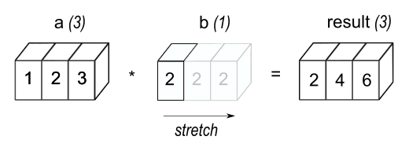
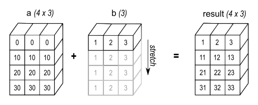
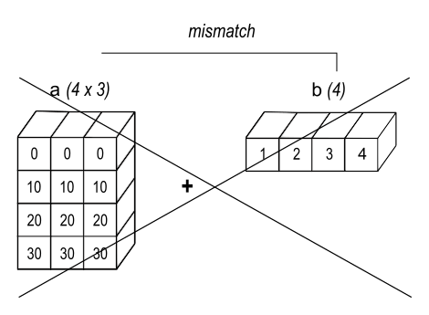
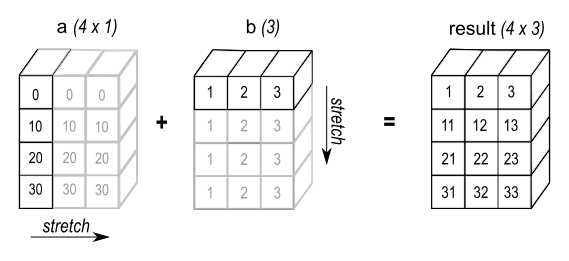
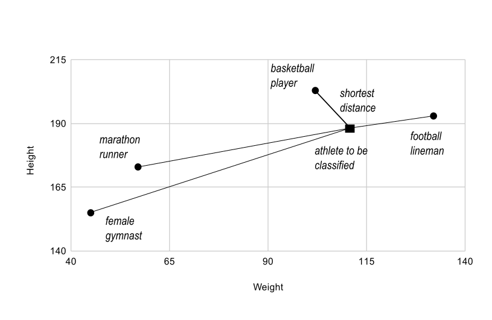

> copy from for learn : https://numpy.com.cn/doc/stable/user/basics.html
## 数组创建

### 简介
共有 6 种通用的数组创建机制

1. 从其他 Python 结构（例如列表和元组）转换
2. NumPy 本身的数组创建函数（例如 arange、ones、zeros 等）
3. 复制、连接或修改现有数组
4. 从磁盘读取数组，无论是标准格式还是自定义格式
5. 通过使用字符串或缓冲区从原始字节创建数组
6. 使用特殊库函数（例如，random）

您可以使用这些方法创建 `ndarray` 或结构化数组。本文档将介绍创建 `ndarray` 的通用方法。

### 1 将 Python 序列转换为 NumPy 数组
可以使用 Python 序列（如列表和元组）定义 NumPy 数组。列表和元组分别使用 `[...]` 和 `(...)` 定义。列表和元组可以定义 ndarray 的创建
- 数字列表将创建一个一维数组，
- 列表的列表将创建一个二维数组，
- 进一步嵌套的列表将创建更高维度的数组。一般来说，任何数组对象在 NumPy 中都称为 `ndarray`。
```python
import numpy as np
a1D = np.array([1, 2, 3, 4])
a2D = np.array([[1, 2], [3, 4]])
a3D = np.array([[[1, 2], [3, 4]], [[5, 6], [7, 8]]])
```
当您使用 `numpy.array` 定义新数组时，您应该考虑数组中元素的 `dtype`，这可以显式指定。此功能使您可以更好地控制底层数据结构以及如何在 C/C++ 函数中处理元素。当值不符合并且您正在使用 dtype 时，NumPy 可能会引发错误。
```python
import numpy as np
np.array([127, 128, 129], dtype=np.int8)
Traceback (most recent call last):
...
OverflowError: Python integer 128 out of bounds for int8
```
8 位有符号整数表示 -128 到 127 之间的整数。将 int8 数组赋值给此范围之外的整数会导致溢出。此功能常常容易被误解。如果您使用不匹配的 dtypes 执行计算，则可能会得到意外的结果，例如
```python
import numpy as np
a = np.array([2, 3, 4], dtype=np.uint32)
b = np.array([5, 6, 7], dtype=np.uint32)
c_unsigned32 = a - b
print('unsigned c:', c_unsigned32, c_unsigned32.dtype)
unsigned c: [4294967293 4294967293 4294967293] uint32
c_signed32 = a - b.astype(np.int32)
print('signed c:', c_signed32, c_signed32.dtype)
signed c: [-3 -3 -3] int64
```
请注意，当您使用相同 `dtype` 的两个数组执行运算时：`uint32`，结果数组类型相同。当您使用不同的 `dtype` 执行运算时，NumPy 将分配一个新类型来满足计算中涉及的所有数组元素，此处 `uint32` 和 `int32` 都可以表示为 `int64`。

NumPy 的默认行为是创建 32 位或 64 位有符号整数（取决于平台，并与 C long 大小匹配）或双精度浮点数数组。如果您希望整数数组为特定类型，则需要在创建数组时指定 `dtype`。

### 2 NumPy 本身的数组创建函数
`NumPy 有超过 40 个内置函数用于创建数组`，如 数组创建例程 中所述。根据这些函数创建的数组维度，可以大致将这些函数分为三类

1. 一维数组
2. 二维数组
3. ndarray

### 2.1 一维数组创建函数
一维数组创建函数，例如 `numpy.linspace` 和 `numpy.arange` 通常至少需要两个输入，`start` 和 `stop`。

`numpy.arange` 创建具有规律递增值的数组。请查看文档以获取完整信息和示例。以下显示了一些示例
```python
import numpy as np
np.arange(10)
array([0, 1, 2, 3, 4, 5, 6, 7, 8, 9])
np.arange(2, 10, dtype=float)
array([2., 3., 4., 5., 6., 7., 8., 9.])
np.arange(2, 3, 0.1)
array([2. , 2.1, 2.2, 2.3, 2.4, 2.5, 2.6, 2.7, 2.8, 2.9])
```
注意：`numpy.arange` 的最佳实践是使用整数 `start`、`end` 和 `step` 值。关于 `dtype` 有一些细微之处。在第二个示例中，定义了 `dtype`。在第三个示例中，数组为 `dtype=float` 以适应步长为 0.1。由于舍入误差，有时会包含 `stop` 值。

`numpy.linspace` 将创建具有指定数量的元素的数组，这些元素在指定的起始值和结束值之间等距分布。例如
```python
import numpy as np
np.linspace(1., 4., 6)
array([1. ,  1.6,  2.2,  2.8,  3.4,  4. ])
```
此创建函数的优点是您可以保证元素的数量以及起始点和终点。之前的 `arange(start, stop, step)` 将不包含值 `stop`。

#### 2.2 二维数组创建函数
二维数组创建函数，例如 `numpy.eye`、`numpy.diag` 和 `numpy.vander` 定义作为二维数组表示的特殊矩阵的属性。

`np.eye(n, m)` 定义一个二维单位矩阵。其中 `i=j`（行索引和列索引相等）的元素为 1，其余元素为 0，如下所示
```python
import numpy as np
np.eye(3)
array([[1., 0., 0.],
       [0., 1., 0.],
       [0., 0., 1.]])
np.eye(3, 5)
array([[1., 0., 0., 0., 0.],
       [0., 1., 0., 0., 0.],
       [0., 0., 1., 0., 0.]])
```

`numpy.diag` 可以定义一个沿对角线具有给定值的`方形二维数组`，或者如果给定一个二维数组，则返回一个仅包含对角线元素的一维数组。这两个数组创建函数在进行线性代数时可能很有帮助，如下所示
```python
import numpy as np
np.diag([1, 2, 3])
array([[1, 0, 0],
       [0, 2, 0],
       [0, 0, 3]])
np.diag([1, 2, 3], 1)
array([[0, 1, 0, 0],
       [0, 0, 2, 0],
       [0, 0, 0, 3],
       [0, 0, 0, 0]])
a = np.array([[1, 2], [3, 4]])
np.diag(a)
array([1, 4])
```

`vander(x, n)` 将范德蒙矩阵定义为二维 NumPy 数组。范德蒙矩阵的每一列都是输入一维数组或列表或元组 x 的递减幂，其中最高多项式阶数为 n-1。此数组创建例程有助于生成线性最小二乘模型，如下所示
```python
import numpy as np
np.vander(np.linspace(0, 2, 5), 2)
array([[0. , 1. ],
      [0.5, 1. ],
      [1. , 1. ],
      [1.5, 1. ],
      [2. , 1. ]])
np.vander([1, 2, 3, 4], 2)
array([[1, 1],
       [2, 1],
       [3, 1],
       [4, 1]])
np.vander((1, 2, 3, 4), 4)
array([[ 1,  1,  1,  1],
       [ 8,  4,  2,  1],
       [27,  9,  3,  1],
       [64, 16,  4,  1]])
```

#### 2.3 通用 ndarray 创建函数
ndarray 创建函数，例如 `numpy.ones`、`numpy.zeros` 和 `random` 根据所需的形状定义数组。ndarray 创建函数可以通过在元组或列表中指定维度数量以及该维度上的长度来创建任意维度的数组。

`numpy.zeros` 将创建一个填充 0 值的数组，并具有指定的形状。默认 `dtype` 为 `float64`
```python
import numpy as np
np.zeros((2, 3))
array([[0., 0., 0.],
       [0., 0., 0.]])
np.zeros((2, 3, 2))
array([[[0., 0.],
        [0., 0.],
        [0., 0.]],

       [[0., 0.],
        [0., 0.],
        [0., 0.]]])
```
`numpy.ones` 将创建一个填充 1 值的数组。在其他方面与 zeros 完全相同，如下所示
```python
import numpy as np
np.ones((2, 3))
array([[1., 1., 1.],
       [1., 1., 1.]])
np.ones((2, 3, 2))
array([[[1., 1.],
        [1., 1.],
        [1., 1.]],

       [[1., 1.],
        [1., 1.],
        [1., 1.]]])
```
使用 `default_rng` 结果的 `random` 方法可以创建一个填充了 0 到 1 之间随机值的数组。它包含在 `numpy.random` 库中。下面，分别创建了两个形状为 (2,3) 和 (2,3,2) 的数组。种子设置为 42，以便您可以重现这些伪随机数。
```python
import numpy as np
from numpy.random import default_rng
default_rng(42).random((2,3))
array([[0.77395605, 0.43887844, 0.85859792],
       [0.69736803, 0.09417735, 0.97562235]])
default_rng(42).random((2,3,2))
array([[[0.77395605, 0.43887844],
        [0.85859792, 0.69736803],
        [0.09417735, 0.97562235]],
       [[0.7611397 , 0.78606431],
        [0.12811363, 0.45038594],
        [0.37079802, 0.92676499]]])
```
`numpy.indices` 将创建一组数组（堆叠为更高维度的数组），每个维度一个，每个数组代表该维度的变化。
```python
import numpy as np
np.indices((3,3))
array([[[0, 0, 0],
        [1, 1, 1],
        [2, 2, 2]],
       [[0, 1, 2],
        [0, 1, 2],
        [0, 1, 2]]])
```
这对于在规则网格上评估多维函数特别有用。

### 3 复制、连接或修改现有数组
创建数组后，您可以复制、连接或修改这些现有数组以创建新数组。将数组或其元素赋值给新变量时，必须显式地 `numpy.copy` 数组，否则该变量将是原始数组的视图。请考虑以下示例：
```python
import numpy as np
a = np.array([1, 2, 3, 4, 5, 6])
b = a[:2]
b += 1
print('a =', a, '; b =', b)
a = [2 3 3 4 5 6] ; b = [2 3]
```
在此示例中，您没有创建新数组。您创建了一个变量 b，它查看了 a 的前 2 个元素。当您向 b 添加 1 时，您将通过向 a[:2] 添加 1 获得相同的结果。如果要创建 *新* 数组，请使用 `numpy.copy` 数组创建例程，如下所示：
```python
import numpy as np
a = np.array([1, 2, 3, 4])
b = a[:2].copy()
b += 1
print('a = ', a, 'b = ', b)
a =  [1 2 3 4] b =  [2 3]
```
有关更多信息和示例，请查看 副本和视图。

有很多例程可以连接现有数组，例如 `numpy.vstack`、`numpy.hstack` 和 `numpy.block`。以下是如何使用 block 将四个 2x2 数组连接成一个 4x4 数组的示例：
```python
import numpy as np
A = np.ones((2, 2))
B = np.eye(2, 2)
C = np.zeros((2, 2))
D = np.diag((-3, -4))
np.block([[A, B], [C, D]])
array([[ 1.,  1.,  1.,  0.],
       [ 1.,  1.,  0.,  1.],
       [ 0.,  0., -3.,  0.],
       [ 0.,  0.,  0., -4.]])
```
其他例程使用类似的语法来连接 `ndarray`。请查看例程的文档以了解更多示例和语法。

### 4 从磁盘读取数组，无论是从标准格式还是自定义格式
这是大型数组创建最常见的情况。细节很大程度上取决于磁盘上数据的格式。本节提供了有关如何处理各种格式的一般性指导。有关 IO 的更详细示例，请查看 如何读取和写入文件。

#### 标准二进制格式
各个领域都有用于数组数据的标准格式。以下是已知 Python 库可以读取它们并返回 NumPy 数组的列表（可能还有其他可以读取并转换为 NumPy 数组的格式，因此也请查看最后一节）：
```python
HDF5: h5py
FITS: Astropy
```
不能直接读取但很容易转换的格式示例是 PIL 等库支持的格式（能够读取和写入许多图像格式，例如 jpg、png 等）。

#### 常见的 ASCII 格式
逗号分隔值 (`csv`) 和制表符分隔值 (`tsv`) 等分隔文件用于 Excel 和 LabView 等程序。Python 函数可以逐行读取和解析这些文件。NumPy 有两个用于导入具有分隔数据的文件的标准例程：`numpy.loadtxt` 和 `numpy.genfromtxt`。这些函数在 读取和写入文件 中有更复杂的用例。给定一个 `simple.csv` 的简单示例：
```python
$ cat simple.csv
x, y
0, 0
1, 1
2, 4
3, 9
```
使用 `numpy.loadtxt` 可以导入 `simple.csv`。
```python
import numpy as np
np.loadtxt('simple.csv', delimiter = ',', skiprows = 1) 
array([[0., 0.],
       [1., 1.],
       [2., 4.],
       [3., 9.]])
```
可以使用 `scipy.io` 和 `Pandas` 读取更通用的 ASCII 文件。

### 5 通过使用字符串或缓冲区从原始字节创建数组
您可以使用各种方法。如果文件格式相对简单，则可以编写一个简单的 I/O 库，并使用 NumPy 的 `fromfile()` 函数和 `.tofile()` 方法直接读取和写入 NumPy 数组（但要注意字节序！）。如果存在可以读取数据的良好 C 或 C++ 库，则可以使用各种技术来包装该库，但这无疑需要更多工作，并且需要更高级的知识才能与 C 或 C++ 交互。

### 6 使用特殊库函数（例如，SciPy、pandas 和 OpenCV）
NumPy 是 Python 科学计算堆栈中数组容器的基本库。许多 Python 库（包括 SciPy、Pandas 和 OpenCV）都使用 NumPy ndarray 作为数据交换的通用格式。这些库可以创建、操作和使用 NumPy 数组。


## `ndarrays` 的索引

`ndarrays` 可以使用标准 `Python x[obj]` 语法进行索引，其中 `x` 是数组，`obj` 是选择器。根据 `obj` 的不同，可以使用不同类型的索引：`基本索引`、`高级索引`和`字段访问`。

以下大多数示例展示了在引用数组中的数据时索引的使用。这些示例在为数组赋值时同样有效。有关赋值方式的具体示例和说明，请参阅 为索引数组赋值。

请注意，在 Python 中，`x[(exp1, exp2, ..., expN)]` 等效于 `x[exp1, exp2, ..., expN]`；后者只是前者的`语法糖`。

### 基本索引

#### 单元素索引
单元素索引的工作方式与其他标准 Python 序列完全相同。它是基于 0 的，并接受负索引来从数组的末尾进行索引。
```python
x = np.arange(10)
x[2]
2
x[-2]
8
```
无需将每个维度的索引分成自己的方括号集。
```python
x.shape = (2, 5)  # now x is 2-dimensional
x[1, 3]
8
x[1, -1]
9
```
请注意，`如果用少于维度的索引来索引多维数组，则会得到一个子维数组`。例如
```python
x[0]
array([0, 1, 2, 3, 4])
```
也就是说，每个指定的索引都会选择对应于所选其余维度的数组。在上面的示例中，选择 0 表示长度为 5 的剩余维度未指定，返回的是具有该维度和大小的数组。必须注意的是，`返回的数组是一个 视图`，即它不是原始数组的副本，而是指向与原始数组相同的内存位置的值。在这种情况下，返回第一个位置 (0) 的一维数组。因此，在返回的数组上使用单个索引，结果返回单个元素。也就是说
```python
x[0][2]
2
```
因此请注意 `x[0, 2] == x[0][2]`，`尽管第二种情况效率较低，因为在第一次索引之后会创建一个新的临时数组，随后该数组被索引为 2`。

> 注意
> 
> NumPy 使用 C 顺序索引。这意味着最后一个索引通常表示变化最快的内存位置，这与 Fortran 或 IDL 不同，在 Fortran 或 IDL 中，第一个索引表示变化最快的内存位置。这种差异可能导致很大的混淆。

#### 切片和步幅
基本切片将 Python 的基本切片概念扩展到 N 维。当 `obj` 是 slice 对象（通过括号内的 `start:stop:step` 符号构造）、整数或切片对象和整数的元组时，就会发生基本切片。`Ellipsis` 和 `newaxis` 对象也可以与它们交织在一起。

用 N 个整数进行索引的最简单情况是返回一个 数组标量，表示相应的项目。与 Python 一样，所有索引都是基于零的：对于第 *i* 个索引 $n_i$，有效范围是 $0 \leq n_i < d_i$，其中 $d_i$
 是数组形状的第 *i* 个元素。负索引被解释为从数组的末尾计数（即如果 $n_i < 0$，则表示 $n_i + d_i$。）。

`通过基本切片生成的全部数组始终是原始数组的 视图`。

> 注意
> 
> NumPy 切片创建 视图 而不是副本，这与内置 Python 序列（如字符串、元组和列表）不同。从大型数组中提取一小部分（提取后变得无用）时，必须小心，因为提取的小部分包含对大型原始数组的引用，在从中派生的所有数组被垃圾回收之前，其内存不会被释放。在这种情况下，建议显式使用 copy()。

序列切片的标准规则适用于每个维度的基本切片（包括使用步长索引）。一些有用的概念包括

- 基本切片语法是 $i:j:k$，其中 $i$ 是起始索引，$j$ 是结束索引，$k$ 是步长 ($k \neq 0$)。这将选择具有索引值 $i, i+k, \ldots, i+(m-1)k$ 的 $m$ 个元素（在相应的维度中），其中 $m = q + (r \neq 0)$，而 $q$ 和 $r$ 是将 $k$ 除以得到的商和余数：$j = qk + r$，因此 $i + (m - 1)k < j$。例如

    ```python
    x = np.array([0, 1, 2, 3, 4, 5, 6, 7, 8, 9])
    x[1:7:2]
    array([1, 3, 5])
    ```
- 负 *i* 和 *j* 被解释为 *n + i* 和 *n + j*，其中 *n* 是相应维度中元素的数量。负 *k* 使步进走向较小的索引。从上面的示例

    ```python
    x[-2:10]
    array([8, 9])
    x[-3:3:-1]
    array([7, 6, 5, 4])
    ```
- 假设 *n* 是被切片的维度中元素的数量。然后，如果没有给出 *i*，则对于 *k > 0*，它默认为 0，对于 *k < 0*，它默认为 *n - 1*。如果没有给出 *j*，则对于 *k > 0*，它默认为 *n*，对于 *k < 0*，它默认为 *-n-1*。如果没有给出 *k*，则默认为 1。请注意 `::` 与 `:` 相同，表示选择此轴上的所有索引。从上面的示例

    ```python
    x[5:]
    array([5, 6, 7, 8, 9])
    ```
- 如果选择元组中的对象数量少于 *N*，则对于任何后续维度都假定为 `:`。例如

    ```python
    x = np.array([[[1],[2],[3]], [[4],[5],[6]]])
    x.shape
    (2, 3, 1)
    x[1:2]
    array([[[4],
            [5],
            [6]]])
    ```
- 整数 *i* 返回与 i:i+1 相同的值，**但**返回对象的维度减少了 1。特别是，选择元组的第 *p* 个元素是一个整数（所有其他条目为 :），则返回具有维度 *N - 1* 的相应子数组。如果 *N = 1*，则返回的对象是数组标量。这些对象在 标量 中有解释。

- 如果选择元组的所有条目都是 `:`，除了第 *p* 个条目是一个切片对象 i:j:k，则返回的数组具有维度 *N*，它沿第 *p* 个轴堆叠由元素 *i*、*i+k*、…、*i + (m - 1) k < j* 的整数索引返回的子数组。

- 在切片元组中有多个非 `:` 条目的基本切片，就像使用单个非 `:` 条目重复应用切片一样，其中非 `:` 条目被连续取用（所有其他非 `:` 条目被替换为 `:`）。因此，在基本切片下，`x[ind1, ..., ind2,:]` 就像 `x[ind1][..., ind2, :]` 一样。

> 警告
> 
> 以上内容对高级索引**不适用**。

- 可以使用切片设置数组中的值，但是（与列表不同）你永远无法增大数组的大小。在`x[obj] = value`中设置的值的大小必须与`x[obj]`的形状相同（或可广播到相同的形状）。
- 切片元组总是可以构造为`obj`，并用于`x[obj]`表示法中。切片对象可以在构造中代替`[start:stop:step]`表示法使用。例如，`x[1:10:5, ::-1]`也可以实现为`obj = (slice(1, 10, 5), slice(None, None, -1))`; `x[obj]`。这对于构建适用于任意维数组的通用代码非常有用。更多信息请参见程序中处理可变数量的索引。

#### 维度索引工具
有一些工具可以方便地将数组形状与表达式和赋值进行匹配。

Ellipsis 展开到选择元组所需数量的:对象，以索引所有维度。在大多数情况下，这意味着展开的选择元组的长度为x.ndim。只能存在一个省略号。从上面的例子
```python
x[..., 0]
array([[1, 2, 3],
      [4, 5, 6]])
```
这等价于
```python
x[:, :, 0]
array([[1, 2, 3],
      [4, 5, 6]])
```
选择元组中的每个`newaxis`对象都用来将结果选择的维度扩展一个单位长度的维度。添加的维度是`newaxis`对象在选择元组中的位置。`newaxis`是`None`的别名，并且可以使用`None`代替它，结果相同。从上面的例子
```python
x[:, np.newaxis, :, :].shape
(2, 1, 3, 1)
x[:, None, :, :].shape
(2, 1, 3, 1)
```
这对于以否则需要显式重塑操作的方式组合两个数组非常方便。例如
```python
x = np.arange(5)
x[:, np.newaxis] + x[np.newaxis, :]
array([[0, 1, 2, 3, 4],
      [1, 2, 3, 4, 5],
      [2, 3, 4, 5, 6],
      [3, 4, 5, 6, 7],
      [4, 5, 6, 7, 8]])
```

### 高级索引
当选择对象`obj`是非元组序列对象、`ndarray`（数据类型为整数或布尔值）或至少包含一个序列对象或`ndarray`（数据类型为整数或布尔值）的元组时，将触发高级索引。高级索引有两种类型：`整数`和`布尔`。

`高级索引总是返回数据的副本（与返回视图的基本切片形成对比）`。

> 警告
> 
> 高级索引的定义意味着x[(1, 2, 3),]与x[(1, 2, 3)]从根本上不同。后者等价于x[1, 2, 3]，它将触发基本选择，而前者将触发高级索引。请务必理解为什么会发生这种情况。


#### 整数数组索引
整数数组索引允许根据项目的N维索引选择数组中的任意项目。每个整数数组代表该维度中的一些索引。

索引数组中允许使用负值，它们的作用与单个索引或切片相同。
```python
x = np.arange(10, 1, -1)
x
array([10,  9,  8,  7,  6,  5,  4,  3,  2])
x[np.array([3, 3, 1, 8])]
array([7, 7, 9, 2])
x[np.array([3, 3, -3, 8])]
array([7, 7, 4, 2])
```
如果索引值超出范围，则会抛出`IndexError`。
```python
x = np.array([[1, 2], [3, 4], [5, 6]])
x[np.array([1, -1])]
array([[3, 4],
      [5, 6]])
x[np.array([3, 4])]
Traceback (most recent call last):
  ...
IndexError: index 3 is out of bounds for axis 0 with size 3
```
当索引包含与被索引数组的维度一样多的整数数组时，索引很简单，但与切片不同。

高级索引总是广播并作为一个进行迭代。
```python
result[i_1, ..., i_M] == x[ind_1[i_1, ..., i_M], ind_2[i_1, ..., i_M],
                           ..., ind_N[i_1, ..., i_M]]
```
请注意，结果形状与（广播）索引数组形状`ind_1, ..., ind_N`相同。如果索引不能广播到相同的形状，则会引发异常`IndexError: shape mismatch: indexing arrays could not be broadcast together with shapes...`。

使用多维索引数组进行索引往往是不常见的用法，但它们是允许的，并且对于某些问题很有用。我们将从最简单的多维情况开始。
```python
y = np.arange(35).reshape(5, 7)
y
array([[ 0,  1,  2,  3,  4,  5,  6],
       [ 7,  8,  9, 10, 11, 12, 13],
       [14, 15, 16, 17, 18, 19, 20],
       [21, 22, 23, 24, 25, 26, 27],
       [28, 29, 30, 31, 32, 33, 34]])
y[np.array([0, 2, 4]), np.array([0, 1, 2])]
array([ 0, 15, 30])
```
在这种情况下，如果索引数组具有匹配的形状，并且对于被索引数组的每个维度都有一个索引数组，则结果数组具有与索引数组相同的形状，并且值对应于索引数组中每个位置的索引集。在这个例子中，两个索引数组的第一个索引值都是0，因此结果数组的第一个值是y[0, 0]。下一个值是y[2, 1]，最后一个是y[4, 2]。

如果索引数组的形状不相同，则会尝试将它们广播到相同的形状。如果它们不能广播到相同的形状，则会引发异常。
```python
y[np.array([0, 2, 4]), np.array([0, 1])]
Traceback (most recent call last):
  ...
IndexError: shape mismatch: indexing arrays could not be broadcast
together with shapes (3,) (2,)
```
广播机制允许将索引数组与其他索引的标量组合。其效果是标量值用于索引数组的所有对应值。
```python
y[np.array([0, 2, 4]), 1]
array([ 1, 15, 29])
```
跳到下一个复杂级别，可以使用索引数组对数组进行部分索引。理解在这种情况下会发生什么需要一些思考。例如，如果我们只对y使用一个索引数组
```python
y[np.array([0, 2, 4])]
array([[ 0,  1,  2,  3,  4,  5,  6],
       [14, 15, 16, 17, 18, 19, 20],
       [28, 29, 30, 31, 32, 33, 34]])
```
它将创建一个新数组，其中索引数组的每个值从被索引数组中选择一行，并且结果数组具有结果形状（索引元素的数量，行的数量）。

通常，结果数组的形状将是索引数组的形状（或所有索引数组广播到的形状）与被索引数组中任何未使用的维度（未被索引的维度）的形状的连接。

- 示例
  
  从每一行中，应该选择一个特定元素。行索引只是[0, 1, 2]，列索引指定为相应行选择的元素，这里为[0, 1, 0]。使用两者一起，可以使用高级索引解决此任务。

    ```python
    x = np.array([[1, 2], [3, 4], [5, 6]])
    x[[0, 1, 2], [0, 1, 0]]
    array([1, 4, 5])
    ```
    为了实现与上述基本切片类似的行为，可以使用广播。函数`ix_`可以帮助进行此广播。最好通过示例来理解这一点。

- 示例
  
  从一个4x3数组中，应该使用高级索引选择角元素。因此，需要选择列为[0, 2]之一且行为[0, 3]之一的所有元素。为了使用高级索引，需要*显式地*选择所有元素。使用前面解释的方法，可以编写

    ```python
    x = np.array([[ 0,  1,  2],
                [ 3,  4,  5],
                [ 6,  7,  8],
                [ 9, 10, 11]])
    rows = np.array([[0, 0],
                    [3, 3]], dtype=np.intp)
    columns = np.array([[0, 2],
                        [0, 2]], dtype=np.intp)
    x[rows, columns]
    array([[ 0,  2],
        [ 9, 11]])
    ```
    但是，由于上面的索引数组只是重复自身，因此可以使用广播（比较诸如`rows[:, np.newaxis] + columns`之类的运算）来简化此操作。

    ```python
    rows = np.array([0, 3], dtype=np.intp)
    columns = np.array([0, 2], dtype=np.intp)
    rows[:, np.newaxis]
    array([[0],
        [3]])
    x[rows[:, np.newaxis], columns]
    array([[ 0,  2],
        [ 9, 11]])
    ```
    此广播也可以使用函数`ix_`来实现。

    ```python
    x[np.ix_(rows, columns)]
    array([[ 0,  2],
        [ 9, 11]])
    ```
    请注意，如果没有`np.ix_`调用，则只会选择对角线元素。

    ```python
    x[rows, columns]
    array([ 0, 11])
    ```
    这种差异是关于使用多个高级索引进行索引时最重要的是要记住的事情。

- 示例

    高级索引可能很有用的一个实际示例是颜色查找表，我们希望将图像的值映射到用于显示的RGB三元组。查找表可以具有形状(nlookup, 3)。使用形状为(ny, nx)且dtype=np.uint8（或任何整数类型，只要值在查找表的范围内）的图像对这样的数组进行索引将产生一个形状为(ny, nx, 3)的数组，其中每个像素位置都关联一个RGB值的三元组。

#### 布尔数组索引

当obj是布尔类型的数组对象（例如比较运算符返回的结果）时，就会发生这种高级索引。单个布尔索引数组实际上与`x[obj.nonzero()]`几乎相同，其中，如上所述，`obj.nonzero()`返回一个元组（长度为`obj.ndim`），包含整数索引数组，这些数组显示了obj中True元素的位置。但是，当`obj.shape == x.shape`时，它速度更快。

如果`obj.ndim == x.ndim`，`x[obj]`将返回一个一维数组，其中填充了对应于obj中True值的x的元素。搜索顺序将是行优先（C风格）。如果obj的形状与x的对应维度不匹配，则会引发索引错误，无论这些值是`True`还是`False`。

这一个常见用例是过滤所需的元素值。例如，可能需要选择数组中所有不是`numpy.nan`的条目。
```python
x = np.array([[1., 2.], [np.nan, 3.], [np.nan, np.nan]])
x[~np.isnan(x)]
array([1., 2., 3.])
```
或者希望向所有负元素添加一个常数。
```python
x = np.array([1., -1., -2., 3])
x[x < 0] += 20
x
array([ 1., 19., 18., 3.])
```
一般来说，如果索引包含布尔数组，则结果将与在相同位置插入`obj.nonzero()`并使用上面描述的整数数组索引机制相同。`x[ind_1, boolean_array, ind_2]`等效于`x[(ind_1,) + boolean_array.nonzero() + (ind_2,)]`。

如果只有一个布尔数组且没有整数索引数组，则很简单。只需要注意确保布尔索引的维度与它应该处理的数组维度完全相同。

通常，当布尔数组的维度小于被索引的数组时，这等效于`x[b, ...]`，这意味着x由b索引，然后是尽可能多的`:`来填充x的秩。因此，结果的形状是一个维度，包含布尔数组中True元素的数量，后面跟着被索引数组的其余维度。
```python
x = np.arange(35).reshape(5, 7)
b = x > 20
b[:, 5]
array([False, False, False,  True,  True])
x[b[:, 5]]
array([[21, 22, 23, 24, 25, 26, 27],
      [28, 29, 30, 31, 32, 33, 34]])
```
这里从被索引的数组中选择第4行和第5行，并将它们组合成一个二维数组。

- 示例
  从数组中选择所有总和不大于2的行。

    ```python
    x = np.array([[0, 1], [1, 1], [2, 2]])
    rowsum = x.sum(-1)
    x[rowsum <= 2, :]
    array([[0, 1],
        [1, 1]])
    ```
    结合多个布尔索引数组或布尔数组与整数索引数组，最好使用`obj.nonzero()`类比来理解。函数`ix_`也支持布尔数组，并且可以毫无意外地工作。

- 示例
  
  使用布尔索引选择所有总和为偶数的行。同时，应使用高级整数索引选择第0列和第2列。使用ix_函数，这可以用以下方法完成：

    ```python
    x = np.array([[ 0,  1,  2],
                [ 3,  4,  5],
                [ 6,  7,  8],
                [ 9, 10, 11]])
    rows = (x.sum(-1) % 2) == 0
    rows
    array([False,  True, False,  True])
    columns = [0, 2]
    x[np.ix_(rows, columns)]
    array([[ 3,  5],
        [ 9, 11]])
    ```
    如果不使用`np.ix_`调用，则只会选择对角线元素。

    或者不使用`np.ix_`（比较整数数组示例）。

    ```python
    rows = rows.nonzero()[0]
    x[rows[:, np.newaxis], columns]
    array([[ 3,  5],
        [ 9, 11]])
    ```

- 示例
  
  使用形状为`(2, 3)`且有四个`True`元素的二维布尔数组从形状为`(2, 3, 5)`的三维数组中选择行，结果将是一个形状为`(4, 5)`的二维结果。

    ```python
    x = np.arange(30).reshape(2, 3, 5)
    x
    array([[[ 0,  1,  2,  3,  4],
            [ 5,  6,  7,  8,  9],
            [10, 11, 12, 13, 14]],
        [[15, 16, 17, 18, 19],
            [20, 21, 22, 23, 24],
            [25, 26, 27, 28, 29]]])
    b = np.array([[True, True, False], [False, True, True]])
    x[b]
    array([[ 0,  1,  2,  3,  4],
        [ 5,  6,  7,  8,  9],
        [20, 21, 22, 23, 24],
        [25, 26, 27, 28, 29]])
    ```

#### 组合高级索引和基本索引
当索引中至少有一个切片(`:`)、省略号(`...`)或`newaxis`(或数组的维度多于高级索引的数量)时，行为可能会更复杂。这就像连接每个高级索引元素的索引结果。

在最简单的情况下，只有一个高级索引与切片组合。例如：
```python
y = np.arange(35).reshape(5,7)
y[np.array([0, 2, 4]), 1:3]
array([[ 1,  2],
       [15, 16],
       [29, 30]])
```
实际上，切片和索引数组操作是独立的。切片操作提取索引为1和2的列（即第2列和第3列），然后是索引数组操作，该操作提取索引为0、2和4的行（即第一行、第三行和第五行）。这等效于：
```python
y[:, 1:3][np.array([0, 2, 4]), :]
array([[ 1,  2],
       [15, 16],
       [29, 30]])
```
例如，单个高级索引可以替换切片，结果数组将相同。但是，它是一个副本，并且可能具有不同的内存布局。如果可能，切片更可取。例如：
```python
x = np.array([[ 0,  1,  2],
              [ 3,  4,  5],
              [ 6,  7,  8],
              [ 9, 10, 11]])
x[1:2, 1:3]
array([[4, 5]])
x[1:2, [1, 2]]
array([[4, 5]])
```

理解多个高级索引组合的最简单方法可能是考虑结果形状。索引操作有两个部分：由基本索引（不包括整数）定义的子空间和高级索引部分的子空间。需要区分两种索引组合的情况：

- 高级索引由`切片`、`Ellipsis`或`newaxis`分隔。例如`x[arr1, :, arr2]`。
- 高级索引彼此相邻。例如`x[..., arr1, arr2, :]`，但不是`x[arr1, :, 1]`，因为在这方面1是一个高级索引。

在第一种情况下，高级索引操作产生的维度在结果数组中排在前面，子空间维度排在其后。在第二种情况下，高级索引操作的维度被插入到结果数组中与它们在初始数组中的位置相同的位置（后一种逻辑使得简单的高级索引的行为就像切片一样）。

- 示例
  
  假设`x.shape`是`(10, 20, 30)`，而`ind`是一个形状为`(2, 5, 2)`的索引`intp`数组，则`result = x[..., ind, :]`的形状为(10, 2, 5, 2, 30)，因为形状为(20,)的子空间已被形状为(2, 5, 2)的广播索引子空间替换。如果我们让i、j、k循环遍历形状为(2, 5, 2)的子空间，则`result[..., i, j, k, :] = x[..., ind[i, j, k], :]`。此示例产生的结果与`x.take(ind, axis=-2)`相同。

- 示例
  
  令`x.shape为(10, 20, 30, 40, 50)`，并假设`ind_1`和`ind_2`可以广播到形状`(2, 3, 4)`。然后`x[:, ind_1, ind_2]`的形状为`(10, 2, 3, 4, 40, 50)`，因为X的形状为`(20, 30)`的子空间已被索引的形状为`(2, 3, 4)`的子空间替换。但是，`x[:, ind_1, :, ind_2]`的形状为`(2, 3, 4, 10, 30, 50)`，因为没有明确的位置可以放入索引子空间，因此它被附加到开头。始终可以使用`.transpose()`将子空间移动到任何所需的位置。请注意，此示例无法使用take复制。

- 示例
  
  切片可以与广播布尔索引组合。

    ```python
    x = np.arange(35).reshape(5, 7)
    b = x > 20
    b
    array([[False, False, False, False, False, False, False],
        [False, False, False, False, False, False, False],
        [False, False, False, False, False, False, False],
        [ True,  True,  True,  True,  True,  True,  True],
        [ True,  True,  True,  True,  True,  True,  True]])
    x[b[:, 5], 1:3]
    array([[22, 23],
        [29, 30]])
    ```
### 字段访问
> 另请参阅 结构化数组

如果`ndarray`对象是结构化数组，则可以通过使用字符串（类似于字典）对数组进行索引来访问数组的字段。

索引`x['field-name']`返回数组的新视图，该视图与x的形状相同（除非字段是子数组），但数据类型为`x.dtype['field-name']`，并且只包含指定字段中的数据部分。此外，记录数组标量也可以这样“索引”。

结构化数组的索引也可以使用字段名列表进行，例如 `x[['field-name1', 'field-name2']]`。从 NumPy 1.16 版本开始，这将返回一个只包含这些字段的视图。在较旧的 NumPy 版本中，它返回的是副本。有关多字段索引的更多信息，请参阅用户指南中关于 结构化数组 的部分。

如果访问的字段是子数组，则子数组的维度将附加到结果的形状。例如
```python
x = np.zeros((2, 2), dtype=[('a', np.int32), ('b', np.float64, (3, 3))])
x['a'].shape
(2, 2)
x['a'].dtype
dtype('int32')
x['b'].shape
(2, 2, 3, 3)
x['b'].dtype
dtype('float64')
```

### 扁平迭代器索引
`x.flat` 返回一个迭代器，它将遍历整个数组（以 C 连续样式，最后一个索引变化最快）。只要选择对象不是元组，就可以使用基本的切片或高级索引对这个迭代器对象进行索引。从 `x.flat` 是一个一维视图这一事实可以清楚地看出这一点。它可以用于使用一维 C 样式扁平索引进行整数索引。因此，任何返回数组的形状都是整数索引对象的形状。

### 为索引数组赋值
如前所述，可以使用单个索引、切片和索引以及掩码数组来选择要赋值的数组子集。赋值给索引数组的值必须与形状一致（相同的形状或可广播到索引生成的形状）。例如，允许将常量赋值给切片
```python
x = np.arange(10)
x[2:7] = 1
```
或一个大小合适的数组
```python
x[2:7] = np.arange(5)
```
请注意，如果将较高类型赋值给较低类型（例如，将浮点数赋值给整数），或者甚至出现异常（将复数赋值给浮点数或整数），则赋值可能会导致更改。
```python
x[1] = 1.2
x[1]
1
x[1] = 1.2j  
Traceback (most recent call last):
  ...
TypeError: can't convert complex to int
```
与某些引用（例如数组和掩码索引）不同，赋值总是对数组中的原始数据进行（事实上，没有什么比这更有意义了！）。但是请注意，某些操作可能无法像人们天真地期望的那样工作。这个具体的例子经常让大家感到惊讶
```python
x = np.arange(0, 50, 10)
x
array([ 0, 10, 20, 30, 40])
x[np.array([1, 1, 3, 1])] += 1
x
array([ 0, 11, 20, 31, 40])
```
人们期望第一个位置将增加 3。事实上，它只会增加 1。原因是从原始数组中提取一个新的数组（作为临时数组），包含 1, 1, 3, 1 的值，然后将值 1 添加到临时数组，然后将临时数组赋值回原始数组。因此，数组在 x[1] + 1 的值被赋值给 x[1] 三次，而不是被递增三次。

### 在程序中处理可变数量的索引
索引语法非常强大，但在处理可变数量的索引时却受到限制。例如，如果您想编写一个可以处理具有不同维度数量的参数的函数，而无需为每个可能的维度数量编写特殊情况代码，那么该如何做到呢？如果向索引提供一个元组，则该元组将被解释为索引列表。例如
```python
z = np.arange(81).reshape(3, 3, 3, 3)
indices = (1, 1, 1, 1)
z[indices]
40
```
因此，可以使用代码构造任意数量索引的元组，然后在索引中使用这些元组。

可以通过在 Python 中使用 `slice()` 函数来指定切片。例如
```python
indices = (1, 1, 1, slice(0, 2))  # same as [1, 1, 1, 0:2]
z[indices]
array([39, 40])
```
同样，可以通过使用 `Ellipsis` 对象在代码中指定省略号
```python
indices = (1, Ellipsis, 1)  # same as [1, ..., 1]
z[indices]
array([[28, 31, 34],
       [37, 40, 43],
       [46, 49, 52]])
```
因此，可以直接使用 `np.nonzero()` 函数的输出作为索引，因为它总是返回一个索引数组元组。

由于对元组的特殊处理，它们不会像列表那样自动转换为数组。例如
```python
z[[1, 1, 1, 1]]  # produces a large array
array([[[[27, 28, 29],
         [30, 31, 32], ...
z[(1, 1, 1, 1)]  # returns a single value
40
```
### 详细说明
以下是一些详细说明，对于日常索引并不重要（无特定顺序）

- NumPy 原生索引类型是 `intp`，可能与默认整数数组类型不同。`intp` 是安全索引任何数组的最小数据类型；对于高级索引，它可能比其他类型更快。
- 对于高级赋值，通常不能保证迭代顺序。这意味着如果一个元素被设置多次，则无法预测最终结果。
- 空（元组）索引是零维数组的完整标量索引。x[()] 如果 x 是零维的则返回一个 *标量*，否则返回一个视图。另一方面，x[...] 总是返回一个视图。
- 如果索引中存在零维数组 *并且* 它是一个完整的整数索引，则结果将是一个 *标量*，而不是一个零维数组。（不会触发高级索引。）
- 当存在省略号 (`...`) 但大小为零（即替换零 `:`）时，结果仍然始终是一个数组。如果不存在高级索引，则为视图，否则为副本。
- 布尔数组的 `nonzero` 等价性不适用于零维布尔数组。
- 当高级索引操作的结果没有元素但单个索引超出范围时，是否引发 IndexError 是未定义的（例如，`x[[], [123]]`，其中 123 超出范围）。
- 当赋值期间发生 *类型转换* 错误（例如，使用字符串序列更新数值数组）时，被赋值的数组最终可能处于不可预测的部分更新状态。但是，如果发生任何其他错误（例如索引超出范围），则数组将保持不变。
- 高级索引结果的内存布局针对每个索引操作进行了优化，并且不能假设任何特定的内存顺序。
- 当使用子类（特别是操纵其形状的子类）时，默认的 `ndarray.__setitem__ `行为将对 *基本* 索引调用` __getitem__`，但对 *高级* 索引不调用。对于这样的子类，最好使用数据的 *基类* ndarray 视图调用 `ndarray.__setitem__`。如果子类的 `__getitem__` 不返回视图，则 *必须* 执行此操作。

## NumPy的 I/O

### 使用 `genfromtxt` 导入数据

NumPy 提供了几个函数来从表格数据创建数组。这里我们重点介绍 `genfromtxt` 函数。

简而言之，`genfromtxt` 运行两个主要循环。第一个循环将文件的每一行转换为字符串序列。第二个循环将每个字符串转换为适当的数据类型。这种机制比单个循环慢，但提供了更大的灵活性。特别是，当其他更快更简单的函数（如 `loadtxt`）无法处理时，`genfromtxt` 能够考虑缺失的数据。

> 注意
> 
> 在给出示例时，我们将使用以下约定
> 
> ```python
> import numpy as np
> from io import StringIO
> ```

#### 定义输入
`genfromtxt` 的唯一强制参数是数据源。它可以是字符串、字符串列表、生成器或具有 read 方法的打开的类文件对象，例如，文件或 io.StringIO 对象。如果提供单个字符串，则假定它是本地或远程文件的名称。如果提供字符串列表或返回字符串的生成器，则每个字符串都被视为文件中的一行。当传递远程文件的 URL 时，该文件会自动下载到当前目录并打开。

可识别的文件类型是文本文件和存档。目前，该函数识别 `gzip` 和 `bz2` (`bzip2`) 存档。存档的类型根据文件的扩展名确定：如果文件名以 `.gz` 结尾，则期望是 `gzip` 存档；如果它以 `bz2` 结尾，则假定为 `bzip2` 存档。

#### 将行拆分为列

##### `delimiter` 参数

一旦定义了文件并打开进行读取，`genfromtxt` 会将每个非空行拆分为字符串序列。空行或注释行只是跳过。`delimiter` 关键字用于定义如何进行拆分。

通常，单个字符标记列之间的分隔。例如，逗号分隔文件 (CSV) 使用逗号 (`,`) 或分号 (`;`) 作为分隔符
```python
data = "1, 2, 3\n4, 5, 6"
np.genfromtxt(StringIO(data), delimiter=",")
array([[1.,  2.,  3.],
       [4.,  5.,  6.]])
```
另一个常见的分隔符是 `\t`，即制表符。但是，我们不限于单个字符，任何字符串都可以。默认情况下，`genfromtxt` 假定 `delimiter=None`，这意味着该行沿空格（包括制表符）拆分，并且连续的空格被视为单个空格。

或者，我们可能正在处理固定宽度文件，其中列被定义为给定的字符数。在这种情况下，我们需要将 `delimiter` 设置为单个整数（如果所有列的大小相同）或整数序列（如果列的大小可以不同）
```python
data = "  1  2  3\n  4  5 67\n890123  4"
np.genfromtxt(StringIO(data), delimiter=3)
array([[  1.,    2.,    3.],
       [  4.,    5.,   67.],
       [890.,  123.,    4.]])
data = "123456789\n   4  7 9\n   4567 9"
np.genfromtxt(StringIO(data), delimiter=(4, 3, 2))
array([[1234.,   567.,    89.],
       [   4.,     7.,     9.],
       [   4.,   567.,     9.]])
```

##### `autostrip` 参数
默认情况下，当一行分解为一系列字符串时，各个条目不会去除前导或尾随空格。可以通过将可选参数 `autostrip` 设置为 `True` 值来覆盖此行为
```python
data = "1, abc , 2\n 3, xxx, 4"
# Without autostrip
np.genfromtxt(StringIO(data), delimiter=",", dtype="|U5")
array([['1', ' abc ', ' 2'],
       ['3', ' xxx', ' 4']], dtype='<U5')
# With autostrip
np.genfromtxt(StringIO(data), delimiter=",", dtype="|U5", autostrip=True)
array([['1', 'abc', '2'],
       ['3', 'xxx', '4']], dtype='<U5')
```

##### `comments` 参数
可选参数 `comments` 用于定义标记注释开始的字符串。默认情况下，`genfromtxt` 假定 `comments='#'`。注释标记可以出现在该行的任何位置。注释标记之后出现的任何字符都将被简单地忽略
```python
data = """#
# Skip me !
# Skip me too !
1, 2
3, 4
5, 6 #This is the third line of the data
7, 8
# And here comes the last line
9, 0
"""
np.genfromtxt(StringIO(data), comments="#", delimiter=",")
array([[1., 2.],
       [3., 4.],
       [5., 6.],
       [7., 8.],
       [9., 0.]])
```
> 注意
> 
> 此行为有一个值得注意的例外：如果可选参数 `names=True`，则将检查第一个注释行中的名称。

#### 跳过行和选择列

##### `skip_header` 和 `skip_footer` 参数
文件中存在标题可能会阻碍数据处理。在这种情况下，我们需要使用 `skip_header` 可选参数。此参数的值必须是整数，该整数对应于在执行任何其他操作之前要在文件开头跳过的行数。同样，我们可以使用 `skip_footer` 属性并通过为其赋值 n 来跳过文件的最后 n 行

```python
data = "\n".join(str(i) for i in range(10))
np.genfromtxt(StringIO(data),)
array([0.,  1.,  2.,  3.,  4.,  5.,  6.,  7.,  8.,  9.])
np.genfromtxt(StringIO(data),
              skip_header=3, skip_footer=5)
array([3.,  4.])
```
默认情况下，`skip_header=0` 和 `skip_footer=0`，这意味着不跳过任何行。

##### `usecols` 参数
在某些情况下，我们不关心所有数据列，而只关心其中的几列。我们可以使用 `usecols` 参数选择要导入的列。此参数接受单个整数或对应于要导入的列的索引的整数序列。请记住，按照惯例，第一列的索引为 0。负整数的行为与常规 Python 负索引相同。

例如，如果我们只想导入第一列和最后一列，我们可以使用 `usecols=(0, -1)`
```python
data = "1 2 3\n4 5 6"
np.genfromtxt(StringIO(data), usecols=(0, -1))
array([[1.,  3.],
       [4.,  6.]])
```
如果列有名称，我们还可以通过将其名称作为字符串序列或逗号分隔的字符串提供给 `usecols` 参数来选择要导入的列
```python
data = "1 2 3\n4 5 6"
np.genfromtxt(StringIO(data),
              names="a, b, c", usecols=("a", "c"))
array([(1., 3.), (4., 6.)], dtype=[('a', '<f8'), ('c', '<f8')])
np.genfromtxt(StringIO(data),
              names="a, b, c", usecols=("a, c"))
    array([(1., 3.), (4., 6.)], dtype=[('a', '<f8'), ('c', '<f8')])
```

#### 选择数据类型
控制如何将我们从文件中读取的字符串序列转换为其他类型的主要方法是设置 dtype 参数。此参数的可接受值有

- 单个类型，例如 `dtype=float`。输出将是具有给定 `dtype` 的 2D，除非使用 `names` 参数（见下文）为每一列关联了一个名称。请注意，`dtype=float` 是 `genfromtxt` 的默认值。
- 类型序列，例如 dtype=(int, float, float)。
- 逗号分隔的字符串，例如 dtype="i4,f8,|U3"。
- 具有两个键 `'names'` 和 `'formats'` 的字典。
- 一个元组序列 (name, type)，例如 dtype=[('A', int), ('B', float)]。
- 一个已存在的 `numpy.dtype` 对象。
- 特殊值 `None`。在这种情况下，列的类型将由数据本身确定（见下文）。

在除第一种情况外的所有情况下，输出都将是一个具有结构化 `dtype` 的一维数组。此 `dtype` 的字段数与序列中的项数相同。字段名称使用 `names` 关键字定义。

当 `dtype=None` 时，每列的类型会根据其数据迭代确定。我们首先检查字符串是否可以转换为布尔值（即，如果字符串与小写的 `true` 或 `false` 匹配）；然后检查它是否可以转换为整数，然后转换为浮点数，然后转换为复数，最后转换为字符串。

提供 `dtype=None` 选项是为了方便。但是，它比显式设置 `dtype` 慢得多。

#### 设置名称

##### `names` 参数
处理表格数据时，一种自然的方法是为`每列`分配一个名称。第一种可能性是使用显式的结构化 dtype，如前所述
```python
data = StringIO("1 2 3\n 4 5 6")
np.genfromtxt(data, dtype=[(_, int) for _ in "abc"])
array([(1, 2, 3), (4, 5, 6)],
      dtype=[('a', '<i8'), ('b', '<i8'), ('c', '<i8')])
```
另一种更简单的可能性是使用 `names` 关键字，后跟字符串序列或逗号分隔的字符串
```python
data = StringIO("1 2 3\n 4 5 6")
np.genfromtxt(data, names="A, B, C")
array([(1., 2., 3.), (4., 5., 6.)],
      dtype=[('A', '<f8'), ('B', '<f8'), ('C', '<f8')])
```
在上面的示例中，我们使用了默认情况下 `dtype=float` 的事实。通过提供名称序列，我们强制输出为结构化 `dtype`。

有时我们可能需要从数据本身定义列名。在这种情况下，我们必须将 names 关键字的值设置为 True。然后将从第一行（在 skip_header 行之后）读取名称，即使该行被注释掉
```python
data = StringIO("So it goes\n#a b c\n1 2 3\n 4 5 6")
np.genfromtxt(data, skip_header=1, names=True)
array([(1., 2., 3.), (4., 5., 6.)],
      dtype=[('a', '<f8'), ('b', '<f8'), ('c', '<f8')])

names 的默认值为 None。如果我们将任何其他值赋予该关键字，则新名称将覆盖我们可能使用 dtype 定义的字段名称
```python
data = StringIO("1 2 3\n 4 5 6")
ndtype=[('a',int), ('b', float), ('c', int)]
names = ["A", "B", "C"]
np.genfromtxt(data, names=names, dtype=ndtype)
array([(1, 2., 3), (4, 5., 6)],
      dtype=[('A', '<i8'), ('B', '<f8'), ('C', '<i8')])
```

##### `defaultfmt` 参数
如果 `names=None` 但期望使用结构化 `dtype`，则名称将使用 NumPy 标准默认值 `"f%i"` 定义，生成类似于 `f0`、`f1` 等名称
```python
data = StringIO("1 2 3\n 4 5 6")
np.genfromtxt(data, dtype=(int, float, int))
array([(1, 2., 3), (4, 5., 6)],
      dtype=[('f0', '<i8'), ('f1', '<f8'), ('f2', '<i8')])
```
同样，如果我们提供的名称不足以匹配 `dtype` 的长度，则缺少的名称将使用此默认模板定义
```python
data = StringIO("1 2 3\n 4 5 6")
np.genfromtxt(data, dtype=(int, float, int), names="a")
array([(1, 2., 3), (4, 5., 6)],
      dtype=[('a', '<i8'), ('f0', '<f8'), ('f1', '<i8')])
```

我们可以使用 `defaultfmt` 参数覆盖此默认值，该参数接受任何格式字符串
```python
data = StringIO("1 2 3\n 4 5 6")
np.genfromtxt(data, dtype=(int, float, int), defaultfmt="var_%02i")
array([(1, 2., 3), (4, 5., 6)],
      dtype=[('var_00', '<i8'), ('var_01', '<f8'), ('var_02', '<i8')])
```
> 注意
> 
> 我们需要记住，只有在预期某些名称但未定义时才使用 defaultfmt。

##### 验证名称
具有结构化 `dtype` 的 NumPy 数组也可以被视为 `recarray`，其中可以像访问属性一样访问字段。因此，我们可能需要确保字段名称不包含任何空格或无效字符，或者不对应于标准属性的名称（例如 `size` 或 `shape`），这将使解释器混淆。`genfromtxt` 接受三个可选参数，可以更好地控制名称

- `deletechars`
  
  提供一个字符串，组合所有必须从名称中删除的字符。默认情况下，无效字符为 `~!@#$%^&*()-=+~\|]}[{';: /?.>,<`。

- `excludelist`
  
  提供要排除的名称列表，例如 `return`、`file`、`print…` 如果输入名称之一在此列表中，则会在其后附加一个下划线字符 (`_`)。

- `case_sensitive`
  
  名称是否应区分大小写 (`case_sensitive=True`)、转换为大写 (`case_sensitive=False` 或 `case_sensitive='upper'`) 或转换为小写 (`case_sensitive='lower'`)。

#### 调整转换

##### `converters` 参数
通常，定义 `dtype` 足以定义必须如何转换字符串序列。但是，有时可能需要一些额外的控制。例如，我们可能需要确保 `YYYY/MM/DD` 格式的日期转换为 `datetime` 对象，或者像 `xx%` 这样的字符串正确转换为介于 0 和 1 之间的浮点数。在这种情况下，我们应该使用 `converters` 参数定义转换函数。

此参数的值通常是一个字典，其中列索引或列名称作为键，转换函数作为值。这些转换函数可以是实际函数或 lambda 函数。在任何情况下，它们都应仅接受一个字符串作为输入，并且仅输出所需类型的单个元素。

在以下示例中，第二列从表示百分比的字符串转换为介于 0 和 1 之间的浮点数
```python
convertfunc = lambda x: float(x.strip("%"))/100.
data = "1, 2.3%, 45.\n6, 78.9%, 0"
names = ("i", "p", "n")
# General case .....
np.genfromtxt(StringIO(data), delimiter=",", names=names)
array([(1., nan, 45.), (6., nan, 0.)],
      dtype=[('i', '<f8'), ('p', '<f8'), ('n', '<f8')])
```
我们需要记住，默认情况下，`dtype=float`。因此，第二列期望是浮点数。但是，字符串 ` 2.3%` 和 ` 78.9%` 无法转换为浮点数，最终我们得到 `np.nan`。现在让我们使用转换器
```python
# Converted case ...
np.genfromtxt(StringIO(data), delimiter=",", names=names,
              converters={1: convertfunc})
array([(1., 0.023, 45.), (6., 0.789, 0.)],
      dtype=[('i', '<f8'), ('p', '<f8'), ('n', '<f8')])
```

通过使用第二列的名称（"p"）作为键而不是其索引 (1)，可以获得相同的结果

```python
# Using a name for the converter ...
np.genfromtxt(StringIO(data), delimiter=",", names=names,
              converters={"p": convertfunc})
array([(1., 0.023, 45.), (6., 0.789, 0.)],
      dtype=[('i', '<f8'), ('p', '<f8'), ('n', '<f8')])
```

转换器还可用于为缺失条目提供默认值。在以下示例中，转换器 `convert` 将剥离的字符串转换为相应的浮点数，如果字符串为空，则转换为 `-999`。我们需要显式地剥离字符串中的空格，因为默认情况下不执行此操作
```python
data = "1, , 3\n 4, 5, 6"
convert = lambda x: float(x.strip() or -999)
np.genfromtxt(StringIO(data), delimiter=",",
              converters={1: convert})
array([[   1., -999.,    3.],
       [   4.,    5.,    6.]])
```

##### 使用缺失值和填充值
我们尝试导入的数据集中可能缺少一些条目。在前面的示例中，我们使用转换器将空字符串转换为浮点数。但是，用户定义的转换器可能很快变得难以管理。

`genfromtxt` 函数提供了另外两种互补机制：`missing_values` 参数用于识别缺失数据，第二个参数 `filling_values` 用于处理这些缺失数据。

###### `missing_values`

默认情况下，任何空字符串都标记为缺失。我们还可以考虑更复杂的字符串，例如 `"N/A"` 或 `"???"` 来表示缺失或无效数据。`missing_values` 参数接受三种类型的值

- 字符串或逗号分隔的字符串
  
  此字符串将用作所有列的缺失数据标记

- 字符串序列
  
  在这种情况下，每个项目都按顺序与一列相关联。
  
- 字典
  
  字典的值是字符串或字符串序列。相应的键可以是列索引（整数）或列名称（字符串）。此外，特殊键 None 可用于定义适用于所有列的默认值。

##### `filling_values`
我们知道如何识别缺失数据，但我们仍然需要为这些缺失条目提供一个值。默认情况下，此值根据此表从预期的 `dtype` 确定

| 预期类型      | 默认值     |
|---------------|------------|
| bool          | False      |
| int           | -1         |
| 0             | float      |
| np.nan        | complex    |
| np.nan + 0j   | '???'      |

string

我们可以使用 `filling_values` 可选参数更精细地控制缺失值的转换。与 `missing_values` 一样，此参数接受不同类型的值
- 单个值
  
  这将是所有列的默认值

- 值序列

- 字典
  
  每个条目将是相应列的默认值

每个键可以是列索引或列名称，并且相应的值应该是单个对象。我们可以使用特殊键 None 来定义所有列的默认值。
```python
data = "N/A, 2, 3\n4, ,???"
kwargs = dict(delimiter=",",
              dtype=int,
              names="a,b,c",
              missing_values={0:"N/A", 'b':" ", 2:"???"},
              filling_values={0:0, 'b':0, 2:-999})
np.genfromtxt(StringIO(data), **kwargs)
array([(0, 2, 3), (4, 0, -999)],
      dtype=[('a', '<i8'), ('b', '<i8'), ('c', '<i8')])
```
在以下示例中，我们假设第一列中的缺失值标记为 "N/A"，第三列中的缺失值标记为 "???"。我们希望将这些缺失值转换为 0（如果它们出现在第一列和第二列中），并且转换为 -999（如果它们出现在最后一列中）

我们可能还想通过构建一个布尔掩码来跟踪缺失数据的出现情况，其中 True 条目表示数据缺失，False 则表示没有缺失。为此，我们只需将可选参数 `usemask` 设置为 True（默认值为 False）。输出数组将是一个 `MaskedArray`。

## 数据类型

> 另请参见 
> 
> `数据类型对象`

### 数组类型和类型之间的转换
NumPy 支持比 Python 多得多的数值类型。本节介绍可用的数值类型以及如何修改数组的数据类型。

NumPy 数值类型是 `numpy.dtype`（数据类型）对象的实例，每个对象都有其独特的特性。使用 `import numpy as np` 导入 NumPy 后，可以使用 numpy 顶级 API 中的标量类型（例如 `numpy.bool`、`numpy.float32` 等）创建具有指定 `dtype` 的数组。

这些标量类型作为许多 numpy 函数或方法接受的 dtype 关键字的参数。例如
```python
z = np.arange(3, dtype=np.uint8)
z
array([0, 1, 2], dtype=uint8)
```

数组类型也可以通过字符代码来引用，例如
```python
np.array([1, 2, 3], dtype='f')
array([1.,  2.,  3.], dtype=float32)
np.array([1, 2, 3], dtype='d')
array([1.,  2.,  3.], dtype=float64)
```

有关指定和构造数据类型对象（包括如何指定字节序等参数）的更多信息，请参见 指定和构造数据类型。

要转换数组的类型，请使用 `.astype()` 方法。例如
```python
z.astype(np.float64)                 
array([0.,  1.,  2.])
```
请注意，在上面，我们可以使用 *Python* 浮点数对象作为 `dtype`，而不是 `numpy.float64`。NumPy 知道 `int` 指的是 `numpy.int_`，`bool` 指的是 `numpy.bool`，`float` 是 `numpy.float64`，而 `complex 是 numpy.complex128`。其他数据类型没有 Python 等效项。

要确定数组的类型，请查看 dtype 属性
```python
z.dtype
dtype('uint8')
```
dtype 对象还包含有关类型的信息，例如其位宽和字节序。数据类型也可以间接用于查询类型的属性，例如它是否是整数
```python
d = np.dtype(np.int64)
d
dtype('int64')

np.issubdtype(d, np.integer)
True

np.issubdtype(d, np.floating)
False
```

#### 数值数据类型
有 5 种基本数值类型，分别表示布尔值 (`bool`)、整数 (`int`)、无符号整数 (`uint`)、浮点数 (`float`) 和 `complex`。基本数值类型名称与数值位大小相结合定义具体的类型。位大小是在内存中表示单个值所需的位数。例如，`numpy.float64` 是 `64` 位浮点数据类型。某些类型（例如 `numpy.int_` 和 `numpy.intp`）的位大小不同，取决于平台（例如 32 位与 64 位 CPU 架构）。在与低级代码（例如 C 或 Fortran）交互时，应考虑到这一点，因为在这些代码中会直接访问原始内存。

#### 字符串和字节的数据类型
除了数值类型外，NumPy 还支持通过 `numpy.str_` `dtype` (`U` 字符代码) 存储 Unicode 字符串，通过 `numpy.bytes_` (`S` 字符代码) 存储以 `null` 结尾的字节序列，以及通过 `numpy.void` (`V` 字符代码) 存储任意字节序列。

以上所有类型都是 *固定宽度* 数据类型。它们由宽度参数化（以字节或 `Unicode` 代码点表示），数组中的单个数据元素必须适合此宽度。这意味着使用此 dtype 存储字节序列或字符串数组需要预先知道或计算最长文本或字节序列的大小。

例如，我们可以创建一个数组来存储单词 `"hello"` 和 `"world!"`
```python
np.array(["hello", "world!"])
array(['hello', 'world!'], dtype='<U6')
```
这里的数据类型被检测为最多 6 个代码点的 Unicode 字符串，足以存储两个条目而不会截断。如果我们指定较短或较长的数据类型，则字符串会被截断或用零填充以适应指定的宽度。
```python
np.array(["hello", "world!"], dtype="U5")
array(['hello', 'world'], dtype='<U5')
np.array(["hello", "world!"], dtype="U7")
array(['hello', 'world!'], dtype='<U7')
```
如果我们使用字节数据类型并要求 NumPy 打印出数组缓冲区中的字节，我们可以更清楚地看到零填充。
```python
np.array(["hello", "world"], dtype="S7").tobytes()
b'hello\x00\x00world\x00\x00'
```
每个条目都用两个额外的空字节填充。但是请注意，NumPy 无法区分故意存储的尾随空字节和填充空字节。
```python
x = [b"hello\0\0", b"world"]
a = np.array(x, dtype="S7")
print(a[0])
b"hello"
a[0] == x[0]
False
```
如果需要存储和往返任何尾随空字节，则需要使用非结构化 void 数据类型。
```python
a = np.array(x, dtype="V7")
a
array([b'\x68\x65\x6C\x6C\x6F\x00\x00', b'\x77\x6F\x72\x6C\x64\x00\x00'],
      dtype='|V7')
a[0] == np.void(x[0])
True
```
高级类型（上面未列出）在 结构化数组 部分进行了探讨。

### NumPy 数据类型和 C 数据类型之间的关系
NumPy 提供基于位大小的类型名称和基于 C 类型名称的名称。由于 C 类型的定义是依赖于平台的，这意味着应优先使用明确的位大小类型，以避免在使用 NumPy 的程序中出现依赖于平台的行为。

为了方便与 C 代码集成（在 C 代码中，引用依赖于平台的 C 类型更自然），NumPy 还提供了与平台的 C 类型对应的类型别名。一些 dtype 带有尾随下划线，以避免与内置 python 类型名称混淆，例如 `numpy.bool_`。

| 规范的 Python API 名称      | Python API 的 C 风格名称 | 实际的 C 类型               | 描述                                   |
|-------------|-----------|----------------|-------------------|
| `numpy.bool` 或 `numpy_bool`     | N/A             | `bool` (定义在 stdbool.h 中) | 布尔值 (True 或 False)，存储为一个字节。 |
| `numpy.int8`                    | `numpy.byte`     | `signed char`         | 具有 8 位的平台定义整数类型。         |
| `numpy.uint8`                   | `numpy.ubyte`    | `unsigned char`       | 具有 8 位的无符号平台定义整数类型。   |
| `numpy.int16`                   | `numpy.short`    | `short`               | 具有 16 位的平台定义整数类型。        |
| `numpy.uint16`                  | `numpy.ushort`   | `unsigned short`      | 具有 16 位的无符号平台定义整数类型。  |
| `numpy.int32`                   | `numpy.intc`     | `int`                 | 具有 32 位的平台定义整数类型。        |
| `numpy.uint32`                  | `numpy.uintc`    | `unsigned int`        | 具有 32 位的无符号平台定义整数类型。  |
| `numpy.intp`                    | N/A              | `ssize_t / Py_ssize_t`| 大小小于或等于 `size_t` 的平台定义整数类型；例如，用于索引。 |
| `numpy.uintp`                   | N/A              | `size_t`              | 能够存储最大内存块大小的平台定义整数类型。 |
| N/A                             | `p`              | `intptr_t`            | 确保可以容纳指针。仅字符代码 (Python 和 C)。 |
| N/A                             | `P`              | `uintptr_t`           | 确保可以容纳指针。仅字符代码 (Python 和 C)。 |
| `numpy.int32` 或 `numpy.int64`   | `numpy.long`    | `long`                | 至少具有 32 位的平台定义整数类型。 |
| `numpy.uint32` 或 `numpy.uint64` | `numpy.ulong`   | `unsigned long`       | 至少具有 32 位的无符号平台定义整数类型。 |
| N/A                             | `numpy.long`     | `long long`           | 至少具有 64 位的平台定义整数类型。       |
| N/A                             | `numpy.ulonglong`| `unsigned long long`  | 至少具有 64 位的无符号平台定义整数类型。 |
| `numpy.float16`                 | `numpy.half`     | N/A                   | 半精度浮点数：符号位、5 位指数、10 位尾数。 |
| `numpy.float32`                 | `numpy.single`   | `float`               | 平台定义的单精度浮点数：通常包含符号位、8 位指数和23 位尾数。 |
| `numpy.float64`                 | `numpy.double`   | `double`              | 平台定义的双精度浮点数：通常包含符号位、11 位指数和52 位尾数。 |
| `numpy.float96` 或 `numpy.float128` | `numpy.longdouble` | `long double`   | 平台定义的扩展精度浮点数。               |
| `numpy.complex64`                   | `numpy.csingle`    | `float complex` | 复数，由两个单精度浮点数表示（实部和虚部）。 |
| `numpy.complex128`                  | `numpy.cdouble`    | `double complex`| 复数，由两个双精度浮点数表示（实部和虚部）。 |
| `numpy.complex192` 或 `numpy.clongdouble` | N/A | `long double complex`     | 复数，由两个扩展精度浮点数表示（实部和虚部）。 |

由于许多类型的定义都依赖于平台，因此提供了一组固定大小的别名（参见 固定大小的别名）。

### 数组标量
NumPy 通常将数组的元素作为数组标量返回（具有关联 `dtype` 的标量）。数组标量与 Python 标量不同，但在大多数情况下可以互换使用（主要例外是 Python v2.x 之前的版本，其中整数数组标量不能用作列表和元组的索引）。有一些例外情况，例如当代码需要标量的非常具体的属性，或者当它专门检查一个值是否为 Python 标量时。通常，可以通过使用相应的 Python 类型函数（例如，`int`、`float`、`complex`、`str`）显式地将数组标量转换为 Python 标量来轻松修复问题。

使用数组标量的主要优点是它保留了数组类型（Python 可能没有可用的匹配标量类型，例如 `int16`）。因此，使用数组标量确保了数组和标量之间相同的行为，无论值是在数组内还是不在数组内。NumPy 标量也具有许多与数组相同的 method。

### 溢出错误
NumPy 数值类型的固定大小可能会在值需要的内存超过数据类型中可用内存时导致溢出错误。例如，`numpy.power` 正确计算 64 位整数的 100 ** 9，但对于 32 位整数则给出 -1486618624（不正确）。
```python
np.power(100, 9, dtype=np.int64)
1000000000000000000
np.power(100, 9, dtype=np.int32)
np.int32(-1486618624)
```
对于整数溢出，NumPy 和 Python 整数类型的行为差异很大，可能会让期望 NumPy 整数的行为类似于 Python 的 int 的用户感到困惑。与 NumPy 不同，Python 的 int 的大小是灵活的。这意味着 Python 整数可以扩展以容纳任何整数，并且不会溢出。

NumPy 提供 `numpy.iinfo` 和 `numpy.finfo` 分别用于验证 NumPy 整数和浮点数的最小值或最大值。
```python
np.iinfo(int) # Bounds of the default integer on this system.
iinfo(min=-9223372036854775808, max=9223372036854775807, dtype=int64)
np.iinfo(np.int32) # Bounds of a 32-bit integer
iinfo(min=-2147483648, max=2147483647, dtype=int32)
np.iinfo(np.int64) # Bounds of a 64-bit integer
iinfo(min=-9223372036854775808, max=9223372036854775807, dtype=int64)
```
如果 64 位整数仍然太小，结果可能会转换为浮点数。浮点数提供了更大但不太精确的可能值范围。
```python
np.power(100, 100, dtype=np.int64) # Incorrect even with 64-bit int
0
np.power(100, 100, dtype=np.float64)
1e+200
```

### 浮点精度
NumPy 中的许多函数，特别是 `numpy.linalg` 中的函数，都涉及浮点运算，由于计算机表示十进制数字的方式，这可能会引入微小的不准确性。例如，在执行涉及浮点数的基本算术运算时
```python
0.3 - 0.2 - 0.1  # This does not equal 0 due to floating-point precision
-2.7755575615628914e-17
```
为了处理这种情况，建议使用诸如 `np.isclose` 之类的函数来比较值，而不是检查精确相等性。
```python
np.isclose(0.3 - 0.2 - 0.1, 0, rtol=1e-05)  # Check for closeness to 0
True
```
在这个例子中，np.isclose 通过应用相对容差来解释浮点计算中发生的微小不准确性，确保在小阈值内的结果被认为是接近的。

有关计算精度的信息，请参见 浮点运算。

### 扩展精度
Python 的浮点数通常是 64 位浮点数，几乎等效于 `numpy.float64`。在某些不寻常的情况下，使用更高精度的浮点数可能很有用。这在 NumPy 中是否可行取决于硬件和开发环境：具体而言，x86 机器提供具有 80 位精度的硬件浮点，虽然大多数 C 编译器将其作为 `long double` 类型提供，但 MSVC（Windows 构建的标准）使 `long double` 与 `double` (64 位) 相同。NumPy 将编译器的 `long double` 作为 `numpy.longdouble`（以及复数的 `np.clongdouble`）提供。您可以使用 `np.finfo(np.longdouble)` 找出您的 NumPy 提供了什么。

NumPy 没有提供比 C 的 `long double` 更高精度的 `dtype`；特别是，128 位 IEEE 四精度数据类型 (FORTRAN 的 REAL*16) 是不可用的。

为了高效的内存对齐，`numpy.longdouble` 通常以零位填充的方式存储，填充到 96 位或 128 位。哪种方式更高效取决于硬件和开发环境；通常在 32 位系统上，它们填充到 96 位，而在 64 位系统上，它们通常填充到 128 位。`np.longdouble` 填充到系统默认值；`np.float96` 和 `np.float128` 是为需要特定填充的用户提供的。尽管名称如此，`np.float96` 和 `np.float128` 只提供与 `np.longdouble` 一样多的精度，即在大多数 x86 机器上为 80 位，在标准 Windows 构建中为 64 位。

需要注意的是，即使 `numpy.longdouble` 提供比 `python float` 更高的精度，也很容易丢失额外的精度，因为 python 经常强制值通过 float。例如，% 格式化运算符要求其参数转换为标准 python 类型，因此即使请求许多小数位，也不可能保留扩展精度。使用值 `1 + np.finfo(np.longdouble).eps` 测试您的代码可能很有用。

## 广播机制

> 另请参见
> 
> `numpy.broadcast`

术语“广播”描述了 NumPy 在算术运算期间如何处理不同形状的数组。在满足某些约束条件的情况下，较小的数组会在较大的数组上“广播”，以便它们具有兼容的形状。广播提供了一种向量化数组运算的方法，以便在 C 而不是 Python 中进行循环。它无需进行不必要的的数据复制，通常可以实现高效的算法。但是，在某些情况下，广播是一个坏主意，因为它会导致内存使用效率低下，从而降低计算速度。

NumPy 运算通常基于逐元素的基础对成对的数组进行。在最简单的情况下，这两个数组必须具有完全相同的形状，如下例所示。
```python
import numpy as np
a = np.array([1.0, 2.0, 3.0])
b = np.array([2.0, 2.0, 2.0])
a * b
array([2.,  4.,  6.])
```
当数组的形状满足某些约束条件时，NumPy 的广播规则会放宽此约束。最简单的广播示例是当数组和标量值组合在一个运算中时。
```python
import numpy as np
a = np.array([1.0, 2.0, 3.0])
b = 2.0
a * b
array([2.,  4.,  6.])
```
结果等效于之前的示例，其中b 是一个数组。我们可以认为标量b在算术运算期间被拉伸成一个与a形状相同的数组。b中的新元素，如图 1所示，只是原始标量的副本。拉伸比喻只是概念上的。NumPy 足够聪明，可以使用原始标量值而无需实际创建副本，以便广播操作尽可能高效地利用内存和计算资源。



在最简单的广播示例中，标量 b 被拉伸以成为与 a 形状相同的数组，以便形状对于逐元素乘法兼容。

第二个示例中的代码比第一个示例中的代码更高效，因为广播在乘法过程中移动的内存更少（b 是标量而不是数组）。

### 通用广播规则
对两个数组进行运算时，NumPy 会逐元素比较它们的形状。`它从尾随（即最右）维度开始，向左工作`。当两个维度满足以下条件时，它们是兼容的：
1. 它们相等，或者
2. 其中之一为 1。

如果这些条件不满足，则会引发`ValueError: operands could not be broadcast together `异常，表明数组的形状不兼容。

`输入数组不需要具有相同数量的维度`。`生成的数组将与具有最大维度数量的输入数组具有相同数量的维度，其中每个维度的大小是输入数组中相应维度中的最大大小`。请注意，缺少的维度假定大小为 1。

例如，如果您有一个`256x256x3` 的 RGB 值数组，并且想要按不同的值缩放图像中的每种颜色，您可以将图像乘以一个具有 3 个值的 1 维数组。根据广播规则对齐这些数组的尾随轴的大小，表明它们是兼容的。
```python
Image  (3d array): 256 x 256 x 3
Scale  (1d array):             3
Result (3d array): 256 x 256 x 3
```
当比较的任何一个维度为一时，则使用另一个维度。换句话说，大小为 1 的维度会被拉伸或“复制”以匹配另一个维度。

在下面的示例中，A 和B 数组都具有长度为一的轴，这些轴在广播操作期间会扩展到更大的大小。
```python
A      (4d array):  8 x 1 x 6 x 1
B      (3d array):      7 x 1 x 5
Result (4d array):  8 x 7 x 6 x 5
```

### 可广播数组
如果上述规则产生有效的结果，则一组数组称为“可广播”到相同的形状。

例如，如果`a.shape` 为 (5,1)，`b.shape` 为 (1,6)，`c.shape` 为 (6,)，`d.shape` 为 ()，因此 *d* 是标量，则 *a*、*b*、*c* 和 *d* 都可广播到维度 `(5,6)`；并且

- *a* 像一个 (5,6) 数组，其中a[:,0] 广播到其他列，
- *b* 像一个 (5,6) 数组，其中b[0,:] 广播到其他行，
- *c* 像一个 (1,6) 数组，因此像一个 (5,6) 数组，其中c[:] 广播到每一行，最后，
- *d* 像一个 (5,6) 数组，其中单个值被重复。

以下是一些更多示例。
```python
A      (2d array):  5 x 4
B      (1d array):      1
Result (2d array):  5 x 4

A      (2d array):  5 x 4
B      (1d array):      4
Result (2d array):  5 x 4

A      (3d array):  15 x 3 x 5
B      (3d array):  15 x 1 x 5
Result (3d array):  15 x 3 x 5

A      (3d array):  15 x 3 x 5
B      (2d array):       3 x 5
Result (3d array):  15 x 3 x 5

A      (3d array):  15 x 3 x 5
B      (2d array):       3 x 1
Result (3d array):  15 x 3 x 5
```
以下是不广播形状的示例。
```python
A      (1d array):  3
B      (1d array):  4 # trailing dimensions do not match

A      (2d array):      2 x 1
B      (3d array):  8 x 4 x 3 # second from last dimensions mismatched
```
将一维数组添加到二维数组时的广播示例。
```python
import numpy as np
a = np.array([[ 0.0,  0.0,  0.0],
              [10.0, 10.0, 10.0],
              [20.0, 20.0, 20.0],
              [30.0, 30.0, 30.0]])
b = np.array([1.0, 2.0, 3.0])
a + b
array([[  1.,   2.,   3.],
        [11.,  12.,  13.],
        [21.,  22.,  23.],
        [31.,  32.,  33.]])
b = np.array([1.0, 2.0, 3.0, 4.0])
a + b
Traceback (most recent call last):
ValueError: operands could not be broadcast together with shapes (4,3) (4,)
```
如图 2所示，b 被添加到a 的每一行。在图 3中，由于形状不兼容，会引发异常。



如果一维数组的元素数量与二维数组的列数匹配，则将一维数组添加到二维数组将导致广播。



当数组的尾随维度不相等时，广播失败，因为无法对齐第一个数组的行中的值与第二个数组的元素进行逐元素相加。

广播提供了一种方便的方法来获取两个数组的外积（或任何其他外部运算）。以下示例显示了两个一维数组的外部加法运算。
```python
import numpy as np
a = np.array([0.0, 10.0, 20.0, 30.0])
b = np.array([1.0, 2.0, 3.0])
a[:, np.newaxis] + b
array([[ 1.,   2.,   3.],
       [11.,  12.,  13.],
       [21.,  22.,  23.],
       [31.,  32.,  33.]])
```



在某些情况下，广播会拉伸两个数组以形成一个比任何初始数组都大的输出数组。

这里，`newaxis` 索引运算符将一个新轴插入`a` 中，使其成为一个二维`4x1` 数组。将`4x1` 数组与形状为`(3,)` 的b 组合，将产生一个`4x3` 数组。

### 一个实际示例：矢量量化
广播在实际问题中经常出现。一个典型的例子发生在信息论、分类和其他相关领域中使用的矢量量化 (VQ) 算法中。VQ 中的基本操作是在一组点（在 VQ 行话中称为codes）中找到最接近给定点（称为observation）的点。在下面所示的非常简单的二维情况下，observation 中的值描述了要分类的运动员的体重和身高。codes 代表不同类别的运动员。[1] 找到最接近的点需要计算观察值和每个代码之间的距离。最短距离提供最佳匹配。在此示例中，codes[0] 是最接近的类别，表明该运动员很可能是篮球运动员。
```python
from numpy import array, argmin, sqrt, sum
observation = array([111.0, 188.0])
codes = array([[102.0, 203.0],
               [132.0, 193.0],
               [45.0, 155.0],
               [57.0, 173.0]])
diff = codes - observation    # the broadcast happens here
dist = sqrt(sum(diff**2,axis=-1))
argmin(dist)
0
```
在此示例中，observation 数组被拉伸以匹配codes 数组的形状。
```python
Observation      (1d array):      2
Codes            (2d array):  4 x 2
Diff             (2d array):  4 x 2
```



矢量量化的基本操作计算要分类的对象（黑色正方形）与多个已知代码（灰色圆圈）之间的距离。在这个简单的例子中，代码代表各个类别。更复杂的情况每个类别使用多个代码。
通常情况下，大量的observations（例如从数据库读取的数据）会与一组codes进行比较。考虑以下场景：
```python
Observation      (2d array):      10 x 3
Codes            (3d array):   5 x 1 x 3
Diff             (3d array):  5 x 10 x 3
```
三维数组diff是广播的结果，并非计算的必要条件。大型数据集会生成一个大型中间数组，这在计算上效率低下。相反，如果使用Python循环对上述二维示例中的代码对每个观测值进行单独计算，则可以使用更小的数组。

广播是编写简洁且通常直观代码的强大工具，它能够在C语言中非常高效地进行计算。但是，在某些情况下，广播会为特定算法使用不必要的大量内存。在这些情况下，最好用Python编写算法的外循环。这也可以产生更易读的代码，因为随着广播中维度数量的增加，使用广播的算法往往更难以理解。

> 脚注
> 
> [1] 在这个例子中，由于数值较大，权重对距离计算的影响大于高度。在实践中，对高度和权重进行归一化处理非常重要，通常使用它们在数据集中的标准差进行归一化，这样高度和权重对距离计算的影响就相等了。

## 副本和视图
在操作 NumPy 数组时，可以使用视图直接访问内部数据缓冲区，而无需复制数据。这可以确保良好的性能，但也可能导致意外问题，如果用户不知道其工作原理。因此，了解这两个术语之间的区别以及哪些操作返回副本哪些操作返回视图非常重要。

NumPy 数组是一种数据结构，由两部分组成：包含实际数据元素的连续数据缓冲区和包含有关数据缓冲区信息的元数据。元数据包括数据类型、步幅和其他有助于轻松操作ndarray的重要信息。有关详细信息，请参阅NumPy 数组的内部组织部分。

### 视图
可以通过仅更改某些元数据（如步幅和dtype）而不更改数据缓冲区来以不同的方式访问数组。这创建了一种查看数据的新方法，这些新数组称为视图。数据缓冲区保持不变，因此对视图所做的任何更改都会反映在原始副本中。可以通过`ndarray.view`方法强制创建视图。

### 副本
当通过复制数据缓冲区和元数据来创建一个新数组时，它被称为副本。对副本所做的更改不会反映在原始数组上。创建副本速度较慢且占用内存，但有时是必要的。可以使用`ndarray.copy`强制创建副本。

### 索引操作

> 另请参见
> 
> 对 ndarrays 的索引

当可以使用原始数组中的偏移量和步幅来寻址元素时，就会创建视图。因此，`基本索引始终创建视图`。例如
```python
import numpy as np
x = np.arange(10)
x
array([0, 1, 2, 3, 4, 5, 6, 7, 8, 9])
y = x[1:3]  # creates a view
y
array([1, 2])
x[1:3] = [10, 11]
x
array([ 0, 10, 11,  3,  4,  5,  6,  7,  8,  9])
y
array([10, 11])
```
在这里，当`x`更改时，`y`也会更改，因为它是一个视图。

另一方面，`高级索引始终创建副本`。例如
```python
import numpy as np
x = np.arange(9).reshape(3, 3)
x
array([[0, 1, 2],
       [3, 4, 5],
       [6, 7, 8]])
y = x[[1, 2]]
y
array([[3, 4, 5],
       [6, 7, 8]])
y.base is None
True

Here, ``y`` is a copy, as signified by the :attr:`base <.ndarray.base>`
attribute. We can also confirm this by assigning new values to ``x[[1, 2]]``
which in turn will not affect ``y`` at all::

x[[1, 2]] = [[10, 11, 12], [13, 14, 15]]
x
array([[ 0,  1,  2],
       [10, 11, 12],
       [13, 14, 15]])
y
array([[3, 4, 5],
       [6, 7, 8]])
```
这里必须注意，在赋值`x[[1, 2]]`期间，不会创建视图或副本，因为赋值是就地进行的。

### 其他操作
`numpy.reshape`函数在可能的情况下创建视图，否则创建副本。在大多数情况下，可以修改步幅以通过视图来重塑数组。但是，在某些情况下，数组变得不连续（可能是在`ndarray.transpose`操作之后），无法通过修改步幅来进行重塑，需要复制。在这些情况下，我们可以通过将新的形状赋给数组的形状属性来引发错误。例如
```python
import numpy as np
x = np.ones((2, 3))
y = x.T  # makes the array non-contiguous
y
array([[1., 1.],
       [1., 1.],
       [1., 1.]])
z = y.view()
z.shape = 6
Traceback (most recent call last):
   ...
AttributeError: Incompatible shape for in-place modification. Use
`.reshape()` to make a copy with the desired shape.
```

以另一个操作为例，`ravel`在可能的情况下返回数组的连续扁平视图。另一方面，`ndarray.flatten`始终返回数组的扁平副本。但是，为了在大多数情况下保证视图，`x.reshape(-1)`可能更可取。

### 如何判断数组是视图还是副本
`ndarray` 的`base`属性可以轻松判断数组是视图还是副本。`base`属性对于视图返回原始数组，而对于副本返回`None`。
```python
import numpy as np
x = np.arange(9)
x
array([0, 1, 2, 3, 4, 5, 6, 7, 8])
y = x.reshape(3, 3)
y
array([[0, 1, 2],
       [3, 4, 5],
       [6, 7, 8]])
y.base  # .reshape() creates a view
array([0, 1, 2, 3, 4, 5, 6, 7, 8])
z = y[[2, 1]]
z
array([[6, 7, 8],
       [3, 4, 5]])
z.base is None  # advanced indexing creates a copy
True
```
请注意，不应使用base属性来确定 ndarray 对象是否为*新的*；而只能确定它是否是另一个 ndarray 的视图或副本。

## 使用字符串和字节数组

虽然 NumPy 主要是一个数值库，但使用 NumPy `字符串`或`字节`数组通常很方便。两种最常见的用例是

- 处理从数据文件加载或内存映射的数据，其中数据中的一个或多个字段是`字符串`或`字节串`，并且提前知道字段的最大长度。这通常用于名称或标签字段。
- 使用 NumPy 索引和广播处理未知长度的 Python 字符串数组，这些字符串可能也可能没有为每个值定义数据。

对于第一个用例，NumPy 提供了固定宽度的 `numpy.void`、`numpy.str_` 和 `numpy.bytes_` 数据类型。对于第二个用例，numpy 提供了 `numpy.dtypes.StringDType`。下面我们将描述如何使用固定宽度和可变宽度字符串数组，如何在两种表示之间进行转换，并提供一些关于如何在 NumPy 中最有效地使用字符串数据的建议。

### 固定宽度数据类型
在 NumPy 2.0 之前，固定宽度的 `numpy.str_`、`numpy.bytes_` 和 `numpy.void` 数据类型是 NumPy 中唯一可用于处理字符串和字节串的类型。因此，它们分别用作字符串和字节串的默认 `dtype`。
```python
np.array(["hello", "world"])
array(['hello', 'world'], dtype='<U5')
```
此处检测到的数据类型为 `'<U5'`，或小端序 Unicode 字符串数据，最大长度为 5 个 Unicode 代码点。

字节串也类似
```python
np.array([b"hello", b"world"])
array([b'hello', b'world'], dtype='|S5')
```
由于这是单字节编码，字节序为 `‘|’`（不适用），检测到的数据类型为最大 5 个字符的字节串。

您还可以使用 `numpy.void` 来表示字节串
```python
np.array([b"hello", b"world"]).astype(np.void)
array([b'\x68\x65\x6C\x6C\x6F', b'\x77\x6F\x72\x6C\x64'], dtype='|V5')
```
当处理不能很好地表示为字节串的字节流时，这最有用，而将其视为 8 位整数的集合更好。

### 可变宽度字符串

> 版本 2.0 中的新功能。
> 
> 注意
> 
> `numpy.dtypes.StringDType` 是 NumPy 的新增功能，它使用 NumPy 中对灵活的用户定义数据类型的新支持来实现，并且在生产工作流程中的测试不如旧的 NumPy 数据类型广泛。

通常，现实世界的字符串数据没有可预测的长度。在这些情况下，使用固定宽度字符串很尴尬，因为在创建数组之前，存储所有数据而不截断需要知道想要存储在数组中的最长字符串的长度。

为了支持这种情况，NumPy 提供了 `numpy.dtypes.StringDType`，它以 UTF-8 编码在 NumPy 数组中存储可变宽度字符串数据。
```python
from numpy.dtypes import StringDType
data = ["this is a longer string", "short string"]
arr = np.array(data, dtype=StringDType())
arr
array(['this is a longer string', 'short string'], dtype=StringDType())
```
请注意，与固定宽度字符串和大多数其他 NumPy 数据类型不同，StringDType 不会将字符串数据存储在“主” ndarray 数据缓冲区中。相反，数组缓冲区用于存储有关字符串数据在内存中存储位置的元数据。这种差异意味着期望数组缓冲区包含字符串数据的代码将无法正常工作，并且需要更新以支持 `StringDType`。

#### 缺失数据支持
字符串数据集通常不完整，需要一个特殊的标签来指示值缺失。默认情况下，`StringDType` 除了使用空字符串填充空数组之外，没有其他对缺失值的特殊支持。
```python
np.empty(3, dtype=StringDType())
array(['', '', ''], dtype=StringDType())
```
或者，您可以通过将 `na_object` 作为初始化程序的关键字参数传递来创建具有缺失值支持的 `StringDType` 实例。
```python
dt = StringDType(na_object=None)
arr = np.array(["this array has", None, "as an entry"], dtype=dt)
arr
array(['this array has', None, 'as an entry'],
      dtype=StringDType(na_object=None))
arr[1] is None
True
```
`na_object` 可以是任何任意的 Python 对象。常见的选择是 `numpy.nan`、`float('nan')`、`None`、专门用于表示缺失数据的对象（如 `pandas.NA`），或一个（希望是）唯一的字符串，如 `"__placeholder__"`。

NumPy 对 `NaN` 样哨兵和字符串哨兵有特殊处理。

##### NaN 样缺失数据哨兵
NaN 样哨兵将自身作为算术运算的结果返回。这包括 python `nan` 浮点数和 Pandas 缺失数据哨兵 `pd.NA`。NaN 样哨兵在字符串操作中继承这些行为。这意味着，例如，与任何其他字符串相加的结果都是哨兵。
```python
dt = StringDType(na_object=np.nan)
arr = np.array(["hello", np.nan, "world"], dtype=dt)
arr + arr
array(['hellohello', nan, 'worldworld'], dtype=StringDType(na_object=nan))
```
遵循浮点数组中 nan 的行为，NaN 样哨兵排序到数组的末尾。
```python
np.sort(arr)
array(['hello', 'world', nan], dtype=StringDType(na_object=nan))
```

##### 字符串缺失数据哨兵
字符串缺失数据值是 `str` 或 `str` 的子类型的实例。如果将此类数组传递给字符串操作或强制转换，“缺失”条目将被视为其值由字符串哨兵给出。比较操作同样直接使用哨兵值表示缺失条目。

##### 其他哨兵
其他对象，例如 `None` 也支持作为缺失数据哨兵。如果使用此类哨兵的数组中存在任何缺失数据，则字符串操作将引发错误。
```python
dt = StringDType(na_object=None)
arr = np.array(["this array has", None, "as an entry"])
np.sort(arr)
Traceback (most recent call last):
...
TypeError: '<' not supported between instances of 'NoneType' and 'str'
```

#### 强制转换非字符串
默认情况下，非字符串数据将强制转换为字符串。
```python
np.array([1, object(), 3.4], dtype=StringDType())
array(['1', '<object object at 0x7faa2497dde0>', '3.4'], dtype=StringDType())
```
如果不需要此行为，则可以通过在初始化程序中设置 `coerce=False` 来创建禁用字符串强制转换的 `DType` 实例。
```python
np.array([1, object(), 3.4], dtype=StringDType(coerce=False))
Traceback (most recent call last):
...
ValueError: StringDType only allows string data when string coercion is disabled.
```
这允许在 NumPy 用于创建数组的同一数据传递中进行严格的数据验证。设置 `coerce=True` 将恢复默认行为，允许强制转换为字符串。

#### 在固定宽度字符串之间进行强制转换
`StringDType` 支持在 `numpy.str_`、`numpy.bytes_` 和 `numpy.void` 之间进行往返强制转换。当需要在 ndarray 中内存映射字符串或需要固定宽度字符串来读取和写入具有已知最大字符串长度的列数据格式时，强制转换为固定宽度字符串最有用。

在所有情况下，强制转换为固定宽度字符串都需要指定允许的最大字符串长度。
```python
arr = np.array(["hello", "world"], dtype=StringDType())
arr.astype(np.str_)  
Traceback (most recent call last):
...
TypeError: Casting from StringDType to a fixed-width dtype with an
unspecified size is not currently supported, specify an explicit
size for the output dtype instead.

The above exception was the direct cause of the following
exception:

TypeError: cannot cast dtype StringDType() to <class 'numpy.dtypes.StrDType'>.
arr.astype("U5")
array(['hello', 'world'], dtype='<U5')
```
`numpy.bytes_` 转换最适用于已知仅包含 ASCII 字符的字符串数据，因为此范围之外的字符无法在 UTF-8 编码中用单个字节表示，因此会被拒绝。

任何有效的 Unicode 字符串都可以转换为 `numpy.str_`，尽管 `numpy.str_` 对所有字符使用 32 位 UCS4 编码，但这对于可以用更高效的编码很好地表示的真实世界文本数据来说，通常会浪费内存。

此外，任何有效的 Unicode 字符串都可以转换为 `numpy.void`，将 UTF-8 字节直接存储在输出数组中。
```python
arr = np.array(["hello", "world"], dtype=StringDType())
arr.astype("V5")
array([b'\x68\x65\x6C\x6C\x6F', b'\x77\x6F\x72\x6C\x64'], dtype='|V5')
```
必须注意确保输出数组有足够的空闲空间来容纳字符串中的 UTF-8 字节，因为 UTF-8 字节流的字节大小不一定与字符串中的字符数相同。

## 结构化数组

### 简介
结构化数组是 `ndarray`，其数据类型是较简单数据类型的组合，这些数据类型组织为命名的字段序列。例如，
```python
x = np.array([('Rex', 9, 81.0), ('Fido', 3, 27.0)],
             dtype=[('name', 'U10'), ('age', 'i4'), ('weight', 'f4')])
x
array([('Rex', 9, 81.), ('Fido', 3, 27.)],
      dtype=[('name', '<U10'), ('age', '<i4'), ('weight', '<f4')])
```
这里 x 是一个长度为 2 的一维数组，其数据类型是一个具有三个字段的结构：1. 一个名为 ‘name’ 的长度为 10 或更短的字符串，2. 一个名为 ‘age’ 的 32 位整数，以及 3. 一个名为 ‘weight’ 的 32 位浮点数。

如果在位置 1 索引 x，你会得到一个结构
```python
x[1]
np.void(('Fido', 3, 27.0), dtype=[('name', '<U10'), ('age', '<i4'), ('weight', '<f4')])
```
你可以通过使用字段名称索引来访问和修改结构化数组的单个字段
```python
x['age']
array([9, 3], dtype=int32)
x['age'] = 5
x
array([('Rex', 5, 81.), ('Fido', 5, 27.)],
      dtype=[('name', '<U10'), ('age', '<i4'), ('weight', '<f4')])
```
结构化数据类型旨在模仿 C 语言中的“struct”，并共享类似的内存布局。它们用于与 C 代码接口以及对结构化缓冲区进行低级操作，例如解释二进制 blob。为此，它们支持诸如子数组、嵌套数据类型和联合之类的专用功能，并允许控制结构的内存布局。

希望操作表格数据（例如存储在 csv 文件中的数据）的用户可能会发现其他 `pydata` 项目更合适，例如 `xarray`、`pandas` 或 `DataArray`。这些项目为表格数据分析提供了高级接口，并针对该用途进行了更好的优化。例如，NumPy 中结构化数组的类似 C 结构的内存布局可能会导致较差的缓存行为。

### 结构化数据类型
可以将结构化数据类型视为具有一定长度（结构的`itemsize`）的字节序列，该字节序列被解释为字段的集合。`每个字段都有一个名称、一个数据类型以及结构中的字节偏移量`。字段的数据类型可以是任何 NumPy 数据类型，包括其他结构化数据类型，并且它也可以是子数组数据类型，其行为类似于指定形状的 `ndarray`。字段的偏移量是任意的，字段甚至可能重叠。这些偏移量通常由 NumPy 自动确定，但也可以指定。

#### 结构化数据类型创建
可以使用函数 `numpy.dtype` 创建结构化数据类型。规范有 4 种替代形式，它们在灵活性和简洁性方面有所不同。这些将在数据类型对象参考页面中进一步记录，简而言之，它们是：

1 元组列表，每个字段一个元组
   
每个元组的形式为`(字段名称, 数据类型, 形状)`，其中`形状是可选`的。字段名称是一个字符串（如果使用标题，则为元组，请参阅下面的字段标题），数据类型可以是任何可转换为数据类型的对象，而形状是一个整数元组，用于指定子数组形状。
   
```python
np.dtype([('x', 'f4'), ('y', np.float32), ('z', 'f4', (2, 2))])
dtype([('x', '<f4'), ('y', '<f4'), ('z', '<f4', (2, 2))])
```
如果 字段名称 是空字符串 `''`，则该字段将被赋予默认名称，形式为 `f#`，其中 `#` 是字段的整数索引，从左侧的 0 开始计数
```python
np.dtype([('x', 'f4'), ('', 'i4'), ('z', 'i8')])
dtype([('x', '<f4'), ('f1', '<i4'), ('z', '<i8')])
```
结构中字段的字节偏移量和总结构项大小是自动确定的。

2 以逗号分隔的数据类型规范的字符串

在这种简写表示法中，任何字符串数据类型规范都可以在字符串中使用，并用逗号分隔。字段的项大小和字节偏移量是自动确定的，并且字段名称被赋予默认名称 f0、f1 等。
```python
np.dtype('i8, f4, S3')
dtype([('f0', '<i8'), ('f1', '<f4'), ('f2', 'S3')])
np.dtype('3int8, float32, (2, 3)float64')
dtype([('f0', 'i1', (3,)), ('f1', '<f4'), ('f2', '<f8', (2, 3))])
```

3 字段参数数组的字典

这是最灵活的规范形式，因为它允许控制字段的字节偏移量和结构的项大小。

该字典具有两个必需的键 `‘names’` 和 `‘formats’`，以及四个可选的键 `‘offsets’`、`‘itemsize’`、`‘aligned’` 和 `‘titles’`。 `‘names’` 和 `‘formats’` 的值应分别为字段名称列表和数据类型规范列表，长度相同。可选的 `‘offsets’` 值应为整数字节偏移量的列表，结构中的每个字段一个。如果未给出 `‘offsets’`，则会自动确定偏移量。可选的 `‘itemsize’` 值应为整数，用于描述数据类型的总大小（以字节为单位），该大小必须足够大以包含所有字段。
```python
np.dtype({'names': ['col1', 'col2'], 'formats': ['i4', 'f4']})
dtype([('col1', '<i4'), ('col2', '<f4')])
np.dtype({'names': ['col1', 'col2'],
          'formats': ['i4', 'f4'],
          'offsets': [0, 4],
          'itemsize': 12})
dtype({'names': ['col1', 'col2'], 'formats': ['<i4', '<f4'], 'offsets': [0, 4], 'itemsize': 12})
```
可以选择偏移量，使字段重叠，但这将意味着分配给一个字段可能会破坏任何重叠字段的数据。作为例外，由于存在破坏内部对象指针然后取消引用的风险，`numpy.object_` 类型的字段不能与其他字段重叠。

可以将可选的 `‘aligned’` 值设置为 True，以使自动偏移量计算使用对齐的偏移量（请参阅自动字节偏移量和对齐），就好像 `numpy.dtype` 的 `‘align’` 关键字参数已设置为 True。

可选的 `‘titles’` 值应为与 `‘names’` 长度相同的标题列表，请参阅下面的字段标题。

4 字段名称字典

字典的键是字段名称，值是指定类型和偏移量的元组
```python
np.dtype({'col1': ('i1', 0), 'col2': ('f4', 1)})
dtype([('col1', 'i1'), ('col2', '<f4')])
```
不建议使用此形式，因为 Python 3.6 之前的 Python 版本中 Python 字典不保留顺序。字段标题可以通过使用 3 元组来指定，请参阅下文。

#### 操作和显示结构化数据类型
可以在 `dtype` 对象的 `names` 属性中找到结构化数据类型的字段名称列表
```python
d = np.dtype([('x', 'i8'), ('y', 'f4')])
d.names
('x', 'y')
```
可以通过名称查找每个单独字段的 dtype
```python
d['x']
dtype('int64')
```
可以通过使用长度相同的字符串序列分配给 `names` 属性来修改字段名称。

dtype 对象还具有类似于字典的属性 `fields`，其键是字段名称（和字段标题，请参阅下文），其值是包含每个字段的 dtype 和字节偏移量的元组。
```python
d.fields
mappingproxy({'x': (dtype('int64'), 0), 'y': (dtype('float32'), 8)})
```
对于非结构化数组，`names` 和 `fields` 属性都将等于 `None`。要测试 dtype 是否为结构的推荐方法是使用 `if dt.names is not None` 而不是 `if dt.names`，以考虑具有 0 个字段的 dtype。

如果可能，结构化数据类型的字符串表示形式将以“元组列表”形式显示，否则 NumPy 会回退到使用更通用的字典形式。

#### 自动字节偏移量和对齐
NumPy 使用两种方法之一自动确定字段字节偏移量和结构化数据类型的整体项大小，具体取决于是否将 `align=True` 指定为 `numpy.dtype` 的关键字参数。

默认情况下（`align=False`），NumPy 将字段打包在一起，以便每个字段都从前一个字段结束的字节偏移量开始，并且字段在内存中是连续的。
```python
def print_offsets(d):
    print("offsets:", [d.fields[name][1] for name in d.names])
    print("itemsize:", d.itemsize)
print_offsets(np.dtype('u1, u1, i4, u1, i8, u2'))
offsets: [0, 1, 2, 6, 7, 15]
itemsize: 17
```
如果设置了 align=True，则 NumPy 将以许多 C 编译器填充 C-struct 的相同方式填充结构。对齐的结构可以在某些情况下提高性能，但代价是增加了数据类型的大小。在字段之间插入填充字节，以便每个字段的字节偏移量将是该字段对齐方式的倍数，对于简单的数据类型，该对齐方式通常等于字段的大小（以字节为单位），请参阅 `PyArray_Descr.alignment`。还将添加尾随填充，以便其项大小是最大字段对齐方式的倍数。
```python
print_offsets(np.dtype('u1, u1, i4, u1, i8, u2', align=True))
offsets: [0, 1, 4, 8, 16, 24]
itemsize: 32
```
请注意，尽管几乎所有现代 C 编译器默认都以这种方式填充，但 C 结构中的填充是 C 实现相关的，因此不能保证此内存布局与 C 程序中相应结构的内存布局完全匹配。可能需要在 NumPy 端或 C 端进行一些工作才能获得精确的对应关系。

如果使用基于字典的数据类型规范中的可选 `offsets` 键指定了偏移量，则设置 `align=True` 将检查每个字段的偏移量是否为其大小的倍数，并且项大小是否为最大字段大小的倍数，如果不是，则会引发异常。

如果结构化数组的字段偏移量和 `itemsize` 满足对齐条件，则该数组将设置 `ALIGNED flag`。

一个便捷函数 `numpy.lib.recfunctions.repack_fields` 可以将对齐的 `dtype` 或数组转换为紧凑的 `dtype` 或数组，反之亦然。它接受 `dtype` 或结构化 `ndarray` 作为参数，并返回一个字段重新打包的副本，带有或不带有填充字节。

#### 字段标题
除了字段名称之外，字段还可以具有关联的 标题，即备用名称，有时用作字段的附加描述或别名。标题可以像字段名称一样用于索引数组。

要在使用 dtype 规范的元组列表形式时添加标题，字段名称可以指定为包含两个字符串的元组，而不是单个字符串，这将分别是字段的标题和字段名称。例如
```python
np.dtype([(('my title', 'name'), 'f4')])
dtype([(('my title', 'name'), '<f4')])
```
当使用基于字典的第一种形式的规范时，标题可以作为额外的 'titles' 键提供，如上所述。当使用第二种（不建议使用）基于字典的规范时，可以通过提供一个包含 3 个元素的元组 (datatype, offset, title) 来提供标题，而不是通常的包含 2 个元素的元组。
```python
np.dtype({'name': ('i4', 0, 'my title')})
dtype([(('my title', 'name'), '<i4')])
```
`dtype.fields` 字典将包含标题作为键（如果使用了任何标题）。这实际上意味着带有标题的字段将在字段字典中表示两次。这些字段的元组值也将具有第三个元素，即字段标题。因此，并且由于 `names` 属性保留了字段顺序，而 `fields` 属性可能不保留，因此建议使用 `dtype` 的 `names` 属性来迭代 `dtype` 的字段，该属性不会列出标题，如下所示：
```python
for name in d.names:
    print(d.fields[name][:2])
(dtype('int64'), 0)
(dtype('float32'), 8)
```

#### 联合类型
结构化数据类型在 numpy 中默认实现为具有基本类型 `numpy.void`，但是可以使用 数据类型对象 中描述的 `dtype` 规范的 `(base_dtype, dtype)` 形式将其他 numpy 类型解释为结构化类型。在此，`base_dtype` 是所需的底层 `dtype`，并且字段和标志将从 `dtype` 中复制。此 `dtype` 类似于 C 中的“联合”。

### 结构化数组的索引和赋值

#### 将数据赋值给结构化数组
有多种方法可以将值赋值给结构化数组：使用 python 元组、使用标量值或使用其他结构化数组。

##### 从 Python 原生类型赋值（元组）
将值赋值给结构化数组的最简单方法是使用 python 元组。每个赋值的值都应该是一个元组，其长度等于数组中的字段数，而不是列表或数组，因为这些会触发 numpy 的广播规则。元组的元素从左到右被赋值给数组的连续字段
```python
x = np.array([(1, 2, 3), (4, 5, 6)], dtype='i8, f4, f8')
x[1] = (7, 8, 9)
x
array([(1, 2., 3.), (7, 8., 9.)],
     dtype=[('f0', '<i8'), ('f1', '<f4'), ('f2', '<f8')])
```

##### 从标量赋值
赋值给结构化元素的标量将被赋值给所有字段。当将标量赋值给结构化数组，或者将非结构化数组赋值给结构化数组时，会发生这种情况。
```python
x = np.zeros(2, dtype='i8, f4, ?, S1')
x[:] = 3
x
array([(3, 3., True, b'3'), (3, 3., True, b'3')],
      dtype=[('f0', '<i8'), ('f1', '<f4'), ('f2', '?'), ('f3', 'S1')])
x[:] = np.arange(2)
x
array([(0, 0., False, b'0'), (1, 1., True, b'1')],
      dtype=[('f0', '<i8'), ('f1', '<f4'), ('f2', '?'), ('f3', 'S1')])
```
结构化数组也可以赋值给非结构化数组，但前提是结构化数据类型只有一个字段
```python
twofield = np.zeros(2, dtype=[('A', 'i4'), ('B', 'i4')])
onefield = np.zeros(2, dtype=[('A', 'i4')])
nostruct = np.zeros(2, dtype='i4')
nostruct[:] = twofield
Traceback (most recent call last):
...
TypeError: Cannot cast array data from dtype([('A', '<i4'), ('B', '<i4')]) to dtype('int32') according to the rule 'unsafe'
```

##### 从其他结构化数组赋值
两个结构化数组之间的赋值就像源元素已转换为元组，然后赋值给目标元素一样发生。也就是说，源数组的第一个字段被赋值给目标数组的第一个字段，第二个字段同样如此，依此类推，而与字段名称无关。字段数量不同的结构化数组不能相互赋值。目标结构中未包含在任何字段中的字节不受影响。
```python
a = np.zeros(3, dtype=[('a', 'i8'), ('b', 'f4'), ('c', 'S3')])
b = np.ones(3, dtype=[('x', 'f4'), ('y', 'S3'), ('z', 'O')])
b[:] = a
b
array([(0., b'0.0', b''), (0., b'0.0', b''), (0., b'0.0', b'')],
      dtype=[('x', '<f4'), ('y', 'S3'), ('z', 'O')])
```

##### 涉及子数组的赋值
当赋值给子数组的字段时，赋值的值将首先广播到子数组的形状。

#### 索引结构化数组

##### 访问单个字段
可以通过使用字段名称索引数组来访问和修改结构化数组的单个字段。
```python
x = np.array([(1, 2), (3, 4)], dtype=[('foo', 'i8'), ('bar', 'f4')])
x['foo']
array([1, 3])
x['foo'] = 10
x
array([(10, 2.), (10, 4.)],
      dtype=[('foo', '<i8'), ('bar', '<f4')])
```
生成的数组是原始数组的视图。它共享相同的内存位置，并且写入视图将修改原始数组。
```python
y = x['bar']
y[:] = 11
x
array([(10, 11.), (10, 11.)],
      dtype=[('foo', '<i8'), ('bar', '<f4')])
```
此视图具有与索引字段相同的 `dtype` 和 `itemsize`，因此通常是非结构化数组，除非在嵌套结构的情况下。
```python
y.dtype, y.shape, y.strides
(dtype('float32'), (2,), (12,))
```
如果访问的字段是子数组，则子数组的维度将附加到结果的形状
```python
x = np.zeros((2, 2), dtype=[('a', np.int32), ('b', np.float64, (3, 3))])
x['a'].shape
(2, 2)
x['b'].shape
(2, 2, 3, 3)
```

##### 访问多个字段
可以使用多字段索引来索引和赋值结构化数组，其中索引是字段名称的列表。

> 警告
> 
> 多字段索引的行为从 Numpy 1.15 更改为 Numpy 1.16。

使用多字段索引进行索引的结果是原始数组的视图，如下所示
```python
a = np.zeros(3, dtype=[('a', 'i4'), ('b', 'i4'), ('c', 'f4')])
a[['a', 'c']]
array([(0, 0.), (0, 0.), (0, 0.)],
     dtype={'names': ['a', 'c'], 'formats': ['<i4', '<f4'], 'offsets': [0, 8], 'itemsize': 12})
```
对视图的赋值会修改原始数组。视图的字段将按照它们被索引的顺序排列。请注意，与单字段索引不同，视图的 `dtype` 具有与原始数组相同的 `itemsize`，并且在与原始数组相同的偏移量处具有字段，并且未索引的字段只是缺失。

> 警告
> 
> 在 Numpy 1.15 中，使用多字段索引索引数组会返回上述结果的副本，但字段在内存中紧密地打包在一起，就像通过 `numpy.lib.recfunctions.repack_fields` 传递一样。
> 
> 从 Numpy 1.16 开始的新行为导致与 1.15 相比，在未索引字段的位置出现额外的“填充”字节。您需要更新任何依赖于数据具有“紧凑”布局的代码。例如，诸如
> ```python
> a[['a', 'c']].view('i8')  # Fails in Numpy 1.16
> Traceback (most recent call last):
>    File "<stdin>", line 1, in <module>
> ValueError: When changing to a smaller dtype, its size must be a divisor of the size of original dtype
> ```
> 之类的代码需要更改。自 Numpy 1.12 以来，此代码引发了 `FutureWarning`，自 1.7 以来，类似的代码引发了 `FutureWarning`。
> 
> 在 1.16 中，在 numpy.lib.recfunctions 模块中引入了许多函数，以帮助用户解释此更改。这些函数是 `numpy.lib.recfunctions.repack_fields`, `numpy.lib.recfunctions.structured_to_unstructured`, `numpy.lib.recfunctions.unstructured_to_structured`, `numpy.lib.recfunctions.apply_along_fields`, `numpy.lib.recfunctions.assign_fields_by_name`, 和 `numpy.lib.recfunctions.require_fields`。
> 
> 函数 `numpy.lib.recfunctions.repack_fields` 始终可用于重现旧的行为，因为它将返回结构化数组的紧凑副本。例如，上面的代码可以替换为
> ```python
> from numpy.lib.recfunctions import repack_fields
> repack_fields(a[['a', 'c']]).view('i8')  # supported in 1.16
> array([0, 0, 0])
> ```
> 此外，numpy 现在提供了一个新函数 `numpy.lib.recfunctions.structured_to_unstructured`，对于希望将结构化数组转换为非结构化数组的用户来说，这是一个更安全，更有效的替代方案，因为上面的视图通常旨在这样做。此函数允许安全转换为非结构化类型，同时考虑填充，通常避免复制，并且还会在需要时转换数据类型，这与视图不同。诸如
> ```python
> b = np.zeros(3, dtype=[('x', 'f4'), ('y', 'f4'), ('z', 'f4')])
> b[['x', 'z']].view('f4')
> array([0., 0., 0., 0., 0., 0., 0., 0., 0.], dtype=float32)
> ```
> 之类的代码可以通过替换为
> ```python
> from numpy.lib.recfunctions import structured_to_unstructured
> structured_to_unstructured(b[['x', 'z']])
> array([[0., 0.],
>        [0., 0.],
>        [0., 0.]], dtype=float32)
> ```

使用多字段索引对数组进行赋值会修改原始数组
```python
a[['a', 'c']] = (2, 3)
a
array([(2, 0, 3.), (2, 0, 3.), (2, 0, 3.)],
      dtype=[('a', '<i4'), ('b', '<i4'), ('c', '<f4')])
```
这遵循上述的结构化数组赋值规则。例如，这意味着可以使用适当的多字段索引交换两个字段的值
```python
a[['a', 'c']] = a[['c', 'a']]
```

##### 使用整数索引获取结构化标量
索引结构化数组的单个元素（使用整数索引）会返回结构化标量
```python
x = np.array([(1, 2., 3.)], dtype='i, f, f')
scalar = x[0]
scalar
np.void((1, 2.0, 3.0), dtype=[('f0', '<i4'), ('f1', '<f4'), ('f2', '<f4')])
type(scalar)
<class 'numpy.void'>
```
与其他 numpy 标量不同，结构化标量是可变的，并且像原始数组的视图一样工作，因此修改标量会修改原始数组。结构化标量还支持通过字段名称进行访问和赋值。
```python
x = np.array([(1, 2), (3, 4)], dtype=[('foo', 'i8'), ('bar', 'f4')])
s = x[0]
s['bar'] = 100
x
array([(1, 100.), (3, 4.)],
      dtype=[('foo', '<i8'), ('bar', '<f4')])
```
与元组类似，结构化标量也可以使用整数进行索引。
```python
scalar = np.array([(1, 2., 3.)], dtype='i, f, f')[0]
scalar[0]
np.int32(1)
scalar[1] = 4
```
因此，元组可以被认为是 Python 本地等同于 numpy 的结构化类型，就像本地 Python 整数等同于 numpy 的整数类型一样。结构化标量可以通过调用 `numpy.ndarray.item` 转换为元组。
```python
scalar.item(), type(scalar.item())
((1, 4.0, 3.0), <class 'tuple'>)
```

#### 查看包含对象的结构化数组
为了防止覆盖 `object` 类型字段中的对象指针，numpy 当前不允许查看包含对象的结构化数组。

#### 结构比较和提升
如果两个空结构化数组的 dtypes 相等，则测试数组的相等性将产生一个与原始数组维度相同的布尔数组，其中元素设置为 True，表示相应结构的所有字段都相等。
```python
a = np.array([(1, 1), (2, 2)], dtype=[('a', 'i4'), ('b', 'i4')])
b = np.array([(1, 1), (2, 3)], dtype=[('a', 'i4'), ('b', 'i4')])
a == b
array([True, False])
```
NumPy 将提升单个字段的数据类型以执行比较。因此，以下操作也是有效的（请注意 `'a'` 字段的 `'f4'` dtype）。
```python
b = np.array([(1.0, 1), (2.5, 2)], dtype=[("a", "f4"), ("b", "i4")])
a == b
array([True, False])
```
要比较两个结构化数组，必须可以将它们提升为 `numpy.result_type` 和 `numpy.promote_types` 返回的公共 dtype。这强制要求字段的数量、字段名称和字段标题必须完全匹配。当无法提升时（例如，由于字段名称不匹配），NumPy 将引发错误。两个结构化 dtype 之间的提升会导致一个规范的 dtype，以确保所有字段的本地字节顺序。
```python
np.result_type(np.dtype("i,>i"))
dtype([('f0', '<i4'), ('f1', '<i4')])
np.result_type(np.dtype("i,>i"), np.dtype("i,i"))
dtype([('f0', '<i4'), ('f1', '<i4')])
```
提升产生的 dtype 也保证是紧凑的，这意味着所有字段都是连续排序的，并且删除了任何不必要的填充。
```python
dt = np.dtype("i1,V3,i4,V1")[["f0", "f2"]]
dt
dtype({'names': ['f0', 'f2'], 'formats': ['i1', '<i4'], 'offsets': [0, 4], 'itemsize': 9})
np.result_type(dt)
dtype([('f0', 'i1'), ('f2', '<i4')])
```
请注意，结果的打印输出没有 `offsets` 或 `itemsize`，这表示没有额外的填充。如果创建结构化 `dtype` 时使用 `align=True`，确保 `dtype.isalignedstruct` 为 true，则此属性将保留。

```python
dt = np.dtype("i1,V3,i4,V1", align=True)[["f0", "f2"]]
dt
dtype({'names': ['f0', 'f2'], 'formats': ['i1', '<i4'], 'offsets': [0, 4], 'itemsize': 12}, align=True)

np.result_type(dt)
dtype([('f0', 'i1'), ('f2', '<i4')], align=True)
np.result_type(dt).isalignedstruct
True
```
当提升多个 `dtype` 时，如果任何输入是对齐的，则结果也是对齐的。
```python
np.result_type(np.dtype("i,i"), np.dtype("i,i", align=True))
dtype([('f0', '<i4'), ('f1', '<i4')], align=True)
```
当比较空结构化数组时，`<` 和 `>` 运算符始终返回 `False`，并且不支持算术和按位运算。

> 在 1.23 版本中更改：在 NumPy 1.23 之前，当提升为公共 `dtype` 失败时，会发出警告并返回 False。此外，提升的限制性更强：它会拒绝上面的混合浮点/整数比较示例。

### 记录数组
作为一种可选的便利，numpy 提供了一个 `ndarray` 子类 `numpy.recarray`，`它允许通过属性而不是仅通过索引来访问结构化数组的字段`。记录数组使用特殊的数据类型 `numpy.record`，该数据类型允许通过数组获取的结构化标量的属性访问字段。`numpy.rec` 模块提供了从各种对象创建记录数组的函数。可以在 `numpy.lib.recfunctions` 中找到用于创建和操作结构化数组的其他辅助函数。

创建记录数组的最简单方法是使用 `numpy.rec.array`。
```python
recordarr = np.rec.array([(1, 2., 'Hello'), (2, 3., "World")],
                   dtype=[('foo', 'i4'),('bar', 'f4'), ('baz', 'S10')])
recordarr.bar
array([2., 3.], dtype=float32)
recordarr[1:2]
rec.array([(2, 3., b'World')],
      dtype=[('foo', '<i4'), ('bar', '<f4'), ('baz', 'S10')])
recordarr[1:2].foo
array([2], dtype=int32)
recordarr.foo[1:2]
array([2], dtype=int32)
recordarr[1].baz
b'World'
```

`numpy.rec.array` 可以将各种参数转换为记录数组，包括结构化数组。
```python
arr = np.array([(1, 2., 'Hello'), (2, 3., "World")],
            dtype=[('foo', 'i4'), ('bar', 'f4'), ('baz', 'S10')])
recordarr = np.rec.array(arr)
```

`numpy.rec` 模块提供了许多其他方便的函数来创建记录数组，请参阅 记录数组创建例程。
可以使用适当的 `view` 获取结构化数组的记录数组表示形式。
```python
arr = np.array([(1, 2., 'Hello'), (2, 3., "World")],
               dtype=[('foo', 'i4'),('bar', 'f4'), ('baz', 'S10')])
recordarr = arr.view(dtype=np.dtype((np.record, arr.dtype)),
                     type=np.recarray)
print(recordarr.foo)    # [1 2]
print(recordarr.bar)    # [2. 3.]
print(recordarr.baz)    # [b'Hello' b'World']
```

为了方便起见，将 `ndarray` 视为 `numpy.recarray` 类型将自动转换为 `numpy.record` 数据类型，因此可以从视图中省略 `dtype`。
```python
recordarr = arr.view(np.recarray)
recordarr.dtype
dtype((numpy.record, [('foo', '<i4'), ('bar', '<f4'), ('baz', 'S10')]))
```

要返回到普通的 ndarray，必须重置 dtype 和类型。以下视图可以做到这一点，考虑到记录数组不是结构化类型的特殊情况。
```python
arr2 = recordarr.view(recordarr.dtype.fields or recordarr.dtype, np.ndarray)
```

如果字段具有结构化类型，则通过索引或属性访问的记录数组字段将作为记录数组返回，否则将作为普通的 ndarray 返回。
```python
recordarr = np.rec.array([('Hello', (1, 2)), ("World", (3, 4))],
                dtype=[('foo', 'S6'),('bar', [('A', int), ('B', int)])])
type(recordarr.foo)
<class 'numpy.ndarray'>
type(recordarr.bar)
<class 'numpy.rec.recarray'>
```
请注意，如果字段的名称与 ndarray 属性的名称相同，则 ndarray 属性优先。此类字段将无法通过属性访问，但仍可通过索引访问。

### 记录数组辅助函数
用于操作结构化数组的实用工具集合。

这些函数最初由 John Hunter 为 matplotlib 实现。为了方便起见，它们已被重写和扩展。

`numpy.lib.recfunctions.append_fields(base, names, data, dtypes=None, fill_value=-1, usemask=True, asrecarray=False)`
[source]

- `向现有数组添加新字段。`
- 字段的名称由 `names` 参数给出，相应的值由 `data` 参数给出。如果附加单个字段，则 `names`、`data` 和 `dtypes` 不必是列表，而可以是值。
- 参数
  - base: array
    - 要扩展的输入数组。
  - names: string, sequence
    - 与新字段名称对应的字符串或字符串序列。
  - data: array 或数组序列
    - 存储要添加到基数的字段的数组或数组序列。
  - dtypes: 数据类型序列，可选
    - 数据类型或数据类型序列。如果为 None，则数据类型从 data 估计。
  - fill_value: {float}, 可选
    - 用于填充较短数组中缺失数据的填充值。
  - usemask: {False, True}, 可选
    - 是否返回掩码数组。
  - asrecarray: {False, True}, 可选
    - 是否返回记录数组 (MaskedRecords)。

`numpy.lib.recfunctions.apply_along_fields(func, arr)` [source]

- 将函数 “func” 作为结构化数组字段之间的归约应用。
- 这类似于 `numpy.apply_along_axis`，但将结构化数组的字段视为一个额外的轴。首先，所有字段都按照 `numpy.result_type` 应用于字段的 `dtype` 的类型提升规则转换为公共类型。
- 参数
  - func: 函数
    - 应用于 “field” 维度的函数。此函数必须支持 `axis` 参数，如 `numpy.mean`、`numpy.sum` 等。
  - arr: ndarray
    - 用于应用 func 的结构化数组。

- 返回
  - out: ndarray
    - 归约运算的结果。

示例
```python
import numpy as np
from numpy.lib import recfunctions as rfn
b = np.array([(1, 2, 5), (4, 5, 7), (7, 8 ,11), (10, 11, 12)],
             dtype=[('x', 'i4'), ('y', 'f4'), ('z', 'f8')])
rfn.apply_along_fields(np.mean, b)
array([ 2.66666667,  5.33333333,  8.66666667, 11.        ])
rfn.apply_along_fields(np.mean, b[['x', 'z']])
array([ 3. ,  5.5,  9. , 11. ])
```

`numpy.lib.recfunctions.assign_fields_by_name(dst, src, zero_unassigned=True)` [source]

- 按字段名称将值从一个结构化数组分配到另一个结构化数组。
- 通常，在 `numpy >= 1.14` 中，将一个结构化数组分配给另一个结构化数组会 “按位置” 复制字段，这意味着无论字段名称如何，src 的第一个字段都会复制到 dst 的第一个字段，依此类推。
- 此函数改为“按字段名”复制，即将目标 (dst) 中的字段从源 (src) 中同名字段赋值。这适用于递归嵌套的结构。这是 numpy >= 1.6 到 <= 1.13 中结构赋值的工作方式。
- 参数
  - dst: ndarray
  - src: ndarray
    - 赋值期间的源数组和目标数组。
  - zero_unassigned: bool, 可选
    - 如果为 True，则目标 (dst) 中在源 (src) 中没有匹配字段的字段将填充值 0 (零)。这是 numpy <= 1.13 的行为。如果为 False，则这些字段不会被修改。

`numpy.lib.recfunctions.drop_fields(base, drop_names, usemask=True, asrecarray=False)` [source]

- 返回一个新数组，其中删除了 `drop_names` 中的字段。
- 支持嵌套字段。
- 参数
  - base: array
    - 输入数组
  - drop_names: 字符串或序列
    - 字符串或字符串序列，对应于要删除的字段的名称。
  - usemask: {False, True}, 可选
    - 是否返回掩码数组。
  - asrecarray: 字符串或序列, 可选
    - 是否返回 `recarray` 或 `mrecarray (asrecarray=True)`，或者带有灵活 dtype 的普通 ndarray 或掩码数组。 默认为 False。

示例
```python
import numpy as np
from numpy.lib import recfunctions as rfn
a = np.array([(1, (2, 3.0)), (4, (5, 6.0))],
  dtype=[('a', np.int64), ('b', [('ba', np.double), ('bb', np.int64)])])
rfn.drop_fields(a, 'a')
array([((2., 3),), ((5., 6),)],
      dtype=[('b', [('ba', '<f8'), ('bb', '<i8')])])
rfn.drop_fields(a, 'ba')
array([(1, (3,)), (4, (6,))], dtype=[('a', '<i8'), ('b', [('bb', '<i8')])])
rfn.drop_fields(a, ['ba', 'bb'])
array([(1,), (4,)], dtype=[('a', '<i8')])
```

`numpy.lib.recfunctions.find_duplicates(a, key=None, ignoremask=True, return_index=False)` [source]

- 查找沿给定键的结构化数组中的重复项
- 参数
  - a: 类数组
    - 输入数组
  - key: {字符串，None}, 可选
    - 用于检查重复项的字段名称。 如果为 None，则按记录执行搜索
  - ignoremask: {True, False}, 可选
    - 是否应丢弃掩码数据或将其视为重复项。
  - return_index: {False, True}, 可选
    - 是否返回重复值的索引。

示例
```python
import numpy as np
from numpy.lib import recfunctions as rfn
ndtype = [('a', int)]
a = np.ma.array([1, 1, 1, 2, 2, 3, 3],
        mask=[0, 0, 1, 0, 0, 0, 1]).view(ndtype)
rfn.find_duplicates(a, ignoremask=True, return_index=True)
(masked_array(data=[(1,), (1,), (2,), (2,)],
             mask=[(False,), (False,), (False,), (False,)],
       fill_value=(999999,),
            dtype=[('a', '<i8')]), array([0, 1, 3, 4]))
```

`numpy.lib.recfunctions.flatten_descr(ndtype)` [source]

- 展平结构化数据类型描述。

示例
```python
import numpy as np
from numpy.lib import recfunctions as rfn
ndtype = np.dtype([('a', '<i4'), ('b', [('ba', '<f8'), ('bb', '<i4')])])
rfn.flatten_descr(ndtype)
(('a', dtype('int32')), ('ba', dtype('float64')), ('bb', dtype('int32')))
```

`numpy.lib.recfunctions.get_fieldstructure(adtype, lastname=None, parents=None)` [source]

- 返回一个字典，其中字段索引其父字段列表。
- 此函数用于简化对嵌套在其他字段中的字段的访问。
- 参数
  - adtype: np.dtype
    - 输入数据类型
  - lastname: 可选
    - 最后处理的字段名称（在递归期间内部使用）。
  - parents: 字典
    - 父字段的字典（在递归期间内部使用）。

示例
```python
import numpy as np
from numpy.lib import recfunctions as rfn
ndtype =  np.dtype([('A', int),
                    ('B', [('BA', int),
                           ('BB', [('BBA', int), ('BBB', int)])])])
rfn.get_fieldstructure(ndtype)
# XXX: possible regression, order of BBA and BBB is swapped
{'A': [], 'B': [], 'BA': ['B'], 'BB': ['B'], 'BBA': ['B', 'BB'], 'BBB': ['B', 'BB']}
```

`numpy.lib.recfunctions.get_names(adtype)` [source]

- 以元组形式返回输入数据类型的字段名称。输入数据类型必须具有字段，否则会引发错误。
- 参数
  - adtype: dtype
    - 输入数据类型

示例
```python
import numpy as np
from numpy.lib import recfunctions as rfn
rfn.get_names(np.empty((1,), dtype=[('A', int)]).dtype)
('A',)
rfn.get_names(np.empty((1,), dtype=[('A',int), ('B', float)]).dtype)
('A', 'B')
adtype = np.dtype([('a', int), ('b', [('ba', int), ('bb', int)])])
rfn.get_names(adtype)
('a', ('b', ('ba', 'bb')))
```

`numpy.lib.recfunctions.get_names_flat(adtype)` [source]

- 以元组形式返回输入数据类型的字段名称。输入数据类型必须具有字段，否则会引发错误。预先展平嵌套结构。
- 参数
  - adtype: dtype
    - 输入数据类型

示例
```python
import numpy as np
from numpy.lib import recfunctions as rfn
rfn.get_names_flat(np.empty((1,), dtype=[('A', int)]).dtype) is None
False
rfn.get_names_flat(np.empty((1,), dtype=[('A',int), ('B', str)]).dtype)
('A', 'B')
adtype = np.dtype([('a', int), ('b', [('ba', int), ('bb', int)])])
rfn.get_names_flat(adtype)
('a', 'b', 'ba', 'bb')
```

`numpy.lib.recfunctions.join_by(key, r1, r2, jointype='inner', r1postfix='1', r2postfix='2', defaults=None, usemask=True, asrecarray=False)` [source]

- 在键 key 上连接数组 r1 和 r2。
- 键应是与用于连接数组的字段相对应的字符串或字符串序列。如果在两个输入数组中都找不到 key 字段，则会引发异常。 沿 key，r1 和 r2 都不应有任何重复项：重复项的存在将使输出非常不可靠。 请注意，该算法不会查找重复项。
- 参数
  - key: {字符串，序列}
    - 与用于比较的字段相对应的字符串或字符串序列。
  - r1, r2: 数组
    - 结构化数组。
  - jointype: {‘inner’，‘outer’，‘leftouter’}, 可选
    - 如果为 `‘inner’`，则返回 r1 和 r2 共有的元素。
    - 如果为 `‘outer’`，则返回公共元素以及 r1 中不在 r2 中的元素和不在 r2 中的元素。
    - 如果为 `‘leftouter’`，则返回公共元素和 r1 中不在 r2 中的元素。
  - r1postfix: 字符串，可选
    - 附加到 r1 中存在于 r2 中但键中不存在的字段名称的字符串。
  - r2postfix: 字符串，可选
    - 附加到 r2 中存在于 r1 中但键中不存在的字段名称的字符串。
  - defaults: {字典}, 可选
    - 将字段名称映射到相应默认值的字典。
  - usemask: {True, False}, 可选
    - 是否返回 MaskedArray（如果 asrecarray==True 则为 MaskedRecords）或 ndarray。
  - asrecarray: {False, True}, 可选
    - 是否返回 recarray（如果 usemask==True 则为 MaskedRecords）或仅返回灵活类型 ndarray。

- 备注
  - 输出沿键排序。
  - 通过删除两个数组中不在键中的字段并连接结果来形成一个临时数组。然后对该数组进行排序，并选择公共条目。通过用选定的条目填充字段来构造输出。如果存在一些重复项，则不保留匹配项...

`numpy.lib.recfunctions.merge_arrays(seqarrays, fill_value=-1, flatten=False, usemask=False, asrecarray=False)` [source]

- 逐字段合并数组。
- 参数
  - seqarrays: ndarray 序列
    - 数组序列
  - fill_value: {float}, 可选
    - 用于填充较短数组中缺失数据的填充值。
  - flatten: {False, True}, 可选
    - 是否折叠嵌套字段。
  - usemask: {False, True}, 可选
    - 是否返回掩码数组。
  - asrecarray: {False, True}, 可选
    - 是否返回记录数组 (MaskedRecords)。

- 备注
  - 如果没有掩码，缺失值将根据其对应的类型填充以下内容：
    - -1      对于整数
    - -1.0    对于浮点数
    - '-'     对于字符
    - '-1'    对于字符串
    - True    对于布尔值
  - XXX: 我只是通过经验获得了这些值

示例
```python
import numpy as np
from numpy.lib import recfunctions as rfn
rfn.merge_arrays((np.array([1, 2]), np.array([10., 20., 30.])))
array([( 1, 10.), ( 2, 20.), (-1, 30.)],
      dtype=[('f0', '<i8'), ('f1', '<f8')])
rfn.merge_arrays((np.array([1, 2], dtype=np.int64),
        np.array([10., 20., 30.])), usemask=False)
 array([(1, 10.0), (2, 20.0), (-1, 30.0)],
         dtype=[('f0', '<i8'), ('f1', '<f8')])
rfn.merge_arrays((np.array([1, 2]).view([('a', np.int64)]),
              np.array([10., 20., 30.])),
             usemask=False, asrecarray=True)
rec.array([( 1, 10.), ( 2, 20.), (-1, 30.)],
          dtype=[('a', '<i8'), ('f1', '<f8')])
```

`numpy.lib.recfunctions.rec_append_fields(base, names, data, dtypes=None)` [source]

- 向现有数组添加新字段。
- 字段的名称由 names 参数给出，相应的值由 data 参数给出。如果附加单个字段，则 names、data 和 dtypes 不必是列表，而可以是值。
- 参数
  - base: array
    - 要扩展的输入数组。
  - names: string, sequence
    - 与新字段名称对应的字符串或字符串序列。
  - data: array 或数组序列
    - 存储要添加到基数的字段的数组或数组序列。
  - dtypes: 数据类型序列，可选
    - 数据类型或数据类型序列。如果为 None，则数据类型从 data 估计。

- 返回
  - appended_array: np.recarray

> 另请参阅
> 
> append_fields

`numpy.lib.recfunctions.rec_drop_fields(base, drop_names)` [source]

- 返回一个新的 numpy.recarray，其中删除了 drop_names 中的字段。

`numpy.lib.recfunctions.rec_join(key, r1, r2, jointype='inner', r1postfix='1', r2postfix='2', defaults=None)` [source]

- 根据键连接数组 r1 和 r2。是 join_by 的替代方法，它始终返回一个 np.recarray。

> 另请参阅
> 
> join_by 等效函数

`numpy.lib.recfunctions.recursive_fill_fields(input, output)` [source]

- 使用输入中的字段填充输出中的字段，并支持嵌套结构。
- 参数
  - input: ndarray
    - 输入数组。
  - output: ndarray
    - 输出数组。
- 备注
  - output 的大小应至少与 input 相同

示例
```python
import numpy as np
from numpy.lib import recfunctions as rfn
a = np.array([(1, 10.), (2, 20.)], dtype=[('A', np.int64), ('B', np.float64)])
b = np.zeros((3,), dtype=a.dtype)
rfn.recursive_fill_fields(a, b)
array([(1, 10.), (2, 20.), (0,  0.)], dtype=[('A', '<i8'), ('B', '<f8')])
```

`numpy.lib.recfunctions.rename_fields(base, namemapper)` [source]

- 重命名灵活数据类型 `ndarray` 或 `recarray` 中的字段。
- 支持嵌套字段。
- 参数
  - base: ndarray
    - 需要修改其字段的输入数组。
  - namemapper: 字典
    - 将旧字段名称映射到其新版本的字典。

示例
```python
import numpy as np
from numpy.lib import recfunctions as rfn
a = np.array([(1, (2, [3.0, 30.])), (4, (5, [6.0, 60.]))],
  dtype=[('a', int),('b', [('ba', float), ('bb', (float, 2))])])
rfn.rename_fields(a, {'a':'A', 'bb':'BB'})
array([(1, (2., [ 3., 30.])), (4, (5., [ 6., 60.]))],
      dtype=[('A', '<i8'), ('b', [('ba', '<f8'), ('BB', '<f8', (2,))])])
```

`numpy.lib.recfunctions.repack_fields(a, align=False, recurse=False)` [source]

- 重新打包结构化数组或数据类型在内存中的字段。
- 结构化数据类型的内存布局允许字段位于任意字节偏移量处。这意味着字段可以被填充字节分隔，它们的偏移量可以是非单调递增的，并且它们可以重叠。
- 此方法删除任何重叠，并重新排序内存中的字段，使其具有递增的字节偏移量，并根据 align 选项添加或删除填充字节，其行为类似于 `numpy.dtype` 的 align 选项。
- 如果 `align=False`，此方法会生成一个“打包”的内存布局，其中每个字段都从前一个字段结束的字节开始，并且删除任何填充字节。
- 如果 `align=True`，此方法会生成一个“对齐”的内存布局，其中每个字段的偏移量都是其对齐的倍数，并且总的 itemsize 是最大对齐的倍数，并根据需要添加填充字节。

- 参数
  - a: ndarray 或 dtype
    - 要重新打包字段的数组或数据类型。
  - align: 布尔值
    - 如果为 true，则使用“对齐”内存布局，否则使用“打包”布局。
  - recurse: 布尔值
    - 如果为 True，则还重新打包嵌套结构。

- 返回
  - repacked: ndarray 或 dtype
    - 具有重新打包字段的 a 的副本，或者如果不需要重新打包，则为 a 本身。

示例
```python
import numpy as np
from numpy.lib import recfunctions as rfn
def print_offsets(d):
    print("offsets:", [d.fields[name][1] for name in d.names])
    print("itemsize:", d.itemsize)

dt = np.dtype('u1, <i8, <f8', align=True)
dt
dtype({'names': ['f0', 'f1', 'f2'], 'formats': ['u1', '<i8', '<f8'], 'offsets': [0, 8, 16], 'itemsize': 24}, align=True)
print_offsets(dt)
offsets: [0, 8, 16]
itemsize: 24
packed_dt = rfn.repack_fields(dt)
packed_dt
dtype([('f0', 'u1'), ('f1', '<i8'), ('f2', '<f8')])
print_offsets(packed_dt)
offsets: [0, 1, 9]
itemsize: 17
```

`numpy.lib.recfunctions.require_fields(array, required_dtype)` [source]

- 使用按字段名称赋值的方式将结构化数组转换为新的数据类型。
- 此函数按名称从旧数组分配到新数组，因此输出数组中字段的值是源数组中具有相同名称的字段的值。这具有创建仅包含 `required_dtype` 所“需要”的字段的新 ndarray 的效果。
- 如果 `required_dtype` 中的字段名称在输入数组中不存在，则会创建该字段并在输出数组中将其设置为 0。

- 参数
  - a: ndarray
    - 要转换的数组
  - required_dtype: dtype
    - 输出数组的数据类型

- 返回
  - out: ndarray
    - 具有新数据类型的数组，其字段值从输入数组中具有相同名称的字段复制而来

示例
```python
import numpy as np
from numpy.lib import recfunctions as rfn
a = np.ones(4, dtype=[('a', 'i4'), ('b', 'f8'), ('c', 'u1')])
rfn.require_fields(a, [('b', 'f4'), ('c', 'u1')])
array([(1., 1), (1., 1), (1., 1), (1., 1)],
  dtype=[('b', '<f4'), ('c', 'u1')])
rfn.require_fields(a, [('b', 'f4'), ('newf', 'u1')])
array([(1., 0), (1., 0), (1., 0), (1., 0)],
  dtype=[('b', '<f4'), ('newf', 'u1')])
```

`numpy.lib.recfunctions.stack_arrays(arrays, defaults=None, usemask=True, asrecarray=False, autoconvert=False)` [source]
- 逐字段叠加数组
- 参数
  - arrays: 数组或序列
    - 输入数组的序列。
  - defaults: 字典，可选
    - 将字段名称映射到相应默认值的字典。
  - usemask: {True, False}, 可选
    - 是否返回 MaskedArray（如果 asrecarray==True 则为 MaskedRecords）或 ndarray。
  - asrecarray: {False, True}, 可选
    - 是否返回 recarray（如果 usemask==True 则为 MaskedRecords）或仅返回灵活类型 ndarray。
  - autoconvert: {False, True}, 可选
    - 是否自动将字段类型转换为最大值。

示例
```python
import numpy as np
from numpy.lib import recfunctions as rfn
x = np.array([1, 2,])
rfn.stack_arrays(x) is x
True
z = np.array([('A', 1), ('B', 2)], dtype=[('A', '|S3'), ('B', float)])
zz = np.array([('a', 10., 100.), ('b', 20., 200.), ('c', 30., 300.)],
  dtype=[('A', '|S3'), ('B', np.double), ('C', np.double)])
test = rfn.stack_arrays((z,zz))
test
masked_array(data=[(b'A', 1.0, --), (b'B', 2.0, --), (b'a', 10.0, 100.0),
                   (b'b', 20.0, 200.0), (b'c', 30.0, 300.0)],
             mask=[(False, False,  True), (False, False,  True),
                   (False, False, False), (False, False, False),
                   (False, False, False)],
       fill_value=(b'N/A', 1e+20, 1e+20),
            dtype=[('A', 'S3'), ('B', '<f8'), ('C', '<f8')])
```

`numpy.lib.recfunctions.structured_to_unstructured(arr, dtype=None, copy=False, casting='unsafe')` [source]
- 将 n 维结构化数组转换为 (n+1) 维非结构化数组。
- 新数组将具有新的最后一个维度，其大小等于输入数组的字段元素数。如果未提供，则输出数据类型由应用于所有字段数据类型的 numpy 类型提升规则确定。
- 嵌套字段以及任何子数组字段的每个元素都算作单个字段元素。

- 参数:
  - arr: ndarray
    - 要转换的结构化数组或数据类型。不能包含对象数据类型。
  - dtype: dtype, 可选
    - 输出非结构化数组的数据类型。
  - copy: bool, 可选
    - 如果为 true，则始终返回副本。如果为 false，则在字段的 dtype 和步幅合适，并且数组子类型为 `numpy.ndarray`、`numpy.recarray` 或 `numpy.memmap` 之一时，将返回视图。
    - > 在 1.25.0 版本中更改: 如果字段由均匀的步幅分隔，则现在可以返回视图。
  - casting: {‘no’, ‘equiv’, ‘safe’, ‘same_kind’, ‘unsafe’}, 可选
    - 请参阅 `numpy.ndarray.astype` 的 `casting` 参数。控制可能发生的数据类型转换种类。

- 返回:
  - unstructured: ndarray
    - 多一个维度的非结构化数组。

示例
```python
import numpy as np
from numpy.lib import recfunctions as rfn
a = np.zeros(4, dtype=[('a', 'i4'), ('b', 'f4,u2'), ('c', 'f4', 2)])
a
array([(0, (0., 0), [0., 0.]), (0, (0., 0), [0., 0.]),
       (0, (0., 0), [0., 0.]), (0, (0., 0), [0., 0.])],
      dtype=[('a', '<i4'), ('b', [('f0', '<f4'), ('f1', '<u2')]), ('c', '<f4', (2,))])
rfn.structured_to_unstructured(a)
array([[0., 0., 0., 0., 0.],
       [0., 0., 0., 0., 0.],
       [0., 0., 0., 0., 0.],
       [0., 0., 0., 0., 0.]])
b = np.array([(1, 2, 5), (4, 5, 7), (7, 8 ,11), (10, 11, 12)],
             dtype=[('x', 'i4'), ('y', 'f4'), ('z', 'f8')])
np.mean(rfn.structured_to_unstructured(b[['x', 'z']]), axis=-1)
array([ 3. ,  5.5,  9. , 11. ])
```

`numpy.lib.recfunctions.unstructured_to_structured(arr, dtype=None, names=None, align=False, copy=False, casting='unsafe')` [source]

- 将 n 维非结构化数组转换为 (n-1) 维结构化数组。

- 输入数组的最后一个维度被转换为一个结构，其中字段元素的数量等于输入数组最后一个维度的大小。默认情况下，所有输出字段都具有输入数组的 dtype，但也可以提供具有相同数量字段元素的输出结构化 dtype。
- 嵌套字段以及任何子数组字段的每个元素，都计入字段元素的数量。

- 参数
  - arr： ndarray
    - 要转换的非结构化数组或 dtype。
  - dtype： dtype, 可选
    - 输出数组的结构化 dtype。
  - names： 字符串列表，可选
    - 如果未提供 dtype，则此参数按顺序指定输出 dtype 的字段名称。字段 dtype 将与输入数组相同。
  - align： 布尔值，可选
    - 是否创建对齐的内存布局。
  - copy： bool, 可选
    - 请参阅 `numpy.ndarray.astype` 的 copy 参数。如果为 True，则始终返回副本。如果为 False，且满足 dtype 要求，则返回视图。
  - casting: {‘no’, ‘equiv’, ‘safe’, ‘same_kind’, ‘unsafe’}, 可选
    - 请参阅 `numpy.ndarray.astype` 的 casting 参数。控制可能发生的数据类型转换种类。

- 返回
  - structured: ndarray
    - 维度较少的结构化数组。

示例
```python
import numpy as np
from numpy.lib import recfunctions as rfn
dt = np.dtype([('a', 'i4'), ('b', 'f4,u2'), ('c', 'f4', 2)])
a = np.arange(20).reshape((4,5))
a
array([[ 0,  1,  2,  3,  4],
       [ 5,  6,  7,  8,  9],
       [10, 11, 12, 13, 14],
       [15, 16, 17, 18, 19]])
rfn.unstructured_to_structured(a, dt)
array([( 0, ( 1.,  2), [ 3.,  4.]), ( 5, ( 6.,  7), [ 8.,  9.]),
       (10, (11., 12), [13., 14.]), (15, (16., 17), [18., 19.])],
      dtype=[('a', '<i4'), ('b', [('f0', '<f4'), ('f1', '<u2')]), ('c', '<f4', (2,))])
```

## 通用函数 (`ufunc`) 基础

> 另请参阅
> 
> 通用函数 (ufunc)

通用函数（简称 `ufunc`）是一个以逐元素方式操作 ndarrays 的函数，支持数组广播、类型转换和其他几个标准功能。也就是说，`ufunc` 是一个函数的“向量化”包装器，该函数接受固定数量的特定输入并产生固定数量的特定输出。

在 NumPy 中，通用函数是 `numpy.ufunc` 类的实例。许多内置函数都是在编译后的 C 代码中实现的。基本的 `ufunc` 对标量进行操作，但也有一些泛化的 `ufunc`，其基本元素是子数组（向量、矩阵等），并且广播是在其他维度上完成的。最简单的例子是加法运算符

```python
np.array([0,2,3,4]) + np.array([1,1,-1,2])
array([1, 3, 2, 6])
```

还可以使用 `numpy.frompyfunc` 工厂函数生成自定义的 `numpy.ufunc` 实例。

### Ufunc 方法
所有 ufunc 都有四个方法。可以在方法中找到它们。但是，这些方法仅在接受两个输入参数并返回一个输出参数的标量 ufunc 上才有意义。尝试在其他 ufunc 上调用这些方法将导致 ValueError。

类 reduce 的方法都接受一个 axis 关键字、一个 dtype 关键字和一个 out 关键字，并且数组的维度必须都 >= 1。axis 关键字指定数组中将执行归约的轴（负值向后计数）。通常，它是一个整数，尽管对于 `numpy.ufunc.reduce`，它也可以是 int 的元组，以同时在多个轴上执行归约，或者 None 以在所有轴上执行归约。例如
```python
x = np.arange(9).reshape(3,3)
x
array([[0, 1, 2],
      [3, 4, 5],
      [6, 7, 8]])
np.add.reduce(x, 1)
array([ 3, 12, 21])
np.add.reduce(x, (0, 1))
36
```
`dtype` 关键字允许您管理一个在使用 `ufunc.reduce` 时经常出现的常见问题。有时，您可能有一个特定数据类型的数组，并且希望将所有元素相加，但结果不适合该数组的数据类型。如果您有一个单字节整数的数组，这种情况通常会发生。

`dtype` 关键字允许您更改执行归约的数据类型（以及输出的类型）。因此，您可以确保输出是一种精度足够高的数据类型，足以处理您的输出。更改归约类型的责任主要取决于您。

有一个例外：如果“add”或“multiply”操作的归约没有给出 dtype，那么如果输入类型是整数（或布尔）数据类型并且小于 `numpy.int_` 数据类型的大小，它将在内部向上转换为 `int_`（或 `numpy.uint`）数据类型。在前面的例子中
```python
x.dtype
dtype('int64')
np.multiply.reduce(x, dtype=float)
array([ 0., 28., 80.])
```
最后，out 关键字允许您提供一个输出数组（或用于多输出 ufunc 的输出数组的元组）。如果给出 out，则 dtype 参数仅用于内部计算。考虑来自先前示例的 x
```python
y = np.zeros(3, dtype=int)
y
array([0, 0, 0])
np.multiply.reduce(x, dtype=float, out=y)
array([ 0, 28, 80])
```
Ufunc 还有一个第五个方法，`numpy.ufunc.at`，它允许使用高级索引执行原地操作。在使用高级索引的维度上不使用 缓冲，因此高级索引可以多次列出一个项，并且该操作将在该项的先前操作的结果上执行。

### 输出类型确定
如果所有输入参数不是 ndarray，则 ufunc（及其方法）的输出不一定是 ndarray。实际上，如果任何输入定义了 `__array_ufunc__` 方法，则控制权将完全传递给该函数，即，ufunc 被覆盖。

如果没有任何输入覆盖 ufunc，则所有输出数组都将传递给输入（除了 ndarrays 和标量）的 `__array_wrap__` 方法，该方法定义了它并且具有任何其他通用函数输入的最高 `__array_priority__`。ndarray 的默认 `__array_priority__` 为 0.0，并且子类型的默认 `__array_priority__` 为 0.0。矩阵的 `__array_priority__` 等于 10.0。

所有 ufunc 也可以接受必须是数组或子类的输出参数。如有必要，结果将转换为提供的输出数组的数据类型。如果输出具有 `__array_wrap__` 方法，则会调用该方法，而不是在输入上找到的方法。

### 广播

> 另请参阅
> 
> 广播基础

每个通用函数都会采用数组输入并通过在输入上逐元素执行核心函数来生成数组输出（其中元素通常是标量，但对于广义 ufunc，它可以是向量或高阶子数组）。应用标准的 广播规则，以便仍然可以有效地操作不完全共享相同形状的输入。

按照这些规则，如果输入在其形状中的维度大小为 1，则该维度中的第一个数据条目将用于沿该维度的所有计算。换句话说，ufunc 的步进机制将不会简单地沿着该维度步进（该维度的 步幅将为 0）。

### 类型转换规则
> 注意
> 
> 在 NumPy 1.6.0 中，创建了一个类型提升 API，以封装确定输出类型的机制。有关更多详细信息，请参阅函数 `numpy.result_type`、`numpy.promote_types` 和 `numpy.min_scalar_type`。

- 每个 ufunc 的核心是一个一维步长循环，它为特定的类型组合实现实际函数。
- 当创建一个 ufunc 时，会为其提供一个内部循环的静态列表，以及一个 ufunc 在其上运行的相应类型签名列表。ufunc 机制使用此列表来确定在特定情况下使用哪个内部循环。
- 您可以检查特定 ufunc 的 `.types` 属性，以查看哪些类型组合定义了内部循环，以及它们产生哪种输出类型（为了简洁起见，在输出中使用了字符代码）。
- 当 ufunc 没有为提供的输入类型实现核心循环时，必须对一个或多个输入执行类型转换。
- 如果找不到输入类型的实现，则该算法会搜索具有类型签名的实现，所有输入都可以“安全地”转换为该类型签名。
- 在完成所有必要的类型转换后，它会在其内部循环列表中找到第一个并执行。请记住，ufunc 期间的内部复制（即使是类型转换）也仅限于内部缓冲区的大小（用户可设置）。

> 注意
> 
> NumPy 中的通用函数足够灵活，可以具有混合类型签名。因此，例如，可以定义一个可以处理浮点值和整数值的通用函数。有关示例，请参见 `numpy.ldexp`。

根据以上描述，类型转换规则本质上是通过判断何时可以将数据类型“安全地”转换为另一种数据类型来实现的。可以使用函数调用在 Python 中确定此问题的答案：`can_cast(fromtype, totype)`。下面的示例显示了在作者的 64 位系统上，对 24 种内部支持的类型进行此调用的结果。您可以使用示例中给出的代码为您的系统生成此表。

示例

代码段显示了 64 位系统的“可以安全转换”表。通常，输出取决于系统；您的系统可能会产生不同的表格。
```python
mark = {False: ' -', True: ' Y'}
def print_table(ntypes):
    print('X ' + ' '.join(ntypes))
    for row in ntypes:
        print(row, end='')
        for col in ntypes:
            print(mark[np.can_cast(row, col)], end='')
        print()

print_table(np.typecodes['All'])
X ? b h i l q n p B H I L Q N P e f d g F D G S U V O M m
? Y Y Y Y Y Y Y Y Y Y Y Y Y Y Y Y Y Y Y Y Y Y Y Y Y Y - Y
b - Y Y Y Y Y Y Y - - - - - - - Y Y Y Y Y Y Y Y Y Y Y - Y
h - - Y Y Y Y Y Y - - - - - - - - Y Y Y Y Y Y Y Y Y Y - Y
i - - - Y Y Y Y Y - - - - - - - - - Y Y - Y Y Y Y Y Y - Y
l - - - - Y Y Y Y - - - - - - - - - Y Y - Y Y Y Y Y Y - Y
q - - - - Y Y Y Y - - - - - - - - - Y Y - Y Y Y Y Y Y - Y
n - - - - Y Y Y Y - - - - - - - - - Y Y - Y Y Y Y Y Y - Y
p - - - - Y Y Y Y - - - - - - - - - Y Y - Y Y Y Y Y Y - Y
B - - Y Y Y Y Y Y Y Y Y Y Y Y Y Y Y Y Y Y Y Y Y Y Y Y - Y
H - - - Y Y Y Y Y - Y Y Y Y Y Y - Y Y Y Y Y Y Y Y Y Y - Y
I - - - - Y Y Y Y - - Y Y Y Y Y - - Y Y - Y Y Y Y Y Y - Y
L - - - - - - - - - - - Y Y Y Y - - Y Y - Y Y Y Y Y Y - -
Q - - - - - - - - - - - Y Y Y Y - - Y Y - Y Y Y Y Y Y - -
N - - - - - - - - - - - Y Y Y Y - - Y Y - Y Y Y Y Y Y - -
P - - - - - - - - - - - Y Y Y Y - - Y Y - Y Y Y Y Y Y - -
e - - - - - - - - - - - - - - - Y Y Y Y Y Y Y Y Y Y Y - -
f - - - - - - - - - - - - - - - - Y Y Y Y Y Y Y Y Y Y - -
d - - - - - - - - - - - - - - - - - Y Y - Y Y Y Y Y Y - -
g - - - - - - - - - - - - - - - - - - Y - - Y Y Y Y Y - -
F - - - - - - - - - - - - - - - - - - - Y Y Y Y Y Y Y - -
D - - - - - - - - - - - - - - - - - - - - Y Y Y Y Y Y - -
G - - - - - - - - - - - - - - - - - - - - - Y Y Y Y Y - -
S - - - - - - - - - - - - - - - - - - - - - - Y Y Y Y - -
U - - - - - - - - - - - - - - - - - - - - - - - Y Y Y - -
V - - - - - - - - - - - - - - - - - - - - - - - - Y Y - -
O - - - - - - - - - - - - - - - - - - - - - - - - - Y - -
M - - - - - - - - - - - - - - - - - - - - - - - - Y Y Y -
m - - - - - - - - - - - - - - - - - - - - - - - - Y Y - Y
```
您应该注意，虽然为了完整性而包含在该表中，但 `‘S’`、`‘U’` 和 `‘V’` 类型不能由 ufunc 操作。另请注意，在 32 位系统上，整数类型可能具有不同的大小，从而导致表格略有变化。

混合标量数组操作使用一组不同的类型转换规则，以确保除非标量的数据类型与数组的数据类型在根本上不同（即，在数据类型层次结构中处于不同的层级），否则标量不能“向上转换”数组。此规则使您可以在代码中使用标量常量（作为 Python 类型，在 ufunc 中进行相应的解释），而不必担心标量常量的精度是否会导致对您的大型（低精度）数组进行向上转换。

### 内部缓冲区的使用
在内部，缓冲区用于未对齐的数据、交换的数据以及必须从一种数据类型转换为另一种数据类型的数据。内部缓冲区的大小是按线程设置的。最多可以创建 $2(n_{\text{inputs}} + n_{\text{outputs}})$ 个指定大小的缓冲区，以处理来自 ufunc 的所有输入和输出的数据。缓冲区的默认大小为 10,000 个元素。当需要基于缓冲区的计算时，但所有输入数组都小于缓冲区大小时，这些行为不端或类型不正确的数组将在计算进行之前被复制。因此，调整缓冲区的大小可能会改变完成各种 ufunc 计算的速度。可以使用函数 `numpy.setbufsize` 访问用于设置此变量的简单接口。

### 错误处理
通用函数可能会触发硬件中的特殊浮点状态寄存器（例如除以零）。如果您的平台上可用，这些寄存器将在计算期间定期检查。错误处理是按线程控制的，可以使用函数 `numpy.seterr` 和 `numpy.seterrcall` 进行配置。

### 重写 ufunc 行为
类（包括 ndarray 子类）可以通过定义某些特殊方法来重写 ufunc 对它们的操作方式。有关详细信息，请参见标准数组子类。